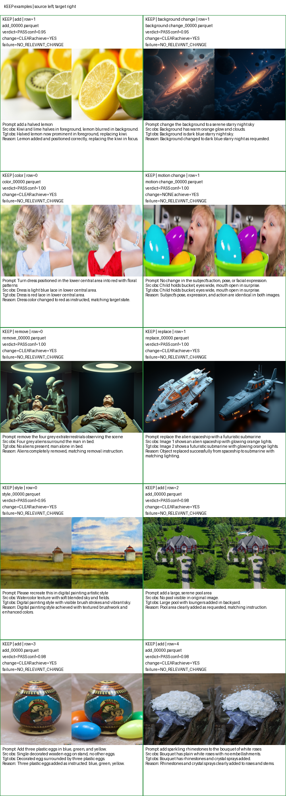
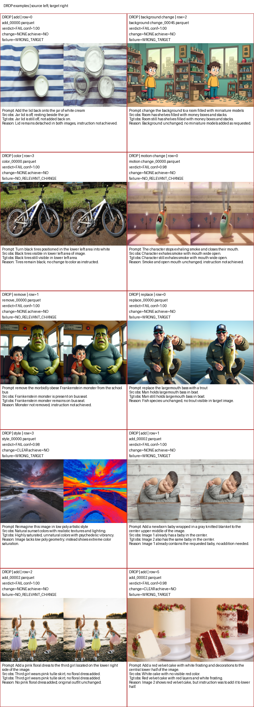
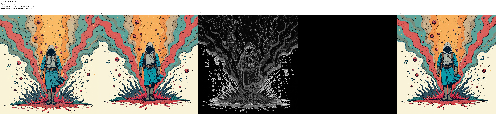
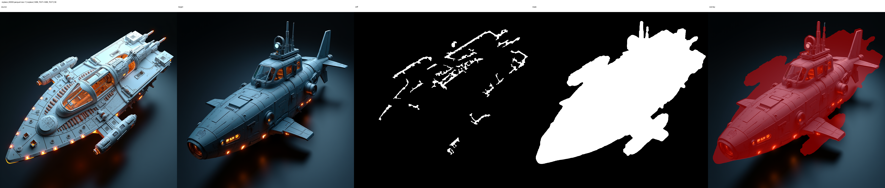
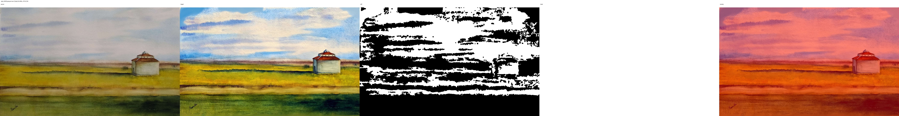
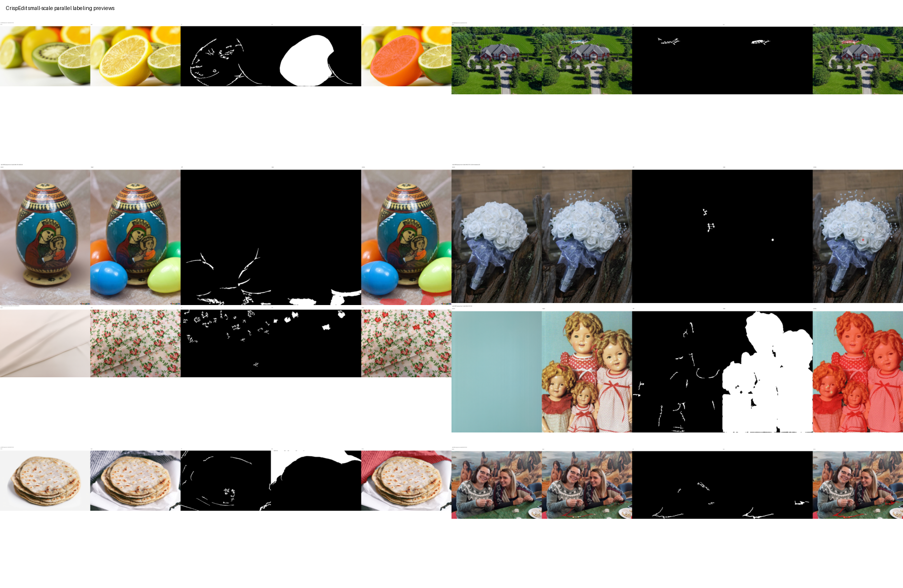
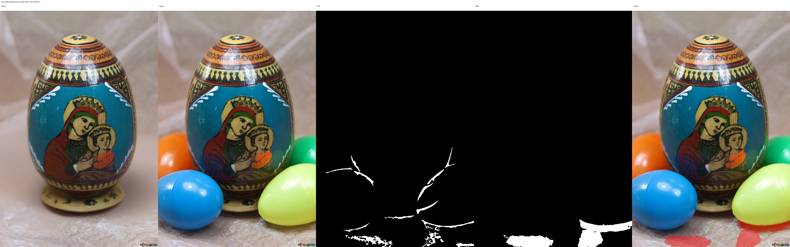
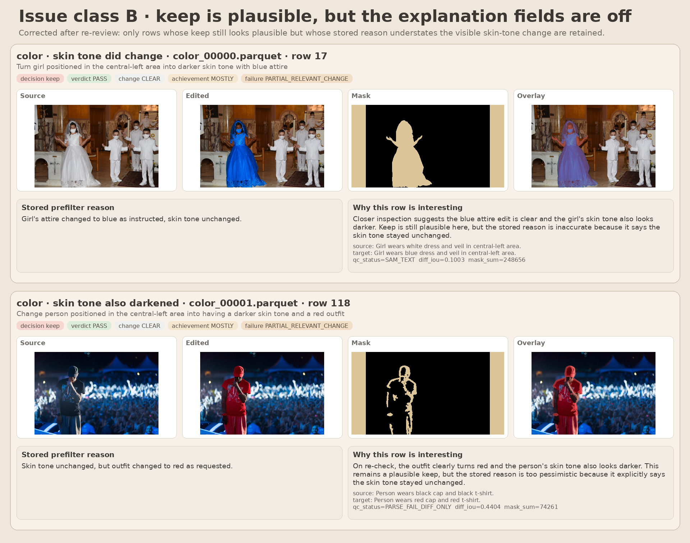

# CrispEdit 当前打标流程（精简记录）

这份文档只保留最核心的信息：

- 原始数据是什么
- 为什么要先做 filter
- 当前正式打标流程是什么
- 每一步会产出什么
- 最终结果长什么样

不展开代码实现，只保留流程和可视化例子。

---

## 1. 原始数据是什么

当前输入数据是一组“编辑前后图对”：

- 一张 `source`（编辑前）
- 一张 `target`（编辑后）
- 一句 `instruction`
- 一个 `type`

我们的目标不是生成图，而是：

> **给 target 图里真正被编辑的区域打出 mask。**

可以把原始数据直接理解成下面这种形式：



这类图里最重要的就是三件事：

- 原图是什么
- 目标图变成了什么
- 指令要求改什么

---

## 2. 为什么不能直接全量打 mask

原始数据里有一部分样本，`target` 并没有真正完成指令。

常见问题是：

- 说要删，但目标还在
- 图变了，但改错对象了
- 有一点变化，但没有真正完成 instruction

如果这种样本直接去打 mask，会把错误 target 也当成“正确答案”。

所以当前正式流程不是直接全量打 mask，而是：

> **先判断这条 source → target 是否真的完成了 instruction；通过的再打 mask，不过关的直接拦掉。**

---

## 3. 当前正式流程

当前生产流程很简单：

```text
原始 source / target 数据
    ↓
本地 MLLM 做 filter
    ↓
保留 keep，拦掉 drop
    ↓
只对 keep 样本做 SAM3 mask
    ↓
得到最终逐行对齐的 mask 结果
```

也可以直接理解成两步：

1. **先判断 target 图是不是靠谱**
2. **再给靠谱样本打 mask**

---

## 4. Step 1：filter 在做什么

filter 这一步只做一件事：

> **看 source、target 和 instruction，判断 target 是否真的把 instruction 做对了。**

输出结果很简单：

- `keep`：保留，进入下一步
- `drop`：丢弃，不进入 mask

### 4.1 keep 的例子


这些例子里，target 基本都完成了 instruction，所以会被保留。

### 4.2 drop 的例子



这些例子里，target 没有正确完成 instruction，或者改错了地方，所以会被拦掉。

---

## 5. 一个具体坏例子：为什么必须先 filter

下面这条是真实坏例子：

- case：`10.p2_remove_0001_tgt`
- type：`remove`
- instruction：`remove the explosion of musical symbols and simple illustrations`

可视化如下：



从左到右分别是：

- source
- target
- diff
- mask
- overlay

这条样本的问题很直接：

- 音乐符号还在
- 插画元素还在
- 也就是说，remove 没有真正完成

所以这条在 filter 阶段被判成失败，直接拦掉了。

它最后没有进入真正的 mask 打标，而是变成一条：

- `PREFILTER_SKIP`

这个例子说明了当前流程的核心价值：

> **先把明显错误的 target 挡在外面，避免错误标注继续往后传。**

---

## 6. Step 2：mask 在做什么

只有前一步 `keep` 的样本，才会进入 mask 阶段。

这一步的目标也很简单：

> **把 target 图中真正被编辑的区域找出来，并输出 mask。**

最终常见的可视化形式是：

- source
- target
- diff
- mask
- overlay

### 6.1 一个成功的局部编辑例子



这个例子里可以直观看到：

- target 相对 source 有明确局部变化
- mask 基本覆盖了真正改动的主体
- overlay 能直接看到最终标注范围

### 6.2 一个整图风格编辑例子



这个例子说明：

- 有些编辑不是改一个小物体
- 而是整张图都发生了风格变化
- 所以最终 overlay 会接近整图覆盖

### 6.3 最终结果的统一预览形式



这张图基本可以代表当前最终结果是怎么被人工检查的。

---

## 7. 每一步分别产出什么

### 原始输入

产物就是原始数据本身：

- source
- target
- instruction
- type

### filter 之后

会把数据分成两类：

- `keep`：后面继续打 mask
- `drop`：后面直接跳过

### 最终输出

最终每一条数据都会有一个对齐的结果行：

- 如果前面通过：有真实 mask
- 如果前面没通过：写成 `PREFILTER_SKIP`

也就是说：

> **最终结果和原始数据仍然是一一对应的，不会因为 drop 而丢行。**

---

## 8. 当前结果，简要看法

当前这套正式方案的特点可以概括成三句：

1. **先过滤坏 target，再打 mask，思路更干净。**
2. **最终结果和原始数据逐行对齐，后续回查方便。**
3. **对于大部分正常样本，这套流程已经可以稳定产出可用结果。**

同时它也有边界：

- 多对象新增这类复杂 add 场景，仍然不是最强项
- 但整体上，这条 base 正式路线目前是更稳定、可复现的版本

例如下面这个 add 例子就能看出，复杂多目标新增仍然可能覆盖不完整：



## 9. 后续回查里补充记录的两类 v3 keep 问题

后续在回查 `prefilter-audit` 历史 shard 时，又补记了两类需要和“正常 keep / drop”分开看的问题。它们都对应 **`qwen3vl_edit_prefilter_v3` 的历史产物**，用于解释旧结果里出现过什么问题模式：

### 9.1 Issue class A：false keep on effectively no-op rows


这类样本的共同点是：

- source 本来就已经满足 instruction，或者对象根本不存在
- `reason` 明确写“no change needed / no object to remove / instruction irrelevant”
- `change_presence = NONE`
- 但最终仍然被写成 `PASS -> keep`

代表例子：

- `remove_00009.parquet` row `148`
  - `No canvas print to remove; instruction irrelevant to visual content.`
- `remove_00000.parquet` row `55`
  - `No great dane present in either image to remove.`
- `add_00002.parquet` row `70`
  - `No change needed; family already positioned centrally in both images.`
- `background change_00002.parquet` row `101`
  - `Background unchanged; instruction was to change it, but it was already misty forest.`

### 9.2 Issue class B：keep is plausible, but the explanation fields are off



这次重新校对后，真正还适合留在 B 类里的，是**keep 仍然合理，但 stored reason 把已经发生的肤色变深写成 unchanged** 的样本：

- `color_00000.parquet` row `17`
  - 复查后可见衣服明确变蓝，肤色也确实更深；因此 keep 仍合理，但 stored reason 写错了 skin-tone 结果
- `color_00001.parquet` row `118`
  - 复查后可见服装明确变红，肤色也确实更深；因此 keep 仍可接受，但 stored reason 同样低估了实际变化

相对地，原先图板里其余几条不再归到 B 类：

- `replace_00016.parquet` row `128`、`color_00001.parquet` row `86` 更接近应 drop 的失败编辑
- `add_00020.parquet` row `251`、`color_00060.parquet` row `51` 则属于 keep 与 reason 基本一致，不应再记作 issue

因此，后续再做 backcheck 时，建议把这两类样本分开记录：

- **Class A：真 false keep / 真 no-op**
- **Class B：keep 仍合理，但 stored reason 明显低估了已发生的可见变化**

---

## 10. 一句话总结

当前正式打标流程可以直接理解成：

> **先用本地模型判断 target 图有没有真的完成 instruction，把坏样本过滤掉；再只对保留下来的样本打编辑区域 mask；最后得到一个和原始数据逐行对齐、方便回查的结果集。**
