# Bad case review (2026-08-26)

本文只分两类：

1. **prefilter 这一侧 bad case**：原始数据 / instruction 本身有问题，按理应该在 prefilter 阶段被筛掉；
2. **mask 打标这一侧 bad case**：source / target 的编辑基本成立，但 final mask 没有把真正的编辑区域标出来。

每条 case 只保留：**数据信息、图、数据集路径下的位置、问题所在**。

---

## 1. Prefilter 这一侧 bad case

这里将 prefilter 侧 bad case 也按 `raw_type` 归类，风格与 mask 侧保持一致。

---

### `motion change`

#### `motion change_00007.parquet` row `219`

- 数据信息：`raw_type=motion change | qc_flag=OK | qc_status=SAM_TEXT+SAM_TEXT | area_frac=0.087`
- 指令：`The person shifts the position of the phones in their hands, with the right hand phone now held more horizontally and the left hand phone angled slightly downward.`
- 数据集位置：
  - 原始数据：`/mnt/bn/strategy-mllm-train/user/tanyue/datasets/CrispEdit-2M/motion change_00007.parquet`
  - 最终打标结果：`/mnt/bn/strategy-mllm-train/user/tanyue/datasets/CrispEdit-2M-mask-parquet-101697/motion change_00007.parquet`
  - 复查图：`/opt/tiger/tanyue/sam3-crispedit/docs_assets/bad_case_review_20260826/motion change_00007__row219_review.png`
- 问题所在：
  - instruction 要求同时判断两只手里 phone 的细粒度角度变化；
  - 但 source / target 里这两个姿态差异都不够稳定，肉眼很难可靠确认“是否真的完成了编辑”；
  - 这类极细粒度 hand/object orientation motion 更像 **historical false keep**，应在 prefilter 阶段被 drop。

---

#### `motion change_00038.parquet` row `194`

- 数据信息：`raw_type=motion change | qc_flag=OK | qc_status=SAM_TEXT+SAM_TEXT | area_frac=0.004`
- 指令：`A man spreads his fingers wider on his right hand.`
- 数据集位置：
  - 原始数据：`/mnt/bn/strategy-mllm-train/user/tanyue/datasets/CrispEdit-2M/motion change_00038.parquet`
  - 最终打标结果：`/mnt/bn/strategy-mllm-train/user/tanyue/datasets/CrispEdit-2M-mask-parquet-101697/motion change_00038.parquet`
  - 复查图：`/opt/tiger/tanyue/sam3-crispedit/docs_assets/bad_case_review_20260826/motion change_00038__row194_review.png`
- 问题所在：
  - 指令要求的是右手手指张开更大，但图中可见变化极弱；
  - 从人工复查角度，这条甚至更像局部生成细节不稳定，而不是一个可稳定审核的手部动作编辑；
  - 因此这条应视为 **subtle / unreliable motion false keep**，更应该在 prefilter 侧被筛掉。

---

#### `motion change_00048.parquet` row `176`

- 数据信息：`raw_type=motion change | qc_flag=OK | qc_status=SAM_TEXT+SAM_TEXT | area_frac=0.007`
- 指令：`The person changes the position of their hands, pointing the right index finger outward while retracting their left thumb slightly.`
- 数据集位置：
  - 原始数据：`/mnt/bn/strategy-mllm-train/user/tanyue/datasets/CrispEdit-2M/motion change_00048.parquet`
  - 最终打标结果：`/mnt/bn/strategy-mllm-train/user/tanyue/datasets/CrispEdit-2M-mask-parquet-101697/motion change_00048.parquet`
  - 复查图：`/opt/tiger/tanyue/sam3-crispedit/docs_assets/bad_case_review_20260826/motion change_00048__row176_review.png`
- 问题所在：
  - instruction 拆成两部分后，分别要求识别右手食指朝向和左手拇指轻微回收；
  - 但图里这两处变化都非常细，肉眼不容易稳定确认；
  - 这种依赖微小手部姿态差异的样本不适合继续保留，属于 **historical motion false keep**。

---

#### `motion change_00060.parquet` row `183`

- 数据信息：`raw_type=motion change | qc_flag=OK | qc_status=SAM_TEXT+SAM_TEXT | area_frac=0.122`
- 指令：`The subject adjusts their golf swing posture slightly.`
- 数据集位置：
  - 原始数据：`/mnt/bn/strategy-mllm-train/user/tanyue/datasets/CrispEdit-2M/motion change_00060.parquet`
  - 最终打标结果：`/mnt/bn/strategy-mllm-train/user/tanyue/datasets/CrispEdit-2M-mask-parquet-101697/motion change_00060.parquet`
  - 复查图：`/opt/tiger/tanyue/sam3-crispedit/docs_assets/bad_case_review_20260826/motion change_00060__row183_review.png`
- 问题所在：
  - source / target 之间可能有变化，但变化太轻微；
  - 肉眼很难稳定确认“是否真的按要求完成了编辑”；
  - 这类 `slightly` / `subtly` 的 motion instruction 不适合做稳定可审核数据，因此更应该在 prefilter 侧被筛掉。

---

### `remove`

#### `remove_00011.parquet` row `225`

- 数据信息：`raw_type=remove | qc_flag=OK | qc_status=SAM_TEXT_BOX | area_frac=0.021`
- 指令：`remove the tentacles in the dystopian scene`
- 数据集位置：
  - 原始数据：`/mnt/bn/strategy-mllm-train/user/tanyue/datasets/CrispEdit-2M/remove_00011.parquet`
  - 最终打标结果：`/mnt/bn/strategy-mllm-train/user/tanyue/datasets/CrispEdit-2M-mask-parquet-101697/remove_00011.parquet`
  - 复查图：`/opt/tiger/tanyue/sam3-crispedit/docs_assets/bad_case_review_20260826/remove_00011__row225_review.png`
- 问题所在：
  - source 里看不到 tentacles；
  - target 里同样看不到 tentacles；
  - 这是典型的 **no-op false keep**，本应在 prefilter 阶段被 drop。

---

#### `remove_00023.parquet` row `208`

- 数据信息：`raw_type=remove | qc_flag=OK | qc_status=SAM_TEXT_BOX | area_frac=0.011`
- 指令：`remove the antique engine parts surrounding the hybrid human jellyfish bodies`
- 数据集位置：
  - 原始数据：`/mnt/bn/strategy-mllm-train/user/tanyue/datasets/CrispEdit-2M/remove_00023.parquet`
  - 最终打标结果：`/mnt/bn/strategy-mllm-train/user/tanyue/datasets/CrispEdit-2M-mask-parquet-101697/remove_00023.parquet`
  - 复查图：`/opt/tiger/tanyue/sam3-crispedit/docs_assets/bad_case_review_20260826/remove_00023__row208_review.png`
- 问题所在：
  - target 里的变化并不清楚对应“围绕 jellyfish bodies 的 antique engine parts”；
  - 实际变化更像是边框、旧照片感、颗粒感之类的风格性变化；
  - 这说明 instruction 在 prefilter / 编辑阶段已经被理解偏了，属于 **semantic drift / wrong thing edited**。

---

#### `remove_00071.parquet` row `249`

- 数据信息：`raw_type=remove | qc_flag=OK | qc_status=SAM_TEXT_BOX | area_frac=0.003`
- 指令：`remove the dragon's eye in the background`
- 数据集位置：
  - 原始数据：`/mnt/bn/strategy-mllm-train/user/tanyue/datasets/CrispEdit-2M/remove_00071.parquet`
  - 最终打标结果：`/mnt/bn/strategy-mllm-train/user/tanyue/datasets/CrispEdit-2M-mask-parquet-101697/remove_00071.parquet`
  - 复查图：`/opt/tiger/tanyue/sam3-crispedit/docs_assets/bad_case_review_20260826/remove_00071__row249_review.png`
- 问题所在：
  - source 里没有 dragon's eye in the background；
  - target 里也没有；
  - 也是典型 **no-op false keep**，按理应在 prefilter 阶段被 drop。

---

## 1.1 当前 prefilter 回归结果

在此前的 `fact` prefilter 回归复查与本轮补充检查中，当前文档中列出的 7 条 prefilter 侧历史 false-keep 里，当前实现已经能正确 drop 其中 6 条；剩余 `remove_00051.parquet:210` 这类 partial remove 边界样本暂未纳入这里的 false-keep 列表。

| Case | 旧结果 | 当前结果 | 结论 |
|---|---|---|---|
| `motion change_00060.parquet:183` | keep | drop | 已修复；没有稳定可见的姿态差异，change/match 均失败 |
| `remove_00011.parquet:225` | keep | drop | 已修复；source/target 都没有 tentacles，实际变化与 instruction 无关 |
| `remove_00023.parquet:208` | keep | drop | 已修复；只观察到色调变化，没有 antique engine parts 的移除 |
| `remove_00071.parquet:249` | keep | drop | 已修复；source/target 都没有 dragon's eye，实际变化发生在人物配饰 |
| `motion change_00007.parquet:219` | keep | drop | 已修复；两只手里 phone 的细粒度角度变化不够稳定，blind description 不支持 keep |
| `motion change_00038.parquet:194` | keep | drop | 已修复；右手手指张开变化极弱，change happened / review consistency 均失败 |
| `motion change_00048.parquet:176` | keep | drop | 已修复；手指/拇指的细粒度姿态变化不够稳定，blind description 不支持 keep |

---

## 2. Mask 打标这一侧 bad case

这里将**原来已有的 case**和**本轮新增确认的 case**统一按 `raw_type` 归类。

---

### `add`

#### `add_00000.parquet` row `17`

- 数据信息：`raw_type=add | qc_flag=OK | qc_status=SAM_TEXT_BOX | area_frac=0.003`
- 指令：`Add the boats back to the marina`
- 数据集位置：
  - 原始数据：`/mnt/bn/strategy-mllm-train/user/tanyue/datasets/CrispEdit-2M/add_00000.parquet`
  - 最终打标结果：`/mnt/bn/strategy-mllm-train/user/tanyue/datasets/CrispEdit-2M-mask-parquet-101697/add_00000.parquet`
  - 复查图：`/opt/tiger/tanyue/sam3-crispedit/docs_assets/bad_case_review_20260826/mask_failures/add_00000__row17_review.png`
- 问题所在：
  - target 中 marina 里确实加回了多条 boats，编辑本身成立；
  - 但 final mask 只落在其中一小块局部，没把新增 boats 整体覆盖起来；
  - 对这种多条小船一起新增的场景，当前结果明显偏成了 **partial add mask / missing multiple small instances**。

---

#### `add_00005.parquet` row `204`

- 数据信息：`raw_type=add | qc_flag=OK | qc_status=SAM_TEXT_BOX | area_frac=0.001`
- 指令：`Add small white flowers surrounding the nest with painted eggs located in the center-right section of the image.`
- 数据集位置：
  - 原始数据：`/mnt/bn/strategy-mllm-train/user/tanyue/datasets/CrispEdit-2M/add_00005.parquet`
  - 最终打标结果：`/mnt/bn/strategy-mllm-train/user/tanyue/datasets/CrispEdit-2M-mask-parquet-101697/add_00005.parquet`
  - 复查图：`/opt/tiger/tanyue/sam3-crispedit/docs_assets/bad_case_review_20260826/mask_failures/add_00005__row204_review.png`
- 问题所在：
  - target 中 center-right 的 nest 周围确实新增了 small white flowers，编辑本身成立；
  - 但 final mask 只打到右侧一小片 tiny fragment，几乎没有覆盖新增花饰主体；
  - 属于 **severe under-mask / tiny fragment only**。

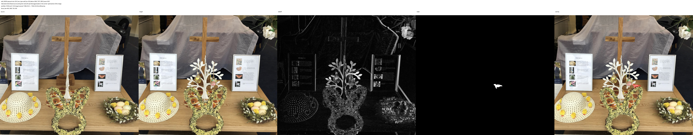

---

#### `add_00014.parquet` row `156`

- 数据信息：`raw_type=add | qc_flag=OK | qc_status=SAM_TEXT | area_frac=0.001`
- 指令：`Add vibrant flowers surrounding the fish located in the central upper portion of the image.`
- 数据集位置：
  - 原始数据：`/mnt/bn/strategy-mllm-train/user/tanyue/datasets/CrispEdit-2M/add_00014.parquet`
  - 最终打标结果：`/mnt/bn/strategy-mllm-train/user/tanyue/datasets/CrispEdit-2M-mask-parquet-101697/add_00014.parquet`
  - 复查图：`/opt/tiger/tanyue/sam3-crispedit/docs_assets/bad_case_review_20260826/mask_failures/add_00014__row156_review.png`
- 问题所在：
  - target 中 fish 周围新增了一圈明显 flowers，编辑本身成立；
  - 但 final mask 只落在中间一个极小碎点，没有覆盖新增花带主体；
  - 属于 **severe under-mask / tiny fragment only**。

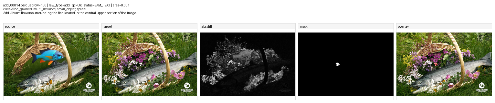

---

#### `add_00016.parquet` row `181`

- 数据信息：`raw_type=add | qc_flag=OK | qc_status=SAM_TEXT | area_frac=0.001`
- 指令：`Add delicate purple flowers among the tall chives spanning across the middle-upper area of the image.`
- 数据集位置：
  - 原始数据：`/mnt/bn/strategy-mllm-train/user/tanyue/datasets/CrispEdit-2M/add_00016.parquet`
  - 最终打标结果：`/mnt/bn/strategy-mllm-train/user/tanyue/datasets/CrispEdit-2M-mask-parquet-101697/add_00016.parquet`
  - 复查图：`/opt/tiger/tanyue/sam3-crispedit/docs_assets/bad_case_review_20260826/mask_failures/add_00016__row181_review.png`
- 问题所在：
  - target 中 middle-upper 花坛里新增了分散的小紫花，编辑本身成立；
  - 但 final mask 只有一个很小的 speck，几乎没覆盖真实新增区域；
  - 属于 **under-mask on scattered small additions**。

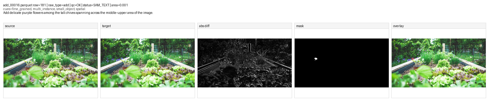

---

#### `add_00040.parquet` row `96`

- 数据信息：`raw_type=add | qc_flag=OK | qc_status=SAM_TEXT_BOX | area_frac=0.002`
- 指令：`Add scattered flower petals slightly right of center in the upper-middle portion of the image.`
- 数据集位置：
  - 原始数据：`/mnt/bn/strategy-mllm-train/user/tanyue/datasets/CrispEdit-2M/add_00040.parquet`
  - 最终打标结果：`/mnt/bn/strategy-mllm-train/user/tanyue/datasets/CrispEdit-2M-mask-parquet-101697/add_00040.parquet`
  - 复查图：`/opt/tiger/tanyue/sam3-crispedit/docs_assets/bad_case_review_20260826/mask_failures/add_00040__row96_review.png`
- 问题所在：
  - target 中主体花束周边新增了多片 scattered petals，编辑本身成立；
  - 但 final mask 只打到中心一个小碎片，没有覆盖分散的花瓣区域；
  - 属于 **partial add mask / missing dispersed instances**。

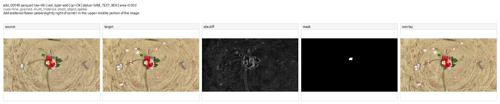

---

#### `add_00045.parquet` row `72`

- 数据信息：`raw_type=add | qc_flag=OK | qc_status=SAM_TEXT_BOX | area_frac=0.001`
- 指令：`Add colorful flowers surrounding the topiary sculptures throughout the entire image. Position: covers almost the entire area, from top left to bottom right corner.`
- 数据集位置：
  - 原始数据：`/mnt/bn/strategy-mllm-train/user/tanyue/datasets/CrispEdit-2M/add_00045.parquet`
  - 最终打标结果：`/mnt/bn/strategy-mllm-train/user/tanyue/datasets/CrispEdit-2M-mask-parquet-101697/add_00045.parquet`
  - 复查图：`/opt/tiger/tanyue/sam3-crispedit/docs_assets/bad_case_review_20260826/mask_failures/add_00045__row72_review.png`
- 问题所在：
  - target 中 topiary sculptures 周围下半区域新增了大面积 flowers，编辑本身成立；
  - 但 final mask 只有一个小点，和真实新增花带范围完全不匹配；
  - 属于 **severe under-mask on broad multi-instance add**。

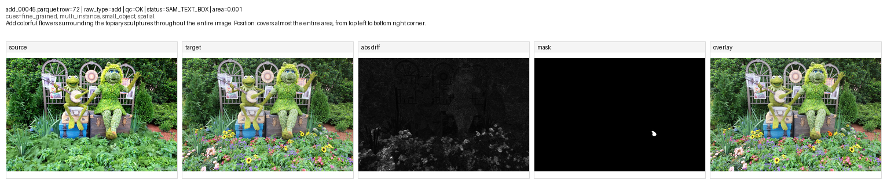

---

#### `add_00047.parquet` row `51`

- 数据信息：`raw_type=add | qc_flag=OK | qc_status=SAM_TEXT_BOX_ALIAS:array | area_frac=0.002`
- 指令：`Add an array of flowers decorating the arch located in the upper right of the image.`
- 数据集位置：
  - 原始数据：`/mnt/bn/strategy-mllm-train/user/tanyue/datasets/CrispEdit-2M/add_00047.parquet`
  - 最终打标结果：`/mnt/bn/strategy-mllm-train/user/tanyue/datasets/CrispEdit-2M-mask-parquet-101697/add_00047.parquet`
  - 复查图：`/opt/tiger/tanyue/sam3-crispedit/docs_assets/bad_case_review_20260826/mask_failures/add_00047__row51_review.png`
- 问题所在：
  - 编辑本身是成立的，target 中 arch 上确实新增了 flowers；
  - 但 final mask 只打到右侧一小片碎片；
  - 属于 **severe under-mask / tiny fragment only**。

---

#### `add_00049.parquet` row `14`

- 数据信息：`raw_type=add | qc_flag=OK | qc_status=SAM_TEXT_MULTI_BOX_ALIAS:bird | area_frac=0.019`
- 指令：`Add birds across the upper left to lower right area, integrating them around the woman's face and the surrounding flowers and animals.`
- 数据集位置：
  - 原始数据：`/mnt/bn/strategy-mllm-train/user/tanyue/datasets/CrispEdit-2M/add_00049.parquet`
  - 最终打标结果：`/mnt/bn/strategy-mllm-train/user/tanyue/datasets/CrispEdit-2M-mask-parquet-101697/add_00049.parquet`
  - 复查图：`/opt/tiger/tanyue/sam3-crispedit/docs_assets/bad_case_review_20260826/mask_failures/add_00049__row14_review.png`
- 问题所在：
  - target 中新增 birds 分布在 upper-left 到 lower-right 的较大区域，编辑本身成立；
  - 但 final mask 只覆盖到其中一小团，没有把多只新增 birds 整体覆盖起来；
  - 属于 **partial add mask / missing multiple instances**。

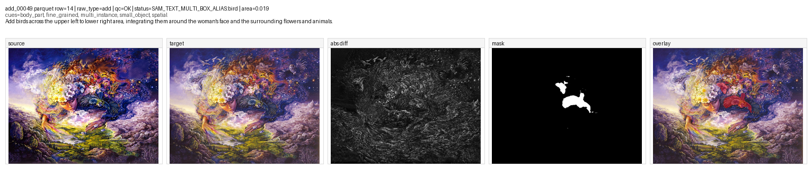

---

#### `add_00071.parquet` row `245`

- 数据信息：`raw_type=add | qc_flag=OK | qc_status=SAM_TEXT_MULTI_BOX_ALIAS:bowl | area_frac=0.106`
- 指令：`Add a wooden bowl containing dark berries to the right-middle area of the image.`
- 数据集位置：
  - 原始数据：`/mnt/bn/strategy-mllm-train/user/tanyue/datasets/CrispEdit-2M/add_00071.parquet`
  - 最终打标结果：`/mnt/bn/strategy-mllm-train/user/tanyue/datasets/CrispEdit-2M-mask-parquet-101697/add_00071.parquet`
  - 复查图：`/opt/tiger/tanyue/sam3-crispedit/docs_assets/bad_case_review_20260826/mask_failures/add_00071__row245_review.png`
- 问题所在：
  - target 中新增 bowl 是成立的；
  - 但 final mask 把新增 bowl 和原本就存在的 bowl 混在了一起；
  - 属于 **target confusion / mixed old+new objects**。

---

### `background change`

#### `background change_00029.parquet` row `181`

- 数据信息：`raw_type=background change | qc_flag=OK | qc_status=OK | area_frac=0.354`
- 指令：`change the background to a galaxy filled with stars`
- 数据集位置：
  - 原始数据：`/mnt/bn/strategy-mllm-train/user/tanyue/datasets/CrispEdit-2M/background change_00029.parquet`
  - 最终打标结果：`/mnt/bn/strategy-mllm-train/user/tanyue/datasets/CrispEdit-2M-mask-parquet-101697/background change_00029.parquet`
  - 复查图：`/opt/tiger/tanyue/sam3-crispedit/docs_assets/bad_case_review_20260826/mask_failures/background_change_00029__row181_review.png`
- 问题所在：
  - target 的 galaxy 背景替换本身是成功的；
  - 但 final mask 主要盖在女人主体和月环前景上，而不是星空背景；
  - 属于 **foreground/background semantic inversion**。

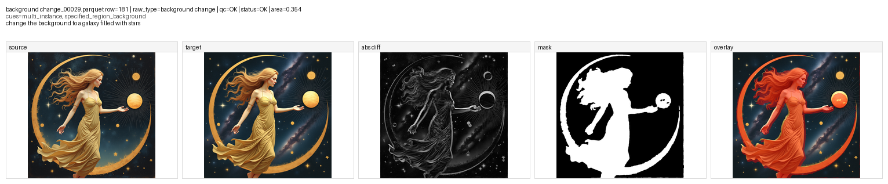

---

#### `background change_00036.parquet` row `15`

- 数据信息：`raw_type=background change | qc_flag=OK | qc_status=OK | area_frac=0.428`
- 指令：`change the background to a royal palace ballroom`
- 数据集位置：
  - 原始数据：`/mnt/bn/strategy-mllm-train/user/tanyue/datasets/CrispEdit-2M/background change_00036.parquet`
  - 最终打标结果：`/mnt/bn/strategy-mllm-train/user/tanyue/datasets/CrispEdit-2M-mask-parquet-101697/background change_00036.parquet`
  - 复查图：`/opt/tiger/tanyue/sam3-crispedit/docs_assets/bad_case_review_20260826/reference/background_change_00036__row15_review.png`
- 问题所在：
  - target 的背景替换本身是成功的；
  - 但 final mask 几乎整块盖在人物前景上，而不是 ballroom 背景；
  - 这条最像 **foreground/background semantic inversion**，即背景编辑却写出了前景主体 mask。

---

#### `background change_00066.parquet` row `71`

- 数据信息：`raw_type=background change | qc_flag=OK | qc_status=OK | area_frac=0.358`
- 指令：`change the background to a library filled with books`
- 数据集位置：
  - 原始数据：`/mnt/bn/strategy-mllm-train/user/tanyue/datasets/CrispEdit-2M/background change_00066.parquet`
  - 最终打标结果：`/mnt/bn/strategy-mllm-train/user/tanyue/datasets/CrispEdit-2M-mask-parquet-101697/background change_00066.parquet`
  - 复查图：`/opt/tiger/tanyue/sam3-crispedit/docs_assets/bad_case_review_20260826/mask_failures/background_change_00066__row71_review.png`
- 问题所在：
  - target 的 library 背景替换本身是成功的；
  - 但 final mask 主要覆盖 cat 前景，而不是后方书架背景；
  - 属于 **foreground/background semantic inversion**。

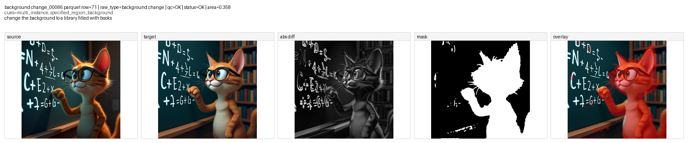

---

#### `background change_00080.parquet` row `33`

- 数据信息：`raw_type=background change | qc_flag=OK | qc_status=OK | area_frac=0.360`
- 指令：`change the background to a sunny meadow with vibrant flowers`
- 数据集位置：
  - 原始数据：`/mnt/bn/strategy-mllm-train/user/tanyue/datasets/CrispEdit-2M/background change_00080.parquet`
  - 最终打标结果：`/mnt/bn/strategy-mllm-train/user/tanyue/datasets/CrispEdit-2M-mask-parquet-101697/background change_00080.parquet`
  - 复查图：`/opt/tiger/tanyue/sam3-crispedit/docs_assets/bad_case_review_20260826/mask_failures/background_change_00080__row33_review.png`
- 问题所在：
  - target 中背景已经明显变成 sunny meadow with vibrant flowers，编辑本身成立；
  - 但 final mask 是一块很粗糙的上半/边缘大区域，和真实发生变化的背景分布不一致，还漏掉了大量下方变化区域；
  - 属于 **poor background mask / wrong region distribution**。

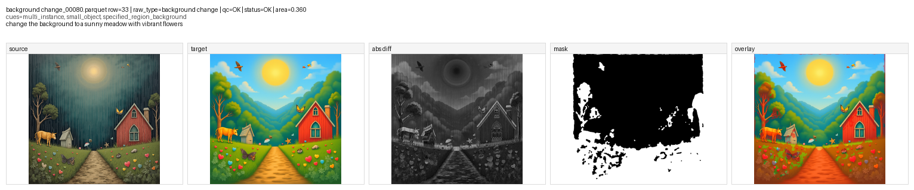

---

### `color`

#### `color_00000.parquet` row `25`

- 数据信息：`raw_type=color | qc_flag=OK | qc_status=SAM_TEXT | area_frac=0.005`
- 指令：`Turn motorcycle positioned in the right-central area into red`
- 数据集位置：
  - 原始数据：`/mnt/bn/strategy-mllm-train/user/tanyue/datasets/CrispEdit-2M/color_00000.parquet`
  - 最终打标结果：`/mnt/bn/strategy-mllm-train/user/tanyue/datasets/CrispEdit-2M-mask-parquet-101697/color_00000.parquet`
  - 复查图：`/opt/tiger/tanyue/sam3-crispedit/docs_assets/bad_case_review_20260826/mask_failures/color_00000__row25_review.png`
- 问题所在：
  - target 里的右侧 motorcycle 已经明显改成红色，编辑本身成立；
  - 但 final mask 只打到车身上一小块 patch；
  - 没有覆盖整辆 motorcycle 的主要改色区域，属于 **severe under-mask on full-object recolor**。

---

#### `color_00000.parquet` row `144`

- 数据信息：`raw_type=color | qc_flag=OK | qc_status=SAM_TEXT_ALIAS:flowers | area_frac=0.009`
- 指令：`Turn flowers positioned slightly right of the center into red`
- 数据集位置：
  - 原始数据：`/mnt/bn/strategy-mllm-train/user/tanyue/datasets/CrispEdit-2M/color_00000.parquet`
  - 最终打标结果：`/mnt/bn/strategy-mllm-train/user/tanyue/datasets/CrispEdit-2M-mask-parquet-101697/color_00000.parquet`
  - 复查图：`/opt/tiger/tanyue/sam3-crispedit/docs_assets/bad_case_review_20260826/mask_failures/color_00000__row144_review.png`
- 问题所在：
  - target 中右侧 bouquet 整体已经变成红色，编辑本身成立；
  - 但 final mask 只打到几个花头小斑点，没有覆盖整束 flowers 的主要改色区域；
  - 属于 **under-mask on full-bouquet recolor**。

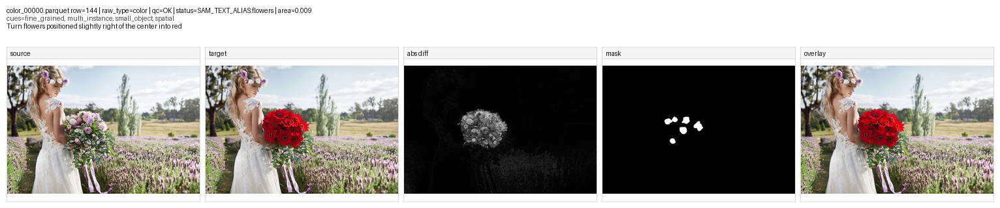

---

#### `color_00008.parquet` row `185`

- 数据信息：`raw_type=color | qc_flag=OK | qc_status=SAM_TEXT | area_frac=0.004`
- 指令：`Turn arms positioned in the upper-right area into darker skin tone`
- 数据集位置：
  - 原始数据：`/mnt/bn/strategy-mllm-train/user/tanyue/datasets/CrispEdit-2M/color_00008.parquet`
  - 最终打标结果：`/mnt/bn/strategy-mllm-train/user/tanyue/datasets/CrispEdit-2M-mask-parquet-101697/color_00008.parquet`
  - 复查图：`/opt/tiger/tanyue/sam3-crispedit/docs_assets/bad_case_review_20260826/mask_failures/color_00008__row185_review.png`
- 问题所在：
  - target 中 upper-right 的 arm 肤色变化是成立的；
  - 但 final mask 只覆盖手臂上一小段细长区域，没有把整条被改色的 arm 覆盖完整；
  - 属于 **under-mask / incomplete arm recolor coverage**。

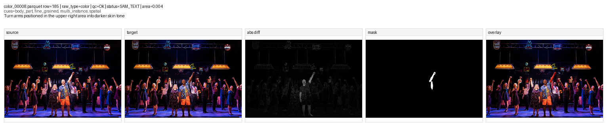

---

#### `color_00060.parquet` row `217`

- 数据信息：`raw_type=color | qc_flag=OK | qc_status=PARSE_FAIL_DIFF_ONLY | area_frac=0.009`
- 指令：`Change flowers positioned in the lower right area to bright red with a soft texture`
- 数据集位置：
  - 原始数据：`/mnt/bn/strategy-mllm-train/user/tanyue/datasets/CrispEdit-2M/color_00060.parquet`
  - 最终打标结果：`/mnt/bn/strategy-mllm-train/user/tanyue/datasets/CrispEdit-2M-mask-parquet-101697/color_00060.parquet`
  - 复查图：`/opt/tiger/tanyue/sam3-crispedit/docs_assets/bad_case_review_20260826/mask_failures/color_00060__row217_review.png`
- 问题所在：
  - target 中 lower-right 的 flowers 已经明显变红，编辑本身成立；
  - 但 final mask 只有几个零散小块，没有覆盖主要改色花簇；
  - 属于 **partial recolor mask / severe under-mask**。

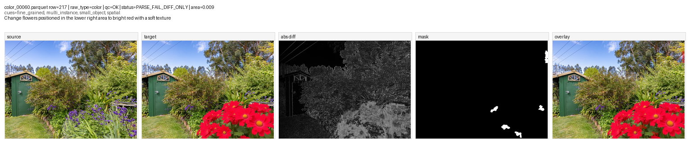

---

#### `color_00061.parquet` row `5`

- 数据信息：`raw_type=color | qc_flag=OK | qc_status=SAM_TEXT_BOX | area_frac=0.012`
- 指令：`change the color of Xenomorph to gold`
- 数据集位置：
  - 原始数据：`/mnt/bn/strategy-mllm-train/user/tanyue/datasets/CrispEdit-2M/color_00061.parquet`
  - 最终打标结果：`/mnt/bn/strategy-mllm-train/user/tanyue/datasets/CrispEdit-2M-mask-parquet-101697/color_00061.parquet`
  - 复查图：`/opt/tiger/tanyue/sam3-crispedit/docs_assets/bad_case_review_20260826/mask_failures/color_00061__row5_review.png`
- 问题所在：
  - 整个主体已经明显被改成 gold；
  - 但 final mask 只打到头部附近一小块；
  - 属于 **severe under-mask on full-body recolor**。

---

#### `color_00067.parquet` row `210`

- 数据信息：`raw_type=color | qc_flag=OK | qc_status=PARSE_FAIL_DIFF_ONLY | area_frac=0.003`
- 指令：`Change boats positioned in the lower-left area to wooden texture with natural brown color`
- 数据集位置：
  - 原始数据：`/mnt/bn/strategy-mllm-train/user/tanyue/datasets/CrispEdit-2M/color_00067.parquet`
  - 最终打标结果：`/mnt/bn/strategy-mllm-train/user/tanyue/datasets/CrispEdit-2M-mask-parquet-101697/color_00067.parquet`
  - 复查图：`/opt/tiger/tanyue/sam3-crispedit/docs_assets/bad_case_review_20260826/mask_failures/color_00067__row210_review.png`
- 问题所在：
  - 指令要求改的是 lower-left 的 boats；
  - 但 final mask 落在不相干的小碎片区域，没有对准 lower-left 的 boats 本体；
  - 属于 **wrong-region mask**。

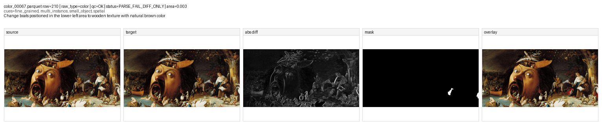

---

#### `color_00074.parquet` row `104`

- 数据信息：`raw_type=color | qc_flag=OK | qc_status=SAM_TEXT | area_frac=0.027`
- 指令：`Turn arms positioned in the central-right area into darker skin tone`
- 数据集位置：
  - 原始数据：`/mnt/bn/strategy-mllm-train/user/tanyue/datasets/CrispEdit-2M/color_00074.parquet`
  - 最终打标结果：`/mnt/bn/strategy-mllm-train/user/tanyue/datasets/CrispEdit-2M-mask-parquet-101697/color_00074.parquet`
  - 复查图：`/opt/tiger/tanyue/sam3-crispedit/docs_assets/bad_case_review_20260826/mask_failures/color_00074__row104_review.png`
- 问题所在：
  - 按图看，target 中不仅右前臂，左手和脸部可见皮肤区域也发生了肤色变化；
  - 但 final mask 只覆盖了右前臂一块，没有把左手和脸部变化纳入；
  - 属于 **multi-region under-mask / incomplete skin-tone recolor coverage**。

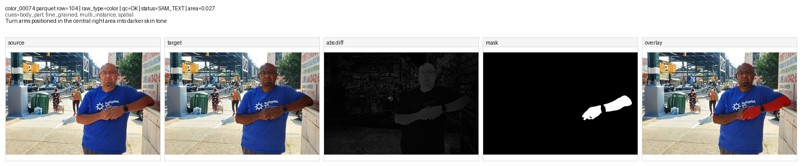

---

### `motion change`

#### `motion change_00003.parquet` row `30`

- 数据信息：`raw_type=motion change | qc_flag=OK | qc_status=SAM_TEXT+SAM_TEXT | area_frac=0.702`
- 指令：`The woman turns her body slightly to the right while keeping her hands on the edge of the bowl.`
- 数据集位置：
  - 原始数据：`/mnt/bn/strategy-mllm-train/user/tanyue/datasets/CrispEdit-2M/motion change_00003.parquet`
  - 最终打标结果：`/mnt/bn/strategy-mllm-train/user/tanyue/datasets/CrispEdit-2M-mask-parquet-101697/motion change_00003.parquet`
  - 复查图：`/opt/tiger/tanyue/sam3-crispedit/docs_assets/bad_case_review_20260826/mask_failures/motion_change_00003__row30_review.png`
- 问题所在：
  - target 中 body turn 的动作编辑是成立的；
  - 但 final mask 扩到人物之外的大块厨房背景，远超真实动作区域；
  - 属于 **over-mask / near whole-person region with background spill**。

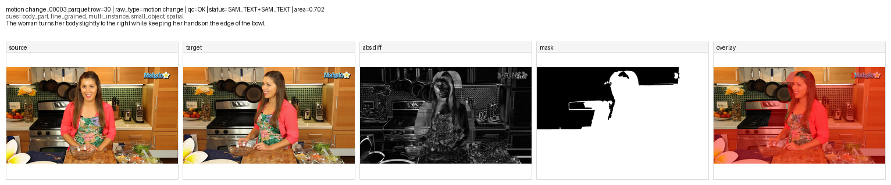

---

#### `motion change_00012.parquet` row `40`

- 数据信息：`raw_type=motion change | qc_flag=OK | qc_status=SAM_TEXT+SAM_TEXT | area_frac=0.830`
- 指令：`The man tilts the power drill downward.`
- 数据集位置：
  - 原始数据：`/mnt/bn/strategy-mllm-train/user/tanyue/datasets/CrispEdit-2M/motion change_00012.parquet`
  - 最终打标结果：`/mnt/bn/strategy-mllm-train/user/tanyue/datasets/CrispEdit-2M-mask-parquet-101697/motion change_00012.parquet`
  - 复查图：`/opt/tiger/tanyue/sam3-crispedit/docs_assets/bad_case_review_20260826/mask_failures/motion_change_00012__row40_review.png`
- 问题所在：
  - target 里的动作编辑是成立的；
  - 真正变化主要在 drill、手臂和邻近工作区域；
  - 但 final mask 几乎吞掉整个人和大片工作台，属于 **over-mask / near whole-person region**。

---

#### `motion change_00024.parquet` row `178`

- 数据信息：`raw_type=motion change | qc_flag=OK | qc_status=SAM_TEXT+SAM_TEXT_BOX | area_frac=0.102`
- 指令：`The person lowers their hands to their sides.`
- 数据集位置：
  - 原始数据：`/mnt/bn/strategy-mllm-train/user/tanyue/datasets/CrispEdit-2M/motion change_00024.parquet`
  - 最终打标结果：`/mnt/bn/strategy-mllm-train/user/tanyue/datasets/CrispEdit-2M-mask-parquet-101697/motion change_00024.parquet`
  - 复查图：`/opt/tiger/tanyue/sam3-crispedit/docs_assets/bad_case_review_20260826/mask_failures/motion_change_00024__row178_review.png`
- 问题所在：
  - target 里 hands lowered 这件事是成立的；
  - 但 final mask 主要落在人物右半边身体，而不是两只手的动作区域；
  - 属于 **wrong granularity / body chunk instead of hands**。

---

#### `motion change_00034.parquet` row `31`

- 数据信息：`raw_type=motion change | qc_flag=OK | qc_status=SAM_TEXT+SAM_TEXT | area_frac=0.008`
- 指令：`The person changes from resting both hands on the table to lifting their right hand slightly above the table.`
- 数据集位置：
  - 原始数据：`/mnt/bn/strategy-mllm-train/user/tanyue/datasets/CrispEdit-2M/motion change_00034.parquet`
  - 最终打标结果：`/mnt/bn/strategy-mllm-train/user/tanyue/datasets/CrispEdit-2M-mask-parquet-101697/motion change_00034.parquet`
  - 复查图：`/opt/tiger/tanyue/sam3-crispedit/docs_assets/bad_case_review_20260826/mask_failures/motion_change_00034__row31_review.png`
- 问题所在：
  - 真正变化是 right hand 略微抬起；
  - 但 final mask 主要落在桌面右侧器皿附近，而不是抬起的手部区域；
  - 属于 **wrong-region mask**。

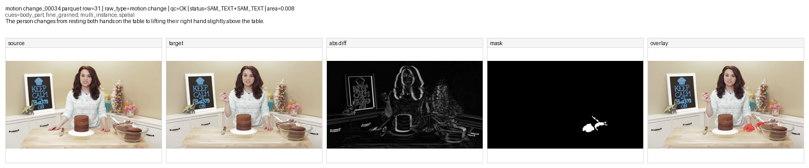

---

#### `motion change_00035.parquet` row `182`

- 数据信息：`raw_type=motion change | qc_flag=OK | qc_status=SAM_TEXT+SAM_TEXT | area_frac=0.008`
- 指令：`The man raises his right hand with fingers pinched together.`
- 数据集位置：
  - 原始数据：`/mnt/bn/strategy-mllm-train/user/tanyue/datasets/CrispEdit-2M/motion change_00035.parquet`
  - 最终打标结果：`/mnt/bn/strategy-mllm-train/user/tanyue/datasets/CrispEdit-2M-mask-parquet-101697/motion change_00035.parquet`
  - 复查图：`/opt/tiger/tanyue/sam3-crispedit/docs_assets/bad_case_review_20260826/mask_failures/motion_change_00035__row182_review.png`
- 问题所在：
  - 真正变化在抬起的 right hand；
  - 但 final mask 落在右下角不相关位置，没有覆盖手部动作主体；
  - 属于 **wrong-region mask**。

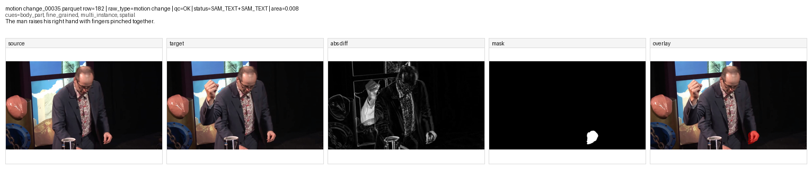

---

#### `motion change_00052.parquet` row `203`

- 数据信息：`raw_type=motion change | qc_flag=OK | qc_status=SAM_TEXT+SAM_TEXT | area_frac=0.021`
- 指令：`The person lowers their right hand slightly while still holding the bowl with both hands.`
- 数据集位置：
  - 原始数据：`/mnt/bn/strategy-mllm-train/user/tanyue/datasets/CrispEdit-2M/motion change_00052.parquet`
  - 最终打标结果：`/mnt/bn/strategy-mllm-train/user/tanyue/datasets/CrispEdit-2M-mask-parquet-101697/motion change_00052.parquet`
  - 复查图：`/opt/tiger/tanyue/sam3-crispedit/docs_assets/bad_case_review_20260826/mask_failures/motion_change_00052__row203_review.png`
- 问题所在：
  - target 中 right hand lowered 的动作是成立的；
  - 但 final mask 主要压在 bowl 下方和局部碎片上，没有完整覆盖 hand + bowl 的实际交互变化区域；
  - 属于 **wrong granularity / incomplete motion-region coverage**。

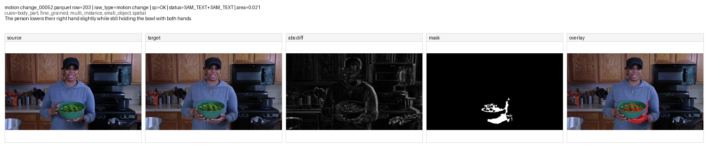

---

#### `motion change_00062.parquet` row `51`

- 数据信息：`raw_type=motion change | qc_flag=OK | qc_status=SAM_TEXT+SAM_TEXT | area_frac=0.005`
- 指令：`The subject's hands holding the tablet are repositioned slightly lower.`
- 数据集位置：
  - 原始数据：`/mnt/bn/strategy-mllm-train/user/tanyue/datasets/CrispEdit-2M/motion change_00062.parquet`
  - 最终打标结果：`/mnt/bn/strategy-mllm-train/user/tanyue/datasets/CrispEdit-2M-mask-parquet-101697/motion change_00062.parquet`
  - 复查图：`/opt/tiger/tanyue/sam3-crispedit/docs_assets/bad_case_review_20260826/mask_failures/motion_change_00062__row51_review.png`
- 问题所在：
  - target 中 hands holding the tablet 的位置变化是成立的；
  - 但 final mask 跑到了图像顶部边缘，和真实动作区域无关；
  - 属于 **wrong-region mask**。

---

#### `motion change_00072.parquet` row `219`

- 数据信息：`raw_type=motion change | qc_flag=OK | qc_status=SAM_TEXT+SAM_TEXT | area_frac=0.749`
- 指令：`The person switches from holding a clipboard to writing on it with a pen.`
- 数据集位置：
  - 原始数据：`/mnt/bn/strategy-mllm-train/user/tanyue/datasets/CrispEdit-2M/motion change_00072.parquet`
  - 最终打标结果：`/mnt/bn/strategy-mllm-train/user/tanyue/datasets/CrispEdit-2M-mask-parquet-101697/motion change_00072.parquet`
  - 复查图：`/opt/tiger/tanyue/sam3-crispedit/docs_assets/bad_case_review_20260826/mask_failures/motion_change_00072__row219_review.png`
- 问题所在：
  - source / target 的动作变化很清楚，编辑本身成立；
  - 真正该标的是 `hand + pen + clipboard` 这一局部交互区域；
  - 但 final mask 扩成了大半个人和大片背景，属于 **over-mask / near whole-person region**。

---

### `remove`

#### `remove_00000.parquet` row `51`

- 数据信息：`raw_type=remove | qc_flag=OK | qc_status=SAM_TEXT_BOX | area_frac=0.004`
- 指令：`remove the flowers surrounding the old black woman tourist`
- 数据集位置：
  - 原始数据：`/mnt/bn/strategy-mllm-train/user/tanyue/datasets/CrispEdit-2M/remove_00000.parquet`
  - 最终打标结果：`/mnt/bn/strategy-mllm-train/user/tanyue/datasets/CrispEdit-2M-mask-parquet-101697/remove_00000.parquet`
  - 复查图：`/opt/tiger/tanyue/sam3-crispedit/docs_assets/bad_case_review_20260826/mask_failures/remove_00000__row51_review.png`
- 问题所在：
  - target 中左侧 flowers 已经被移除，编辑本身成立；
  - 但 final mask 完全没有落在左侧 flower bed 上，而是只落在人物前景附近一个小碎片位置；
  - 属于 **wrong-region mask**。

---

#### `remove_00001.parquet` row `127`

- 数据信息：`raw_type=remove | qc_flag=TOO_LARGE_LOCAL | qc_status=SAM_TEXT_BOX | area_frac=0.965`
- 指令：`remove the narrow floral frame surrounding the bouquet`
- 数据集位置：
  - 原始数据：`/mnt/bn/strategy-mllm-train/user/tanyue/datasets/CrispEdit-2M/remove_00001.parquet`
  - 最终打标结果：`/mnt/bn/strategy-mllm-train/user/tanyue/datasets/CrispEdit-2M-mask-parquet-101697/remove_00001.parquet`
  - 复查图：`/opt/tiger/tanyue/sam3-crispedit/docs_assets/bad_case_review_20260826/mask_failures/remove_00001__row127_review.png`
- 问题所在：
  - target 中窄 floral frame 确实被移除了，编辑本身成立；
  - 但 final mask 几乎把整张图都打满了，远大于真正的边框区域；
  - 属于 **extreme over-mask / near whole-image region**。

---

#### `remove_00009.parquet` row `15`

- 数据信息：`raw_type=remove | qc_flag=OK | qc_status=SAM_TEXT | area_frac=0.002`
- 指令：`remove the multiple piercings on her face`
- 数据集位置：
  - 原始数据：`/mnt/bn/strategy-mllm-train/user/tanyue/datasets/CrispEdit-2M/remove_00009.parquet`
  - 最终打标结果：`/mnt/bn/strategy-mllm-train/user/tanyue/datasets/CrispEdit-2M-mask-parquet-101697/remove_00009.parquet`
  - 复查图：`/opt/tiger/tanyue/sam3-crispedit/docs_assets/bad_case_review_20260826/mask_failures/remove_00009__row15_review.png`
- 问题所在：
  - source 中脸上有多处 piercings，target 中这些 piercings 已被去掉，编辑本身成立；
  - 但 final mask 只给了嘴边一个小点，没有覆盖整组被移除的 piercings；
  - 属于 **severe under-mask / missing multiple small instances**。

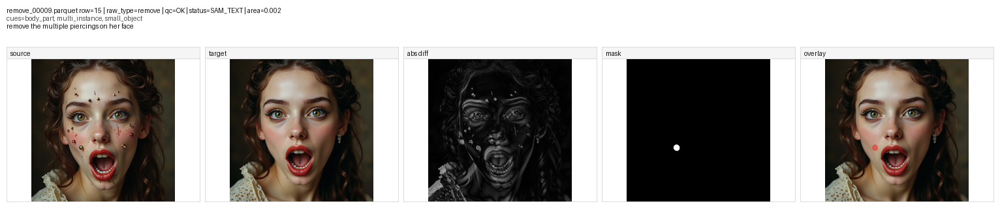

---

#### `remove_00012.parquet` row `88`

- 数据信息：`raw_type=remove | qc_flag=OK | qc_status=SAM_TEXT_BOX | area_frac=0.002`
- 指令：`remove the bioluminescent flowers surrounding the Aztec woman`
- 数据集位置：
  - 原始数据：`/mnt/bn/strategy-mllm-train/user/tanyue/datasets/CrispEdit-2M/remove_00012.parquet`
  - 最终打标结果：`/mnt/bn/strategy-mllm-train/user/tanyue/datasets/CrispEdit-2M-mask-parquet-101697/remove_00012.parquet`
  - 复查图：`/opt/tiger/tanyue/sam3-crispedit/docs_assets/bad_case_review_20260826/mask_failures/remove_00012__row88_review.png`
- 问题所在：
  - source 中围绕人物的 bioluminescent flowers 在 target 里已被移除，编辑本身成立；
  - 但 final mask 只落在下方一个极小碎片，没有覆盖真正被移除的花朵区域；
  - 属于 **severe under-mask**。

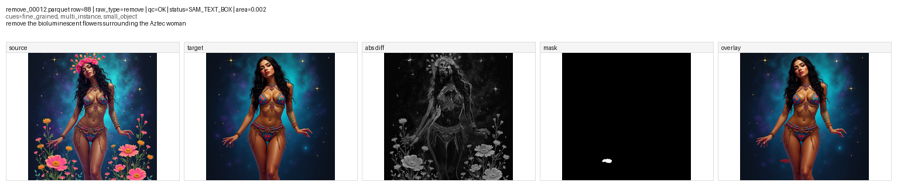

---

#### `remove_00015.parquet` row `215`

- 数据信息：`raw_type=remove | qc_flag=OK | qc_status=SAM_TEXT_BOX | area_frac=0.004`
- 指令：`remove the bed of flowers growing from the top of her head`
- 数据集位置：
  - 原始数据：`/mnt/bn/strategy-mllm-train/user/tanyue/datasets/CrispEdit-2M/remove_00015.parquet`
  - 最终打标结果：`/mnt/bn/strategy-mllm-train/user/tanyue/datasets/CrispEdit-2M-mask-parquet-101697/remove_00015.parquet`
  - 复查图：`/opt/tiger/tanyue/sam3-crispedit/docs_assets/bad_case_review_20260826/mask_failures/remove_00015__row215_review.png`
- 问题所在：
  - source 中头顶整片 flower bed 在 target 里已被去掉，编辑本身成立；
  - 但 final mask 却落在颈部/下巴附近一个小块，不在头顶区域；
  - 属于 **wrong-region mask**。

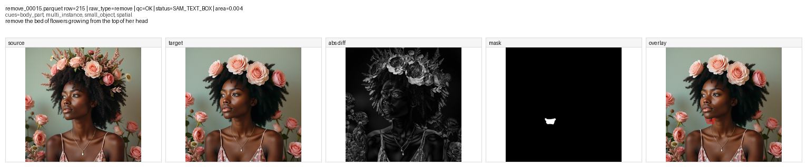

---

#### `remove_00022.parquet` row `62`

- 数据信息：`raw_type=remove | qc_flag=OK | qc_status=SAM_TEXT | area_frac=0.004`
- 指令：`remove the tattoo of flowers and small butterflies from the woman's lower back and upper legs`
- 数据集位置：
  - 原始数据：`/mnt/bn/strategy-mllm-train/user/tanyue/datasets/CrispEdit-2M/remove_00022.parquet`
  - 最终打标结果：`/mnt/bn/strategy-mllm-train/user/tanyue/datasets/CrispEdit-2M-mask-parquet-101697/remove_00022.parquet`
  - 复查图：`/opt/tiger/tanyue/sam3-crispedit/docs_assets/bad_case_review_20260826/mask_failures/remove_00022__row62_review.png`
- 问题所在：
  - source 中 lower back 和 upper legs 上的 tattoo / butterflies 在 target 里已被移除，编辑本身成立；
  - 但 final mask 只覆盖中央很小一块，没把整组被删除图案覆盖起来；
  - 属于 **partial remove mask / severe under-mask**。

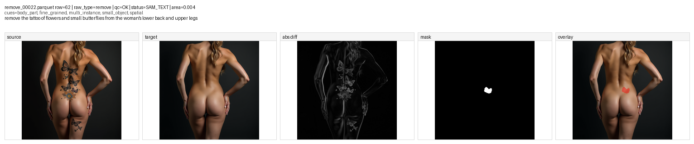

---

#### `remove_00035.parquet` row `247`

- 数据信息：`raw_type=remove | qc_flag=OK | qc_status=SAM_TEXT_BOX | area_frac=0.026`
- 指令：`remove the chains wrapped around the silver metal blade`
- 数据集位置：
  - 原始数据：`/mnt/bn/strategy-mllm-train/user/tanyue/datasets/CrispEdit-2M/remove_00035.parquet`
  - 最终打标结果：`/mnt/bn/strategy-mllm-train/user/tanyue/datasets/CrispEdit-2M-mask-parquet-101697/remove_00035.parquet`
  - 复查图：`/opt/tiger/tanyue/sam3-crispedit/docs_assets/bad_case_review_20260826/mask_failures/remove_00035__row247_review.png`
- 问题所在：
  - target 中 chains 已经被移除，编辑本身成立；
  - 但 final mask 只覆盖了其中一条 chain 的局部区域；
  - 没有覆盖“wrapped around the blade”的全部 chains，属于 **partial remove mask / missing multiple instances**。

---

#### `remove_00047.parquet` row `220`

- 数据信息：`raw_type=remove | qc_flag=OK | qc_status=SAM_TEXT_BOX | area_frac=0.008`
- 指令：`remove the snake tempting Adam and Eve with an apple`
- 数据集位置：
  - 原始数据：`/mnt/bn/strategy-mllm-train/user/tanyue/datasets/CrispEdit-2M/remove_00047.parquet`
  - 最终打标结果：`/mnt/bn/strategy-mllm-train/user/tanyue/datasets/CrispEdit-2M-mask-parquet-101697/remove_00047.parquet`
  - 复查图：`/opt/tiger/tanyue/sam3-crispedit/docs_assets/bad_case_review_20260826/mask_failures/remove_00047__row220_review.png`
- 问题所在：
  - snake 在 target 里已经被去掉，编辑本身成立；
  - 但 final mask 落在 Adam 头部 / 上半身附近；
  - 没有落在左下角 snake 原来的位置，属于 **wrong-region mask**。

---

#### `remove_00055.parquet` row `230`

- 数据信息：`raw_type=remove | qc_flag=OK | qc_status=SAM_TEXT | area_frac=0.089`
- 指令：`remove the realistic flowers and natural elements surrounding the woman's face`
- 数据集位置：
  - 原始数据：`/mnt/bn/strategy-mllm-train/user/tanyue/datasets/CrispEdit-2M/remove_00055.parquet`
  - 最终打标结果：`/mnt/bn/strategy-mllm-train/user/tanyue/datasets/CrispEdit-2M-mask-parquet-101697/remove_00055.parquet`
  - 复查图：`/opt/tiger/tanyue/sam3-crispedit/docs_assets/bad_case_review_20260826/mask_failures/remove_00055__row230_review.png`
- 问题所在：
  - source 中围绕 woman face 的 flowers / natural elements 在 target 里大多已被移除，编辑本身成立；
  - 但 final mask 只覆盖到几块局部，而且仍有位置和范围不完整的问题；
  - 属于 **partial multi-instance remove mask**。

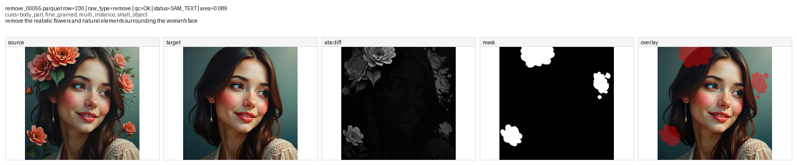

---

#### `remove_00059.parquet` row `248`

- 数据信息：`raw_type=remove | qc_flag=OK | qc_status=SAM_TEXT_BOX | area_frac=0.034`
- 指令：`remove the mushroom fungi growing inside the hollow planet`
- 数据集位置：
  - 原始数据：`/mnt/bn/strategy-mllm-train/user/tanyue/datasets/CrispEdit-2M/remove_00059.parquet`
  - 最终打标结果：`/mnt/bn/strategy-mllm-train/user/tanyue/datasets/CrispEdit-2M-mask-parquet-101697/remove_00059.parquet`
  - 复查图：`/opt/tiger/tanyue/sam3-crispedit/docs_assets/bad_case_review_20260826/mask_failures/remove_00059__row248_review.png`
- 问题所在：
  - mushrooms 在 target 里已经被移除，编辑本身成立；
  - 但 final mask 只覆盖了上方一簇 mushroom；
  - 其余 mushrooms 没被覆盖，属于 **partial remove mask / missing multiple instances**。

---

#### `remove_00070.parquet` row `133`

- 数据信息：`raw_type=remove | qc_flag=OK | qc_status=SAM_TEXT_BOX | area_frac=0.009`
- 指令：`remove the two tufts of fur that stick up from the top of the Puffletuft's head`
- 数据集位置：
  - 原始数据：`/mnt/bn/strategy-mllm-train/user/tanyue/datasets/CrispEdit-2M/remove_00070.parquet`
  - 最终打标结果：`/mnt/bn/strategy-mllm-train/user/tanyue/datasets/CrispEdit-2M-mask-parquet-101697/remove_00070.parquet`
  - 复查图：`/opt/tiger/tanyue/sam3-crispedit/docs_assets/bad_case_review_20260826/mask_failures/remove_00070__row133_review.png`
- 问题所在：
  - 按图看，真正被去掉的是两只耳朵 / 耳尖区域，而不只是一个很小的顶部毛簇；
  - 但 final mask 只落在耳朵顶部几个小碎块，没有把完整耳朵区域覆盖进去；
  - 属于 **under-mask / incomplete ear-region coverage**。

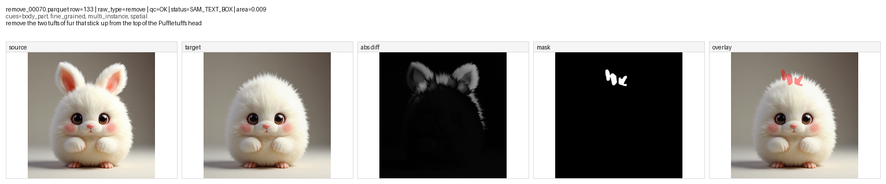

---

#### `remove_00083.parquet` row `133`

- 数据信息：`raw_type=remove | qc_flag=OK | qc_status=SAM_TEXT_BOX | area_frac=0.002`
- 指令：`remove the pastel blue flowers surrounding the girl`
- 数据集位置：
  - 原始数据：`/mnt/bn/strategy-mllm-train/user/tanyue/datasets/CrispEdit-2M/remove_00083.parquet`
  - 最终打标结果：`/mnt/bn/strategy-mllm-train/user/tanyue/datasets/CrispEdit-2M-mask-parquet-101697/remove_00083.parquet`
  - 复查图：`/opt/tiger/tanyue/sam3-crispedit/docs_assets/bad_case_review_20260826/mask_failures/remove_00083__row133_review.png`
- 问题所在：
  - source 中围绕女孩的 pastel blue flowers 在 target 里已被移除，编辑本身成立；
  - 但 final mask 只落在左侧一个很小的碎片，没有覆盖真实被删除的花朵群；
  - 属于 **severe under-mask**。

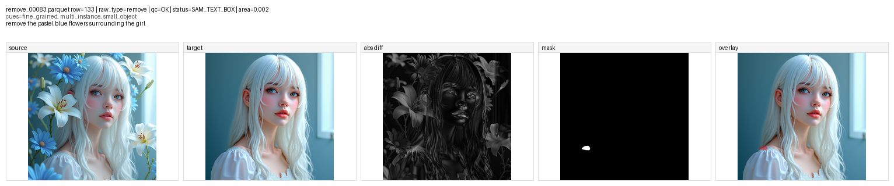

---

### `replace`

#### `replace_00007.parquet` row `131`

- 数据信息：`raw_type=replace | qc_flag=OK | qc_status=SAM_TEXT+SAM_TEXT | area_frac=0.012`
- 指令：`replace the small pink pastel flowers on her face with tiny golden stars`
- 数据集位置：
  - 原始数据：`/mnt/bn/strategy-mllm-train/user/tanyue/datasets/CrispEdit-2M/replace_00007.parquet`
  - 最终打标结果：`/mnt/bn/strategy-mllm-train/user/tanyue/datasets/CrispEdit-2M-mask-parquet-101697/replace_00007.parquet`
  - 复查图：`/opt/tiger/tanyue/sam3-crispedit/docs_assets/bad_case_review_20260826/mask_failures/replace_00007__row131_review.png`
- 问题所在：
  - source 中脸上的多朵 pink flowers 被替换成了 target 中的 golden stars，编辑本身成立；
  - 但 final mask 只覆盖一条细长区域，没有把多处替换位置整体覆盖起来；
  - 属于 **partial replace mask / missing multiple replaced regions**。

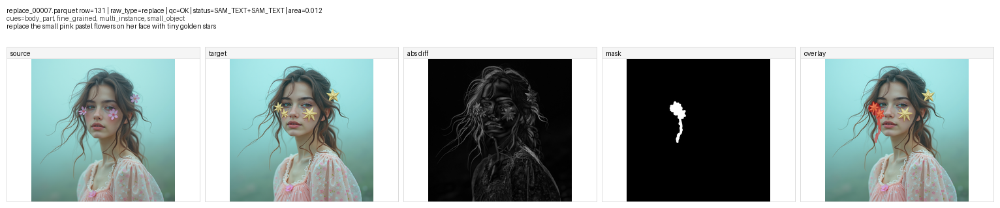

---

#### `replace_00013.parquet` row `38`

- 数据信息：`raw_type=replace | qc_flag=OK | qc_status=SAM_TEXT_BOX+SAM_TEXT | area_frac=0.024`
- 指令：`replace the Shabbat candles with a small oil lamp`
- 数据集位置：
  - 原始数据：`/mnt/bn/strategy-mllm-train/user/tanyue/datasets/CrispEdit-2M/replace_00013.parquet`
  - 最终打标结果：`/mnt/bn/strategy-mllm-train/user/tanyue/datasets/CrispEdit-2M-mask-parquet-101697/replace_00013.parquet`
  - 复查图：`/opt/tiger/tanyue/sam3-crispedit/docs_assets/bad_case_review_20260826/mask_failures/replace_00013__row38_review.png`
- 问题所在：
  - candles → oil lamp 的替换是成立的；
  - 但 final mask 一方面没有干净地覆盖完整替换区域，另一方面还额外带上了右上角一块不相干区域；
  - 属于 **mixed coverage / slightly wrong-region replace mask**。

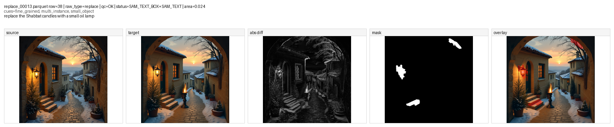

---

#### `replace_00033.parquet` row `92`

- 数据信息：`raw_type=replace | qc_flag=OK | qc_status=SAM_TEXT_BOX+SAM_TEXT_BOX | area_frac=0.005`
- 指令：`replace the Pestilence God with a giant tree bursting with vibrant flowers and glowing with a serene aura`
- 数据集位置：
  - 原始数据：`/mnt/bn/strategy-mllm-train/user/tanyue/datasets/CrispEdit-2M/replace_00033.parquet`
  - 最终打标结果：`/mnt/bn/strategy-mllm-train/user/tanyue/datasets/CrispEdit-2M-mask-parquet-101697/replace_00033.parquet`
  - 复查图：`/opt/tiger/tanyue/sam3-crispedit/docs_assets/bad_case_review_20260826/mask_failures/replace_00033__row92_review.png`
- 问题所在：
  - source 中巨大怪物被 target 中整棵 tree 替换，编辑本身成立；
  - 但 final mask 只落在树干底部一小条，完全没有覆盖主体替换区域；
  - 属于 **extreme under-mask**。

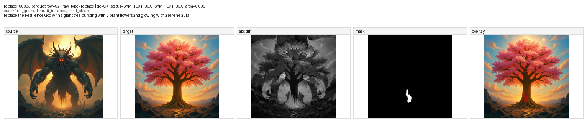

---

#### `replace_00047.parquet` row `66`

- 数据信息：`raw_type=replace | qc_flag=OK | qc_status=SAM_TEXT_BOX+SAM_TEXT_BOX | area_frac=0.008`
- 指令：`replace the crown made of hinges and cabinet legs with a crown made of flowers`
- 数据集位置：
  - 原始数据：`/mnt/bn/strategy-mllm-train/user/tanyue/datasets/CrispEdit-2M/replace_00047.parquet`
  - 最终打标结果：`/mnt/bn/strategy-mllm-train/user/tanyue/datasets/CrispEdit-2M-mask-parquet-101697/replace_00047.parquet`
  - 复查图：`/opt/tiger/tanyue/sam3-crispedit/docs_assets/bad_case_review_20260826/mask_failures/replace_00047__row66_review.png`
- 问题所在：
  - 真正被替换的是头部 crown；
  - 但 final mask 却落在人物下方腰部附近，不在 crown 区域；
  - 属于 **wrong-region mask**。

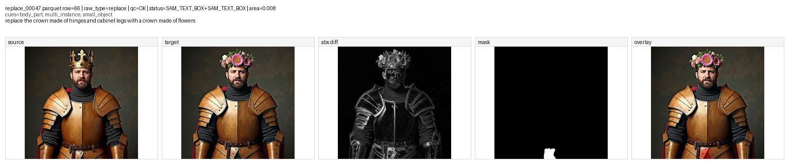

---

#### `replace_00063.parquet` row `149`

- 数据信息：`raw_type=replace | qc_flag=OK | qc_status=SAM_TEXT_BOX+SAM_TEXT | area_frac=0.050`
- 指令：`replace the biomechanically intricate maximal astrolabe eye implant with a simple pair of reading glasses`
- 数据集位置：
  - 原始数据：`/mnt/bn/strategy-mllm-train/user/tanyue/datasets/CrispEdit-2M/replace_00063.parquet`
  - 最终打标结果：`/mnt/bn/strategy-mllm-train/user/tanyue/datasets/CrispEdit-2M-mask-parquet-101697/replace_00063.parquet`
  - 复查图：`/opt/tiger/tanyue/sam3-crispedit/docs_assets/bad_case_review_20260826/mask_failures/replace_00063__row149_review.png`
- 问题所在：
  - 真正变化是头部 eye implant 被 reading glasses 替换；
  - 但 final mask 却大块覆盖下半身，只在头部留下一小块；
  - 属于 **severe wrong-region mask / target-shape spill**。

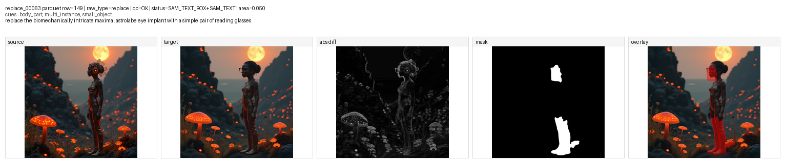

---

#### `replace_00072.parquet` row `53`

- 数据信息：`raw_type=replace | qc_flag=OK | qc_status=SAM_TEXT_BOX+SAM_TEXT | area_frac=0.013`
- 指令：`replace the various objects inside the person's head with swirling flowers`
- 数据集位置：
  - 原始数据：`/mnt/bn/strategy-mllm-train/user/tanyue/datasets/CrispEdit-2M/replace_00072.parquet`
  - 最终打标结果：`/mnt/bn/strategy-mllm-train/user/tanyue/datasets/CrispEdit-2M-mask-parquet-101697/replace_00072.parquet`
  - 复查图：`/opt/tiger/tanyue/sam3-crispedit/docs_assets/bad_case_review_20260826/mask_failures/replace_00072__row53_review.png`
- 问题所在：
  - source 中 head 里的 various objects 被替换成 target 中的 flowers，编辑本身成立；
  - 但 final mask 只给了头顶一小块和下方一小块，没有覆盖整个 head replace 区域；
  - 属于 **partial replace mask / wrong-region fragments**。

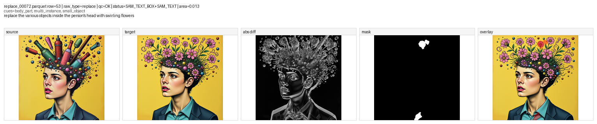

---

#### `replace_00080.parquet` row `77`

- 数据信息：`raw_type=replace | qc_flag=OK | qc_status=SAM_TEXT_BOX+SAM_TEXT | area_frac=0.040`
- 指令：`replace the absence of hands with elegantly detailed hands`
- 数据集位置：
  - 原始数据：`/mnt/bn/strategy-mllm-train/user/tanyue/datasets/CrispEdit-2M/replace_00080.parquet`
  - 最终打标结果：`/mnt/bn/strategy-mllm-train/user/tanyue/datasets/CrispEdit-2M-mask-parquet-101697/replace_00080.parquet`
  - 复查图：`/opt/tiger/tanyue/sam3-crispedit/docs_assets/bad_case_review_20260826/mask_failures/replace_00080__row77_review.png`
- 问题所在：
  - target 中新增 hands / forearm 区域是成立的；
  - 但 final mask 只覆盖了一部分手臂，没有把完整新增 limb 区域标出来；
  - 属于 **under-mask / incomplete limb coverage**。

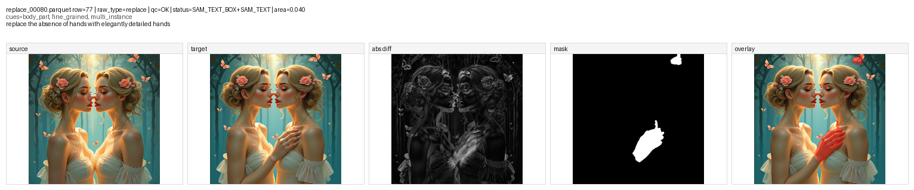

---
## 3. 补充参考：background raw mask 的 SAMTok codec probe

这部分不是当前生产 pipeline 的一环，只是补充回答一个问题：**如果直接把 background 类的 raw raster mask 送进已发布的 SAMTok codec 做 encode / decode，重建出来的 mask 会不会比原始 raster 更像一个可用的编辑先验。**

这里使用用户指定的 4 条 `background change` 样本，直接对 raw mask 做 codec round-trip。每张图标题里给出了 `area / IoU / Dice`；其中蓝色是 `raw mask`，红色是 `decoded mask`。

- 观察结论：
  - `decoded mask` 通常不能逐像素严格还原 `raw mask`，边界、细孔和尖细结构会被量化 / 平滑；
  - 但对 background 类编辑来说，它往往保住了更大尺度的“哪里属于背景编辑区域”的语义；
  - 和原始 raster 相比，decoded 结果通常更连贯、碎点更少，更像一个**可用的 background edit prior**；
  - 所以如果目标是得到一个“语义上更顺”的背景编辑区域先验，那么在这 4 条样本上，**SAMTok 重建结果看起来往往比 raw mask 更合适**；
  - 但它仍然不是精确 GT，不能替代生产标注 mask，也不应用来直接替换当前 bad-case 分析里的真值参考。

### `background change_00000.parquet` row `1`

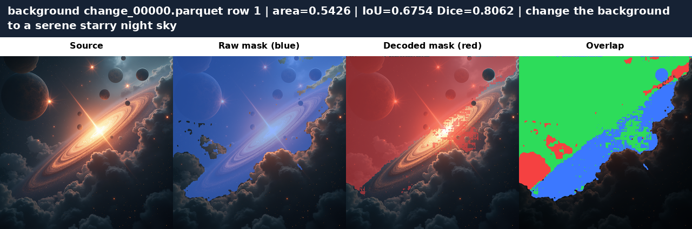

### `background change_00012.parquet` row `9`

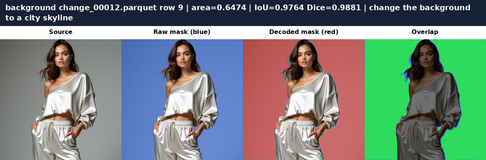

### `background change_00024.parquet` row `13`

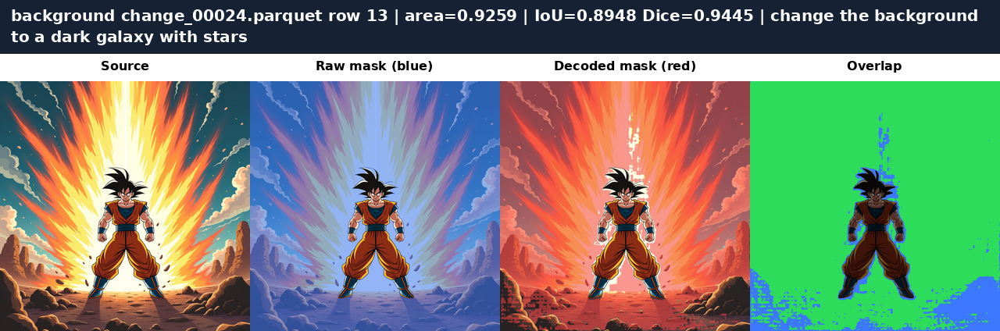

### `background change_00060.parquet` row `12`

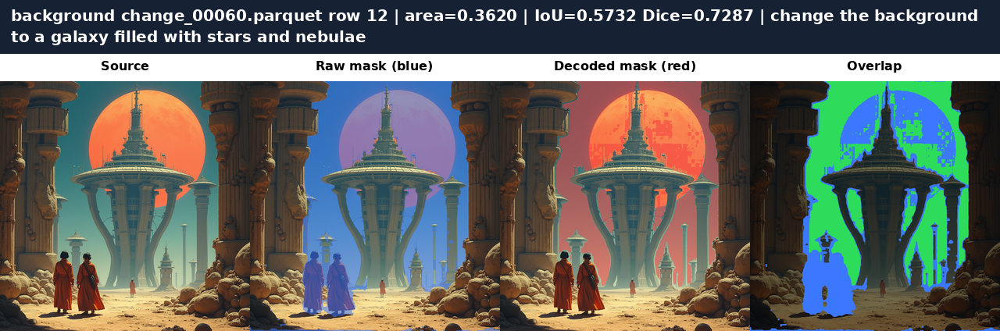
