# Bad case review (2026-08-26)

本文只分两类：

1. **prefilter 这一侧 bad case**：原始数据 / instruction 本身有问题，按理应该在 prefilter 阶段被筛掉；
2. **mask 打标这一侧 bad case**：source / target 的编辑基本成立，但 final mask 没有把真正的编辑区域标出来。

每条 case 只保留：**数据信息、图、数据集路径下的位置、问题所在**。

---

## 1. Prefilter 这一侧 bad case

### `motion change_00060.parquet` row `183`

- 数据信息：`raw_type=motion change | qc_flag=OK | qc_status=SAM_TEXT+SAM_TEXT | area_frac=0.122`
- 指令：`The subject adjusts their golf swing posture slightly.`
- 数据集位置：
  - 原始数据：`/mnt/bn/strategy-mllm-train/user/tanyue/datasets/CrispEdit-2M/motion change_00060.parquet`
  - 最终打标结果：`/mnt/bn/strategy-mllm-train/user/tanyue/datasets/CrispEdit-2M-mask-parquet-101697/motion change_00060.parquet`
  - 复查图：`/opt/tiger/tanyue/sam3-crispedit/docs_assets/bad_case_review_20260826/motion change_00060__row183_review.png`
- 问题所在：
  - source / target 之间可能有变化，但变化太轻微；
  - 肉眼很难稳定确认“是否真的按要求完成了编辑”；
  - 这类 `slightly` / `subtly` 的 motion instruction 不适合做稳定可审核数据，因此更应该在 prefilter 侧被筛掉。

---

### `remove_00011.parquet` row `225`

- 数据信息：`raw_type=remove | qc_flag=OK | qc_status=SAM_TEXT_BOX | area_frac=0.021`
- 指令：`remove the tentacles in the dystopian scene`
- 数据集位置：
  - 原始数据：`/mnt/bn/strategy-mllm-train/user/tanyue/datasets/CrispEdit-2M/remove_00011.parquet`
  - 最终打标结果：`/mnt/bn/strategy-mllm-train/user/tanyue/datasets/CrispEdit-2M-mask-parquet-101697/remove_00011.parquet`
  - 复查图：`/opt/tiger/tanyue/sam3-crispedit/docs_assets/bad_case_review_20260826/remove_00011__row225_review.png`
- 问题所在：
  - source 里看不到 tentacles；
  - target 里同样看不到 tentacles；
  - 这是典型的 **no-op false keep**，本应在 prefilter 阶段被 drop。

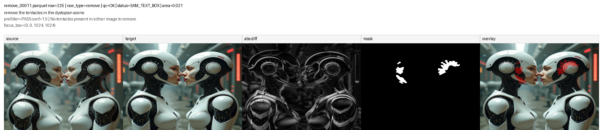

---

### `remove_00023.parquet` row `208`

- 数据信息：`raw_type=remove | qc_flag=OK | qc_status=SAM_TEXT_BOX | area_frac=0.011`
- 指令：`remove the antique engine parts surrounding the hybrid human jellyfish bodies`
- 数据集位置：
  - 原始数据：`/mnt/bn/strategy-mllm-train/user/tanyue/datasets/CrispEdit-2M/remove_00023.parquet`
  - 最终打标结果：`/mnt/bn/strategy-mllm-train/user/tanyue/datasets/CrispEdit-2M-mask-parquet-101697/remove_00023.parquet`
  - 复查图：`/opt/tiger/tanyue/sam3-crispedit/docs_assets/bad_case_review_20260826/remove_00023__row208_review.png`
- 问题所在：
  - target 里的变化并不清楚对应“围绕 jellyfish bodies 的 antique engine parts”；
  - 实际变化更像是边框、旧照片感、颗粒感之类的风格性变化；
  - 这说明 instruction 在 prefilter / 编辑阶段已经被理解偏了，属于 **semantic drift / wrong thing edited**。

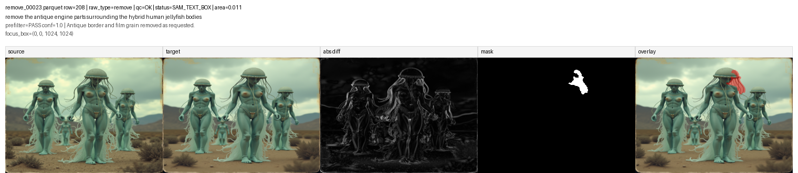

---

### `remove_00071.parquet` row `249`

- 数据信息：`raw_type=remove | qc_flag=OK | qc_status=SAM_TEXT_BOX | area_frac=0.003`
- 指令：`remove the dragon's eye in the background`
- 数据集位置：
  - 原始数据：`/mnt/bn/strategy-mllm-train/user/tanyue/datasets/CrispEdit-2M/remove_00071.parquet`
  - 最终打标结果：`/mnt/bn/strategy-mllm-train/user/tanyue/datasets/CrispEdit-2M-mask-parquet-101697/remove_00071.parquet`
  - 复查图：`/opt/tiger/tanyue/sam3-crispedit/docs_assets/bad_case_review_20260826/remove_00071__row249_review.png`
- 问题所在：
  - source 里没有 dragon's eye in the background；
  - target 里也没有；
  - 也是典型 **no-op false keep**，按理应在 prefilter 阶段被 drop。

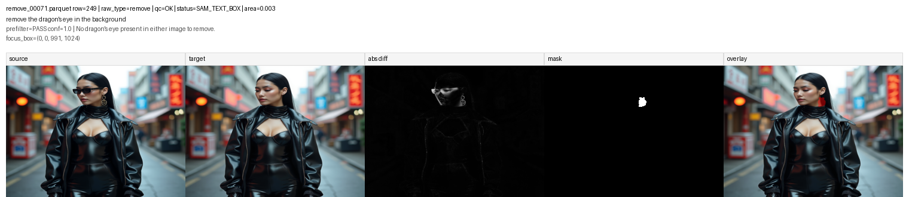

---

## 1.1 当前 prefilter 回归结果

在此前的 `fact` prefilter 回归复查中，除去已不再纳入 bad case 的样本后，当前仍保留的 4 条 prefilter 侧历史 false-keep 均已被正确 drop，原有 Class A/B 保护样本保持 8/8。

| Case | 旧结果 | 当前结果 | 结论 |
|---|---|---|---|
| `motion change_00060.parquet:183` | keep | drop | 已修复；没有稳定可见的姿态差异，change/match 均失败 |
| `remove_00011.parquet:225` | keep | drop | 已修复；source/target 都没有 tentacles，实际变化与 instruction 无关 |
| `remove_00023.parquet:208` | keep | drop | 已修复；只观察到色调变化，没有 antique engine parts 的移除 |
| `remove_00071.parquet:249` | keep | drop | 已修复；source/target 都没有 dragon's eye，实际变化发生在人物配饰 |

---

## 2. Mask 打标这一侧 bad case

### `add_00047.parquet` row `51`

- 数据信息：`raw_type=add | qc_flag=OK | qc_status=SAM_TEXT_BOX_ALIAS:array | area_frac=0.002`
- 指令：`Add an array of flowers decorating the arch located in the upper right of the image.`
- 数据集位置：
  - 原始数据：`/mnt/bn/strategy-mllm-train/user/tanyue/datasets/CrispEdit-2M/add_00047.parquet`
  - 最终打标结果：`/mnt/bn/strategy-mllm-train/user/tanyue/datasets/CrispEdit-2M-mask-parquet-101697/add_00047.parquet`
  - 复查图：`/opt/tiger/tanyue/sam3-crispedit/docs_assets/bad_case_review_20260826/mask_failures/add_00047__row51_review.png`
- 问题所在：
  - 编辑本身是成立的，target 中 arch 上确实新增了 flowers；
  - 但 final mask 只打到右侧一小片碎片；
  - 属于 **severe under-mask / tiny fragment only**。

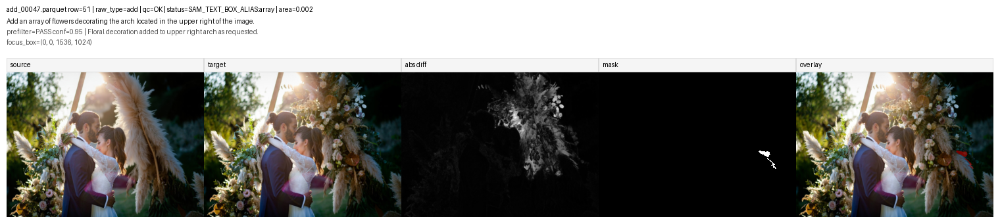

---

### `add_00071.parquet` row `245`

- 数据信息：`raw_type=add | qc_flag=OK | qc_status=SAM_TEXT_MULTI_BOX_ALIAS:bowl | area_frac=0.106`
- 指令：`Add a wooden bowl containing dark berries to the right-middle area of the image.`
- 数据集位置：
  - 原始数据：`/mnt/bn/strategy-mllm-train/user/tanyue/datasets/CrispEdit-2M/add_00071.parquet`
  - 最终打标结果：`/mnt/bn/strategy-mllm-train/user/tanyue/datasets/CrispEdit-2M-mask-parquet-101697/add_00071.parquet`
  - 复查图：`/opt/tiger/tanyue/sam3-crispedit/docs_assets/bad_case_review_20260826/mask_failures/add_00071__row245_review.png`
- 问题所在：
  - target 中新增 bowl 是成立的；
  - 但 final mask 把新增 bowl 和原本就存在的 bowl 混在了一起；
  - 属于 **target confusion / mixed old+new objects**。

---

### `add_00000.parquet` row `17`

- 数据信息：`raw_type=add | qc_flag=OK | qc_status=SAM_TEXT_BOX | area_frac=0.003`
- 指令：`Add the boats back to the marina`
- 数据集位置：
  - 原始数据：`/mnt/bn/strategy-mllm-train/user/tanyue/datasets/CrispEdit-2M/add_00000.parquet`
  - 最终打标结果：`/mnt/bn/strategy-mllm-train/user/tanyue/datasets/CrispEdit-2M-mask-parquet-101697/add_00000.parquet`
  - 复查图：`/opt/tiger/tanyue/sam3-crispedit/docs_assets/bad_case_review_20260826/mask_failures/add_00000__row17_review.png`
- 问题所在：
  - target 中 marina 里确实加回了多条 boats，编辑本身成立；
  - 但 final mask 只落在其中一小块局部，没把新增 boats 整体覆盖起来；
  - 对这种多条小船一起新增的场景，当前结果明显偏成了 **partial add mask / missing multiple small instances**。

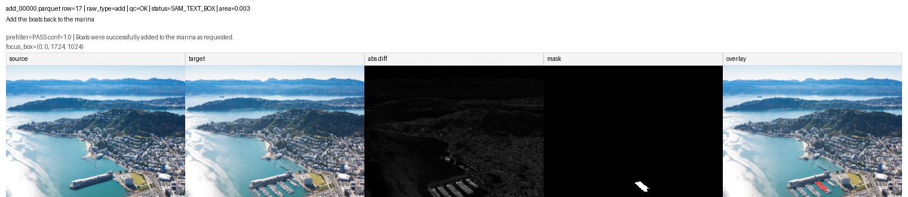

---

### `color_00061.parquet` row `5`

- 数据信息：`raw_type=color | qc_flag=OK | qc_status=SAM_TEXT_BOX | area_frac=0.012`
- 指令：`change the color of Xenomorph to gold`
- 数据集位置：
  - 原始数据：`/mnt/bn/strategy-mllm-train/user/tanyue/datasets/CrispEdit-2M/color_00061.parquet`
  - 最终打标结果：`/mnt/bn/strategy-mllm-train/user/tanyue/datasets/CrispEdit-2M-mask-parquet-101697/color_00061.parquet`
  - 复查图：`/opt/tiger/tanyue/sam3-crispedit/docs_assets/bad_case_review_20260826/mask_failures/color_00061__row5_review.png`
- 问题所在：
  - 整个主体已经明显被改成 gold；
  - 但 final mask 只打到头部附近一小块；
  - 属于 **severe under-mask on full-body recolor**。

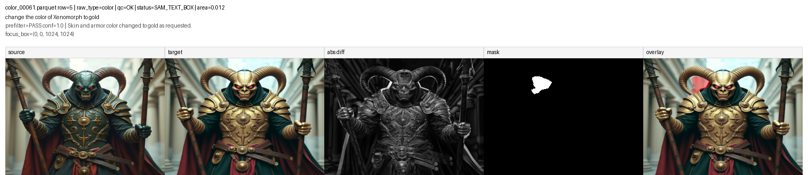

---

### `color_00000.parquet` row `25`

- 数据信息：`raw_type=color | qc_flag=OK | qc_status=SAM_TEXT | area_frac=0.005`
- 指令：`Turn motorcycle positioned in the right-central area into red`
- 数据集位置：
  - 原始数据：`/mnt/bn/strategy-mllm-train/user/tanyue/datasets/CrispEdit-2M/color_00000.parquet`
  - 最终打标结果：`/mnt/bn/strategy-mllm-train/user/tanyue/datasets/CrispEdit-2M-mask-parquet-101697/color_00000.parquet`
  - 复查图：`/opt/tiger/tanyue/sam3-crispedit/docs_assets/bad_case_review_20260826/mask_failures/color_00000__row25_review.png`
- 问题所在：
  - target 里的右侧 motorcycle 已经明显改成红色，编辑本身成立；
  - 但 final mask 只打到车身上一小块 patch；
  - 没有覆盖整辆 motorcycle 的主要改色区域，属于 **severe under-mask on full-object recolor**。

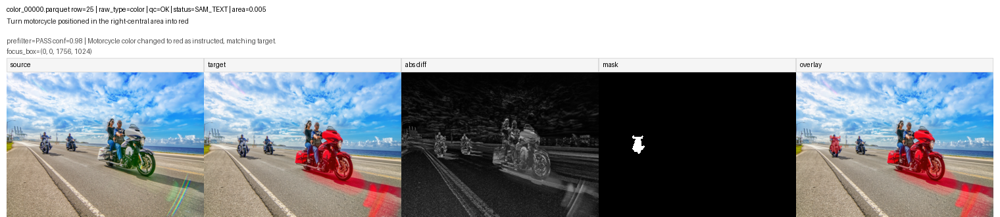

---

### `motion change_00012.parquet` row `40`

- 数据信息：`raw_type=motion change | qc_flag=OK | qc_status=SAM_TEXT+SAM_TEXT | area_frac=0.830`
- 指令：`The man tilts the power drill downward.`
- 数据集位置：
  - 原始数据：`/mnt/bn/strategy-mllm-train/user/tanyue/datasets/CrispEdit-2M/motion change_00012.parquet`
  - 最终打标结果：`/mnt/bn/strategy-mllm-train/user/tanyue/datasets/CrispEdit-2M-mask-parquet-101697/motion change_00012.parquet`
  - 复查图：`/opt/tiger/tanyue/sam3-crispedit/docs_assets/bad_case_review_20260826/mask_failures/motion_change_00012__row40_review.png`
- 问题所在：
  - target 里的动作编辑是成立的；
  - 真正变化主要在 drill、手臂和邻近工作区域；
  - 但 final mask 几乎吞掉整个人和大片工作台，属于 **over-mask / near whole-person region**。

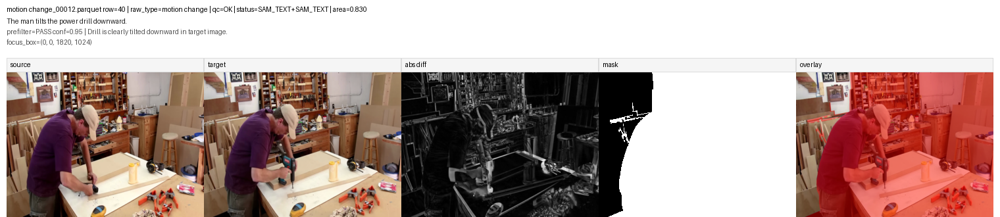

---

### `motion change_00024.parquet` row `178`

- 数据信息：`raw_type=motion change | qc_flag=OK | qc_status=SAM_TEXT+SAM_TEXT_BOX | area_frac=0.102`
- 指令：`The person lowers their hands to their sides.`
- 数据集位置：
  - 原始数据：`/mnt/bn/strategy-mllm-train/user/tanyue/datasets/CrispEdit-2M/motion change_00024.parquet`
  - 最终打标结果：`/mnt/bn/strategy-mllm-train/user/tanyue/datasets/CrispEdit-2M-mask-parquet-101697/motion change_00024.parquet`
  - 复查图：`/opt/tiger/tanyue/sam3-crispedit/docs_assets/bad_case_review_20260826/mask_failures/motion_change_00024__row178_review.png`
- 问题所在：
  - target 里 hands lowered 这件事是成立的；
  - 但 final mask 主要落在人物右半边身体，而不是两只手的动作区域；
  - 属于 **wrong granularity / body chunk instead of hands**。

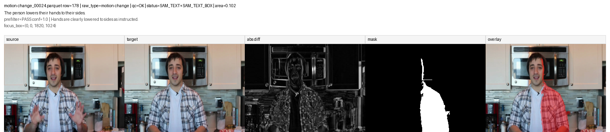

---

### `motion change_00072.parquet` row `219`

- 数据信息：`raw_type=motion change | qc_flag=OK | qc_status=SAM_TEXT+SAM_TEXT | area_frac=0.749`
- 指令：`The person switches from holding a clipboard to writing on it with a pen.`
- 数据集位置：
  - 原始数据：`/mnt/bn/strategy-mllm-train/user/tanyue/datasets/CrispEdit-2M/motion change_00072.parquet`
  - 最终打标结果：`/mnt/bn/strategy-mllm-train/user/tanyue/datasets/CrispEdit-2M-mask-parquet-101697/motion change_00072.parquet`
  - 复查图：`/opt/tiger/tanyue/sam3-crispedit/docs_assets/bad_case_review_20260826/mask_failures/motion_change_00072__row219_review.png`
- 问题所在：
  - source / target 的动作变化很清楚，编辑本身成立；
  - 真正该标的是 `hand + pen + clipboard` 这一局部交互区域；
  - 但 final mask 扩成了大半个人和大片背景，属于 **over-mask / near whole-person region**。

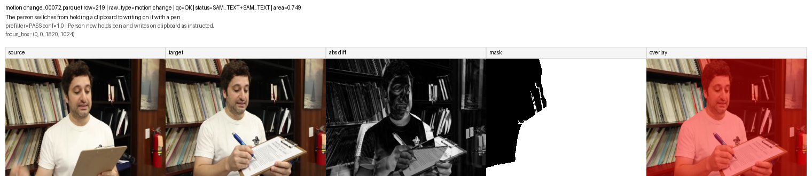

---

### `remove_00000.parquet` row `51`

- 数据信息：`raw_type=remove | qc_flag=OK | qc_status=SAM_TEXT_BOX | area_frac=0.004`
- 指令：`remove the flowers surrounding the old black woman tourist`
- 数据集位置：
  - 原始数据：`/mnt/bn/strategy-mllm-train/user/tanyue/datasets/CrispEdit-2M/remove_00000.parquet`
  - 最终打标结果：`/mnt/bn/strategy-mllm-train/user/tanyue/datasets/CrispEdit-2M-mask-parquet-101697/remove_00000.parquet`
  - 复查图：`/opt/tiger/tanyue/sam3-crispedit/docs_assets/bad_case_review_20260826/mask_failures/remove_00000__row51_review.png`
- 问题所在：
  - target 中左侧 flowers 已经被移除，编辑本身成立；
  - 但 final mask 完全没有落在左侧 flower bed 上，而是只落在人物前景附近一个小碎片位置；
  - 属于 **wrong-region mask**。

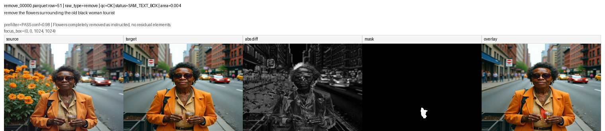

---

### `remove_00001.parquet` row `127`

- 数据信息：`raw_type=remove | qc_flag=TOO_LARGE_LOCAL | qc_status=SAM_TEXT_BOX | area_frac=0.965`
- 指令：`remove the narrow floral frame surrounding the bouquet`
- 数据集位置：
  - 原始数据：`/mnt/bn/strategy-mllm-train/user/tanyue/datasets/CrispEdit-2M/remove_00001.parquet`
  - 最终打标结果：`/mnt/bn/strategy-mllm-train/user/tanyue/datasets/CrispEdit-2M-mask-parquet-101697/remove_00001.parquet`
  - 复查图：`/opt/tiger/tanyue/sam3-crispedit/docs_assets/bad_case_review_20260826/mask_failures/remove_00001__row127_review.png`
- 问题所在：
  - target 中窄 floral frame 确实被移除了，编辑本身成立；
  - 但 final mask 几乎把整张图都打满了，远大于真正的边框区域；
  - 属于 **extreme over-mask / near whole-image region**。

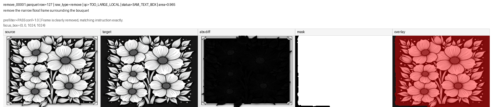

---

### `remove_00035.parquet` row `247`

- 数据信息：`raw_type=remove | qc_flag=OK | qc_status=SAM_TEXT_BOX | area_frac=0.026`
- 指令：`remove the chains wrapped around the silver metal blade`
- 数据集位置：
  - 原始数据：`/mnt/bn/strategy-mllm-train/user/tanyue/datasets/CrispEdit-2M/remove_00035.parquet`
  - 最终打标结果：`/mnt/bn/strategy-mllm-train/user/tanyue/datasets/CrispEdit-2M-mask-parquet-101697/remove_00035.parquet`
  - 复查图：`/opt/tiger/tanyue/sam3-crispedit/docs_assets/bad_case_review_20260826/mask_failures/remove_00035__row247_review.png`
- 问题所在：
  - target 中 chains 已经被移除，编辑本身成立；
  - 但 final mask 只覆盖了其中一条 chain 的局部区域；
  - 没有覆盖“wrapped around the blade”的全部 chains，属于 **partial remove mask / missing multiple instances**。

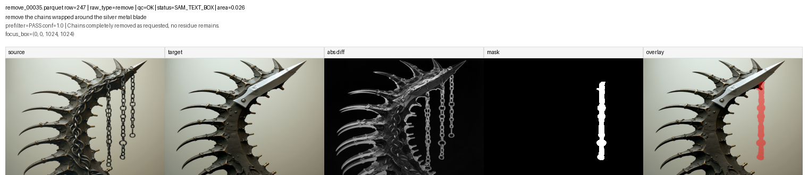

---

### `remove_00047.parquet` row `220`

- 数据信息：`raw_type=remove | qc_flag=OK | qc_status=SAM_TEXT_BOX | area_frac=0.008`
- 指令：`remove the snake tempting Adam and Eve with an apple`
- 数据集位置：
  - 原始数据：`/mnt/bn/strategy-mllm-train/user/tanyue/datasets/CrispEdit-2M/remove_00047.parquet`
  - 最终打标结果：`/mnt/bn/strategy-mllm-train/user/tanyue/datasets/CrispEdit-2M-mask-parquet-101697/remove_00047.parquet`
  - 复查图：`/opt/tiger/tanyue/sam3-crispedit/docs_assets/bad_case_review_20260826/mask_failures/remove_00047__row220_review.png`
- 问题所在：
  - snake 在 target 里已经被去掉，编辑本身成立；
  - 但 final mask 落在 Adam 头部 / 上半身附近；
  - 没有落在左下角 snake 原来的位置，属于 **wrong-region mask**。

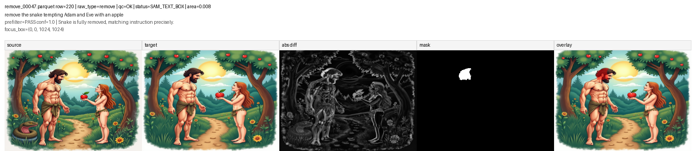

---

### `remove_00059.parquet` row `248`

- 数据信息：`raw_type=remove | qc_flag=OK | qc_status=SAM_TEXT_BOX | area_frac=0.034`
- 指令：`remove the mushroom fungi growing inside the hollow planet`
- 数据集位置：
  - 原始数据：`/mnt/bn/strategy-mllm-train/user/tanyue/datasets/CrispEdit-2M/remove_00059.parquet`
  - 最终打标结果：`/mnt/bn/strategy-mllm-train/user/tanyue/datasets/CrispEdit-2M-mask-parquet-101697/remove_00059.parquet`
  - 复查图：`/opt/tiger/tanyue/sam3-crispedit/docs_assets/bad_case_review_20260826/mask_failures/remove_00059__row248_review.png`
- 问题所在：
  - mushrooms 在 target 里已经被移除，编辑本身成立；
  - 但 final mask 只覆盖了上方一簇 mushroom；
  - 其余 mushrooms 没被覆盖，属于 **partial remove mask / missing multiple instances**。

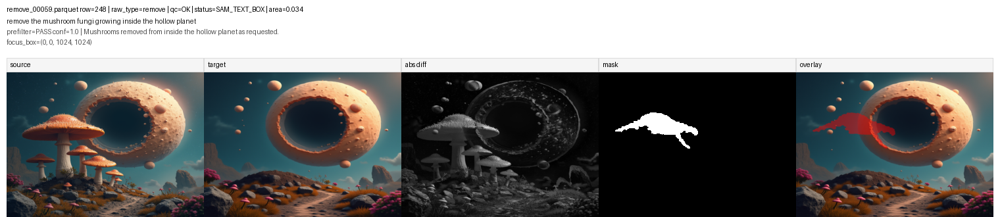

---

### `background change_00036.parquet` row `15`

- 数据信息：`raw_type=background change | qc_flag=OK | qc_status=OK | area_frac=0.428`
- 指令：`change the background to a royal palace ballroom`
- 数据集位置：
  - 原始数据：`/mnt/bn/strategy-mllm-train/user/tanyue/datasets/CrispEdit-2M/background change_00036.parquet`
  - 最终打标结果：`/mnt/bn/strategy-mllm-train/user/tanyue/datasets/CrispEdit-2M-mask-parquet-101697/background change_00036.parquet`
  - 复查图：`/opt/tiger/tanyue/sam3-crispedit/docs_assets/bad_case_review_20260826/reference/background_change_00036__row15_review.png`
- 问题所在：
  - target 的背景替换本身是成功的；
  - 但 final mask 几乎整块盖在人物前景上，而不是 ballroom 背景；
  - 这条最像 **foreground/background semantic inversion**，即背景编辑却写出了前景主体 mask。

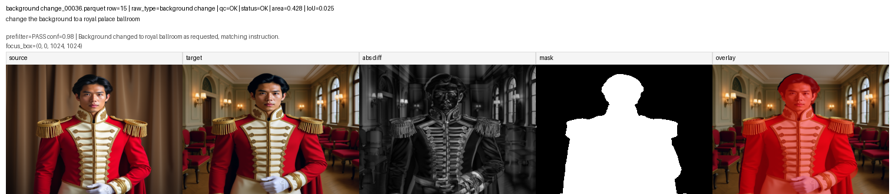
