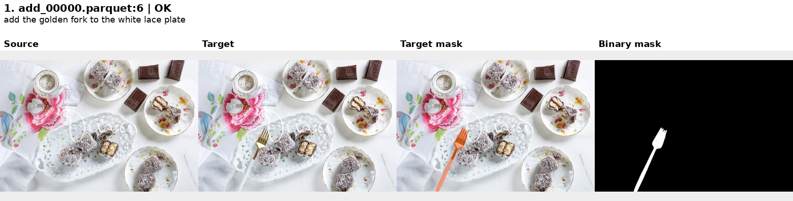
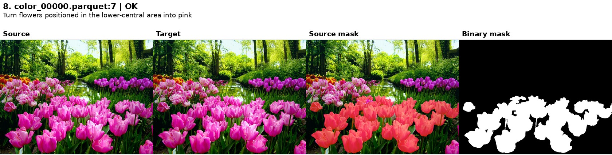
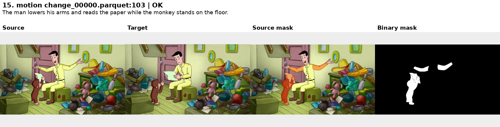
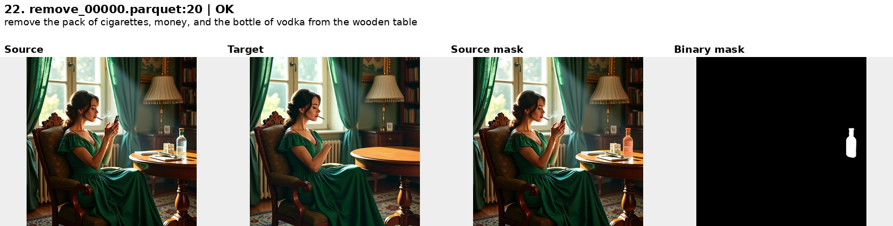
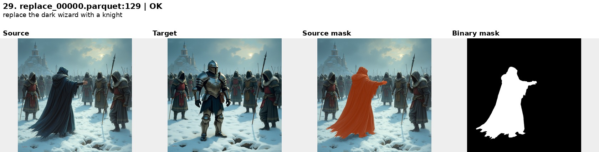

# CrispEdit 当前打标流程与正式结果

本文件只描述当前 CrispEdit 流程。四机入口见 [CRISPEDIT_4NODE.md](CRISPEDIT_4NODE.md)，方法迭代和历史实验见 [CRISPEDIT_MASK_ITERATION.md](CRISPEDIT_MASK_ITERATION.md)。最终运行已于 2026-09-26 完成并通过结构校验；自动 `OK` 不等于人工语义验收。

## 流程

仅处理 `add`、`color`、`motion change`、`remove`、`replace`，以原始 parquet 名及 `row_idx` 关联各阶段。

1. **图像对质量过滤**：Qwen3.8-27B/vLLM 查看 source、target、指令和类型。解析可见变化及指令匹配；全部质量条件通过才输出 `PASS`，否则 `FAIL` 或 `UNSURE`。只有 `PASS` 进入下一轮。实现见 [pair_quality.py](../crispedit/prefilter/pair_quality.py) 和 [pair_runner.py](../crispedit/prefilter/pair_runner.py)。
2. **细粒度场景过滤**：同模型查看 source、指令和类型，保留多实例选择、局部部位、可见关系锚点等难定位局部编辑；输出 `PASS`/`DROP`。此轮不看 target 或 mask。实现见 [benchmark_scene.py](../crispedit/difficulty/benchmark_scene.py) 和 [scene_runner.py](../crispedit/difficulty/scene_runner.py)。
3. **Grounding**：Qwen3.8-27B 首先观察 source、target、指令，按 SAM3 可分割粒度列出被编辑对象/部位及 ref；然后对待标图逐单元输出 0–1000 坐标框。非 `add` 只在 source 定位，`add` 在 target 定位新增内容。实现见 [checklist.py](../crispedit/mask/checklist.py) 和 [grounding_runner.py](../crispedit/mask/grounding_runner.py)。
4. **Mask**：每个框外扩 25% 后 crop，使用 ref、框和 SAM3 生成候选，按语义、包含度和形态风险选择；回贴至对应图像坐标（`add` 为 target，其余为 source）。输出 union PNG、逐实例 RLE、框和审计字段。定位失败保留 `GROUND_FAIL` 空 mask，需复核的结果标 `MASK_REVIEW`。实现见 [pipeline.py](../crispedit/mask/pipeline.py) 和 [runner.py](../crispedit/mask/runner.py)。

## 正式产物路径

统一根目录：`/mnt/bn/strategy-mllm-train/user/tanyue/CrispEdit-labeling/`。

| 内容 | 根目录下路径 | 说明 |
| --- | --- | --- |
| 源数据 | `source/CrispEdit-2M/` | 2,078 shard / 529,020 行；含历史 background/style，当前任务只调度五类 1,908 shard / 485,964 行 |
| 质量过滤 | `prefilter/quality/{audit,manifest}/` | 模型响应与逐行结论 |
| 细粒度过滤 | `prefilter/scene/{audit,manifest}/` | 模型响应与逐行结论 |
| 四机运行 | `runs/labeling_4node_crispedit_full_localenv_20260925/` | `plan.json`、`selection.json`、`work/`、`logs/`、`control/`、`reports/` |
| Grounding | `runs/labeling_4node_crispedit_full_localenv_20260925/labels/grounding/` | 双 PASS 稀疏行 |
| 最终 mask | `runs/labeling_4node_crispedit_full_localenv_20260925/labels/mask/` | 1,844 shard / 38,971 行 |

原 `datasets/CrispEdit-2M*` 三个正式目录和原 `experiments/CrispEdit/labeling_4node_crispedit_full_localenv_20260925` 现在是指向以上位置的兼容符号链接。历史 `plan.json`、日志和审计中仍记录当时路径，链接使这些记录可读。`work/` 和失败尝试的控制标记保留，不能仅凭旧 `.failed` 判断最新运行失败；最新 `control/retry_validate_fix_02/complete.ok` 表示全链路结构校验完成。

## 结果统计

质量/场景汇总覆盖根目录中的 2,078 个 shard，包括已保留的 170 个非本次调度类型的历史结果；本次五类 mask selection 为 38,971 条。

| 阶段 | 行数 / 结论 |
| --- | --- |
| 质量过滤 | 529,020 行：PASS 460,518；FAIL 68,501；UNSURE 1 |
| 细粒度过滤 | 460,518 行：PASS 38,971；DROP 421,547 |
| Mask | 38,971 行：OK 37,728（96.81%）；MASK_REVIEW 910；GROUND_FAIL 333 |

Mask 中非空 38,583（99.00%），验证实例 62,013，运行时错误 0。Grounding 解析失败 7 行、观察解析失败 4 行，均留在可恢复的 `GROUND_FAIL` 行中；不可恢复解析错误 0。存在 361 条 source canvas 诊断和 21 条 unresolved change，详见 [validation_summary.json](/mnt/bn/strategy-mllm-train/user/tanyue/CrispEdit-labeling/runs/labeling_4node_crispedit_full_localenv_20260925/labels/validation_summary.json)。

| 类型 | 双 PASS | OK | MASK_REVIEW | GROUND_FAIL |
| --- | ---: | ---: | ---: | ---: |
| add | 3,654 | 3,563 | 82 | 9 |
| color | 11,833 | 11,485 | 220 | 128 |
| motion change | 614 | 488 | 69 | 57 |
| remove | 13,713 | 13,276 | 352 | 85 |
| replace | 9,157 | 8,916 | 187 | 54 |

## 可视化复核

[最终统计与 35 条内嵌可视化 HTML](/mnt/bn/strategy-mllm-train/user/tanyue/CrispEdit-labeling/runs/labeling_4node_crispedit_full_localenv_20260925/reports/crispedit_result_review_20260926.html)：按五种编辑类型抽 25 条 `OK`、5 条 `MASK_REVIEW`、5 条 `GROUND_FAIL`；每例展示 source、target、对应画布上的 overlay 和 binary mask。`add` 叠加在 target，其余叠加在 source。样本清单在 [selection.json](../docs_assets/final_review/selection.json)，这是定性检查，不是准确率的无偏估计。HTML 将图像内嵌，移动单个文件也可预览。

以下为 `OK` 的代表例，完整的各类 PASS 样本见 HTML：

人工抽样中，多数展示的 `OK` 例子定位合理，但自动 QC 仍会漏掉语义错误：`color_00020.parquet:65` 的 `OK` mask 似乎包含了未编辑的花环与鹿角，`remove_00254.parquet:222` 的 `OK` mask 则偏宽且碎。`remove_00001.parquet:116` 在 `MASK_REVIEW` 中选中了未编辑的球；`color_00003.parquet:33` 的明显编辑定位失败，被保留为 `GROUND_FAIL`。不可把 96.81% 自动 OK 率解释为 mask 准确率。

## 运行

四机正式运行的完整 clone、环境安装、日志及续传入口在 [CRISPEDIT_4NODE.md](CRISPEDIT_4NODE.md)。单机复核可用仓库 `.venv-crispedit/bin/python` 和 `scripts/review_crispedit_masks.py`，传入上述 source、mask、`selection.json` 与 [report_intro.html](../docs_assets/final_review/report_intro.html) 重建画廊。不要向已经完成的正式 `labels/` 写入实验结果。
