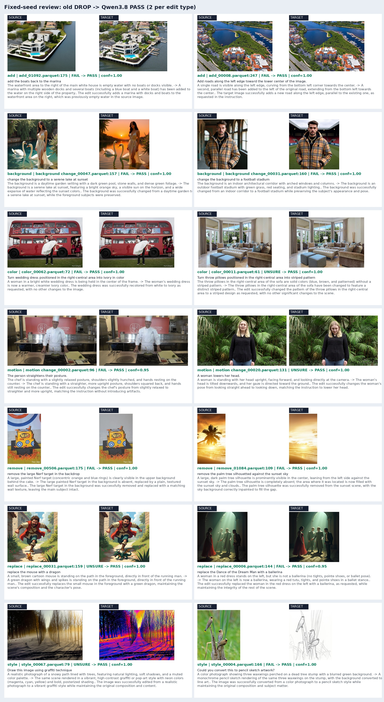
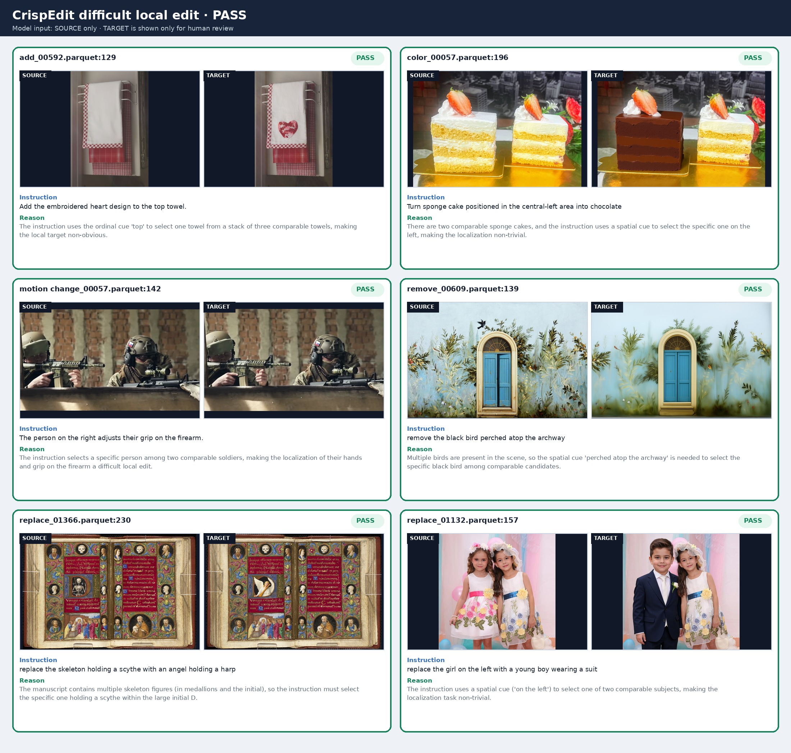
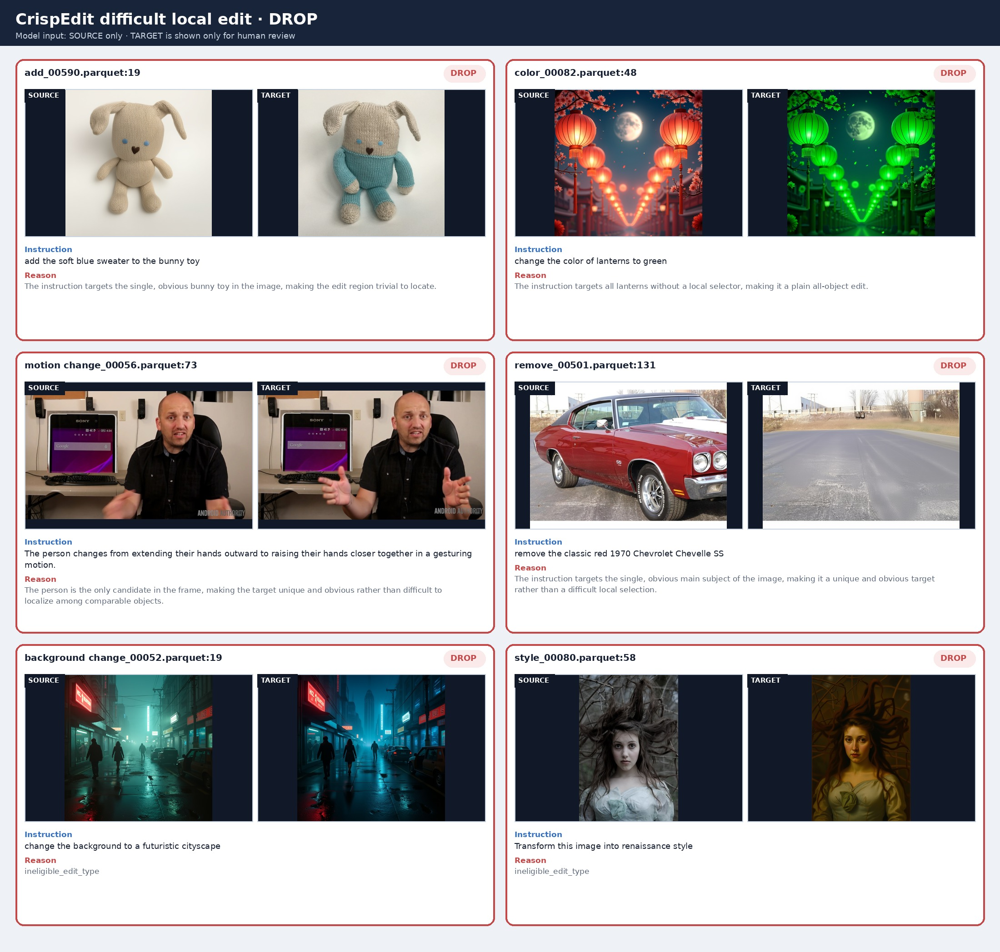
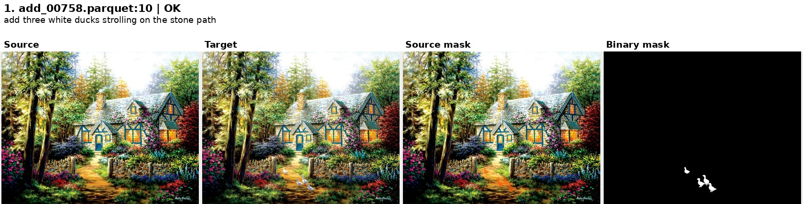
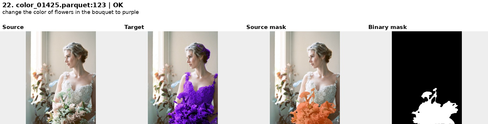

# CrispEdit：当前两阶段筛选与 mask 打标

仅记录当前实现。历史尝试、坏例和计划见[迭代记录](CRISPEDIT_MASK_ITERATION.md)；四机完整入口见[四机运行](CRISPEDIT_4NODE.md)。两阶段筛选已有生产结果，最新 mask 已做小批量验证，尚未完成全量质量验收。自动 `OK` 不等于语义正确。

## 1. 方法与实现

```text
原始 source / target / instruction / type
 → Qwen3.8 图像对质量：仅 PASS
 → Qwen3.8 难定位局部编辑：仅 PASS
 → Qwen3.8 双图观察编辑单元 → 单图 grounding
 → 框外扩 crop → SAM3 候选选择 → 原图坐标 mask → 校验
```

仅处理 add、color、motion change、remove、replace，不处理 background/style。不改原图，以原始 parquet 名和 row_idx 关联。

### 图像对质量

每条一次主请求，输入 source、target、instruction、type，不做框/crop。先描述编辑前后可见事实，再判断六项：指代有效性、指令有意义、编辑完成度、源图完整性、目标图完整性、非编辑内容保持。

代码计算最终结论：全 PASS 才保留，任一 FAIL 则 FAIL，否则 UNSURE。`visible_change=NONE` 或 `instruction_match=FAIL` 强制编辑完成度失败，不确定证据不能产生 PASS。JSON 解析失败最多纠错一次，仍失败不保留。仅 PASS 进入第二阶段。

实现：[pair_quality.py](../crispedit/prefilter/pair_quality.py)（prompt/规则）、[pair_runner.py](../crispedit/prefilter/pair_runner.py)（vLLM 批推理）。响应在 `audit/`，逐行结论在 `manifest/`。

### 难定位局部编辑

仅输入 source、instruction、type，不看 target/mask。保留多实例中选择对象/子集、定位被选中对象的局部部位、依据可见锚点关系定位的编辑。唯一明显目标、全局改动、无选择器的全体编辑、歧义指代、仅按画布绝对位置新增，输出 DROP。最终只有 PASS / DROP，解析失败 DROP。

实现：[benchmark_scene.py](../crispedit/difficulty/benchmark_scene.py)、[scene_runner.py](../crispedit/difficulty/scene_runner.py)。两个 manifest 严格对齐，仅双 PASS 才执行 mask 推理。

### 编辑单元 → 定位 → SAM3 mask

1. **观察**：Qwen3.8 输入 source + target + instruction，描述实际编辑，拆成 SAM 可独立分割的对象/部位单元。每项保留 ID、描述、位置、对应侧的 ref；多实例分别列出。
2. **定位**：Qwen3.8 输入单张待标图和编辑清单，逐项返回 ID 与 xyxy 框（0–1000 归一化）或 unresolved。非 add 仅 source；add 在 target 定位新增内容。坐标换算到该图尺寸，检查 ID 对齐，截断 JSON 不当成功。
3. **分割**：框四周扩 25%（每边至少 8px）后 crop；框占图像面积 ≥65% 则用全图。第一轮 ref 与换算后的框输入 SAM3，生成文本、文本+框、框提示候选，按语义约束、框包含度、实例匹配和形态风险选择，不合并所有候选。
4. **后处理**：整物、部位、稀疏对象分别处理，只清理相对很小的噪声/孔洞，不全局填洞。保留受限附件补全、防稀疏物过标。crop mask 回贴原图；非 add 只标 source，add 的 target mask 映射到 source 尺寸。
5. **输出**：union 二值 PNG（白=编辑区域）、逐实例 RLE、框、ref、审计信息。校验筛选来源、行号、尺寸、像素数及实例/union 一致性。`GROUND_FAIL` / `MASK_REVIEW` 单列待复查。

实现：[checklist.py](../crispedit/mask/checklist.py)（prompt）、[grounding.py](../crispedit/mask/grounding.py)（请求/解析）、[grounding_runner.py](../crispedit/mask/grounding_runner.py)、[pipeline.py](../crispedit/mask/pipeline.py)（SAM 策略）、[regions.py](../crispedit/mask/regions.py)、[candidates.py](../crispedit/mask/candidates.py)、[runner.py](../crispedit/mask/runner.py)。所有 MLLM 均 Qwen3.8-27B/vLLM，不启用额外 thinking 或实验性复核轮。

## 2. 路径与生产结果

基目录：`/mnt/bn/strategy-mllm-train/user/tanyue`。以下为 2026-09-24 已完成结果；当天四机全量尝试在环境初始化失败，新增筛选结果为 0，故下表不变。

| 内容 | 基目录下路径 | 规模 |
| --- | --- | ---: |
| 源数据 | `datasets/CrispEdit-2M` | 2,078 shard / 529,020 行 |
| 质量结果 | `datasets/CrispEdit-2M-qwen38-pair-prefilter` | 已处理旧 1,298 shard / 330,245 行 |
| 场景结果 | `datasets/CrispEdit-2M-difficult-local-edit` | 已处理旧 1,298 shard / 285,676 行 |
| 历史 mask 试验 | `datasets/CrispEdit-2M-difficult-local-edit-labeling` | 各轮独立目录 |
| 当前 65 条试验 | `experiments/CrispEdit/mask_fresh65_doublepass_20260923` | 已有双 PASS，未曾打 mask |
| 当前新增数据试验 | `experiments/CrispEdit/mask_newdownload64_20260923` | 64 条 |

源目录总数包含历史保留的 background 84、style 86 个 shard，原数据不删除；当前四机任务仅调度其余 1,908 个 shard。
新增 780 shard / 198,775 行均为所需类型，已合入源目录，尚未全量通过两轮筛选。四机入口复用已完成结果、补齐缺失 shard，再对所需类型总的双 PASS 集合打 mask。

| 筛选 | 输入 | 保留 | 其余 |
| --- | ---: | ---: | ---: |
| 质量 | 330,245 | 285,676（86.50%） | 44,568 FAIL + 1 UNSURE |
| 场景 | 285,676 | 19,516（6.83%） | 266,160 DROP |

两阶段生产记录无解析/worker 错误。`color_00070.parquet:252` 已按人工确认剔除：质量 FAIL/drop，场景删除该行。原图/历史响应保留，审计在质量目录 `review/manual_exclusion_color_00070_252/`。增量运行保留该覆盖，不重写已完成结果。

## 3. 单机 8 卡运行

在节点本地 clone 后运行 `bash scripts/setup_crispedit_env.sh`，创建本地 `.uv-python` 和 `.venv-crispedit`（统一 Qwen/vLLM + SAM3，只安装 headless OpenCV）。以下在同一 shell 顺序执行；独立复跑应换新结果路径，不使用 `--overwrite`。四机默认先通过各节点真实双图推理预检查再处理数据，完整入口见四机指南。

```bash
cd /opt/tiger/tanyue/sam3-crispedit-crispedit-labeling
PY="$PWD/.venv-crispedit/bin/python"
DATA=/mnt/bn/strategy-mllm-train/user/tanyue/datasets
MODEL=/mnt/bn/strategy-mllm-train/user/tanyue/models/pretrained_models/Qwen3.8-27B

"$PY" -u crispedit_pair_prefilter.py \
  --input-dir "$DATA/CrispEdit-2M" \
  --output-dir "$DATA/CrispEdit-2M-qwen38-pair-prefilter" \
  --model-path "$MODEL" --devices 0,1,2,3,4,5,6,7 \
  --include-types add,color,motion,remove,replace \
  --tensor-parallel-size 1 --batch-size 4 --vllm-max-num-seqs 4 \
  --vllm-max-model-len 8192 --vllm-gpu-memory-utilization 0.85 \
  --max-new-tokens 1024 --parse-retries 1 --progress-mininterval 5

"$PY" -u crispedit_benchmark_scene_filter.py \
  --input-dir "$DATA/CrispEdit-2M" \
  --prefilter-manifest-dir "$DATA/CrispEdit-2M-qwen38-pair-prefilter/manifest" \
  --output-dir "$DATA/CrispEdit-2M-difficult-local-edit" \
  --model-path "$MODEL" --devices 0,1,2,3,4,5,6,7 \
  --include-types add,color,motion,remove,replace \
  --tensor-parallel-size 1 --batch-size 4 --vllm-max-num-seqs 4 \
  --vllm-max-model-len 8192 --vllm-gpu-memory-utilization 0.85 \
  --max-new-tokens 256 --parse-retries 1 --progress-mininterval 5

export CRISPEDIT_VLLM_PYTHON="$PY" CRISPEDIT_SAM_PYTHON="$PY"
bash scripts/run_crispedit_mask_pipeline.sh \
  /mnt/bn/strategy-mllm-train/user/tanyue/experiments/CrispEdit/mask_current_run
```

mask 默认 grounding TP=2、batch=16（每机 4 个 vLLM 实例），SAM3 每卡一个进程。可用 `CRISPEDIT_BATCH_SIZE=4` 降批大小。必须先补齐全部输入 shard 的两阶段 manifest；缺失结果不是 DROP。

小批量：mask 脚本第二个参数传 `selection.json`，格式 `{"cases":[{"shard":"add_00001.parquet","row_idx":7}]}`。不传 selection 时，直接 mask 入口保留未通过行的 `PREFILTER_SKIP` 占位；四机入口冻结双 PASS selection，mask 输出仅含选中行，仍保留原始 row_idx。

mask 目录包含 `grounding/`、`mask/`、`grounding.log`、`mask.log`、`validation_summary.json`。两轮筛选各包含 `run_summary.json`、`audit/`、`manifest/`。均支持 tqdm；四机日志和 tmux 示例见[运行指南](CRISPEDIT_4NODE.md)。可视化参数见 `"$PY" scripts/review_crispedit_masks.py --help`。

## 4. 当前可视化与验证

质量按类型固定种子抽样（首批 985 shard，非全量准确率评测）：[逐例清单](../docs_assets/prefilter/qwen38_full_selection.json)。




场景[逐例清单](../docs_assets/benchmark_scene_filter/full_run_representative_cases.json)。target 仅供人工核对，未输入第二阶段模型。





当前 mask 三组实验（互不混合统计）：

| 样本 | 完成 | OK / REVIEW / GROUND_FAIL | 非空 | 结果 |
| --- | ---: | --- | ---: | --- |
| 固定回归与补充 | 115 | 109 / 4 / 2 | 113 | [其中 25 条审阅](/mnt/bn/strategy-mllm-train/user/tanyue/experiments/CrispEdit/repo_cleanup_20260924/docs_assets/mask_pipeline/instruction_units/scoped_previous25/index.html)、[补充 25 条](/mnt/bn/strategy-mllm-train/user/tanyue/experiments/CrispEdit/repo_cleanup_20260924/docs_assets/mask_pipeline/instruction_units/scoped_fresh25/index.html) |
| 已有双 PASS、未打 mask | 65 | 63 / 1 / 1 | 64 | [完整画廊](/mnt/bn/strategy-mllm-train/user/tanyue/experiments/CrispEdit/mask_fresh65_doublepass_20260923/review/index.html) |
| 新下载 shard 隔离筛选后 | 64 | 60 / 4 / 0 | 62 | [完整画廊](/mnt/bn/strategy-mllm-train/user/tanyue/experiments/CrispEdit/mask_newdownload64_20260923/review/index.html) |

后两组目录各含 `selection.json`、`pipeline.log`、`validation_summary.json`、`review_findings.md`。没有像素真值，不报告 IoU/准确率。画廊 binary 是最终 source 坐标的预测 mask。

代表例：新增鸭子（Source / Target / overlay / binary）。



失败例：首轮只列花束、漏掉衣服，自动 OK 仍可能语义漏标。



仍有漏实例/部位、局部扩大到宿主、稀疏物为空等问题。本次整理不声称修好了这些质量问题，后续见[迭代记录](CRISPEDIT_MASK_ITERATION.md)。

2026-09-24 整理后真实一机 8 卡、四 rank 全流程：五类各 4 条，质量 20 PASS，场景 19 PASS / 1 DROP，19 条均产出非空 mask（35 实例），0 解析/运行错误。
[本次 19 条画廊](/mnt/bn/strategy-mllm-train/user/tanyue/experiments/CrispEdit/pipeline_4rank_verified_20260924/cached_review/index.html)。该轮结果作为历史验证保留；当前运行已改为各节点 git clone 和本地安装，见[四机指南](CRISPEDIT_4NODE.md)。链路验证不代表质量问题已解决。

重建本次画廊（测试副本有重编号，原 shard / row_idx 映射在 `provenance.json`）：

```bash
PY="$PWD/.venv-crispedit/bin/python"
SMOKE=/mnt/bn/strategy-mllm-train/user/tanyue/experiments/CrispEdit/pipeline_4rank_verified_20260924
"$PY" scripts/review_crispedit_masks.py \
  --input-dir "$SMOKE/source" --mask-dir "$SMOKE/cached_run/labels/mask" \
  --selection-file "$SMOKE/cached_run/selection.json" --output-dir "$SMOKE/cached_review"
```
