# CrispEdit-2M 完整打标流程

本文是 CrispEdit-2M 的唯一主打标文档，覆盖 fact prefilter、Qwen3.5 grounding、
SAM3 mask、环境安装、全量命令、生产路径、结果口径和可视化。当前方法不使用
pixel diff。历史 legacy pipeline 仅用于回归对照，不是生产入口。

本汇总分支不会让 CrispEdit 与 ScaleEdit 共享可变的 mask policy：CrispEdit 使用
`crispedit/mask/pipeline.py` 中的生产版 `sam3-dual-prompt-region-fusion-v5-surface-aware`；
ScaleEdit v18 依赖的后续实现已原样隔离在 `scaleedit/sam3_backend.py`。

## 1. 输入、输出与生产路径

源 parquet 每行使用 `input_img`、`output_img`、`instruction` 和 `type`。三个阶段均保持
原 shard 文件名和 `row_idx` 对齐；prefilter drop 行在后续阶段保留 `PREFILTER_SKIP`
占位，不调用 Qwen3.5 或 SAM3。

| 内容 | 路径 |
| --- | --- |
| 原始数据 | `/mnt/bn/strategy-mllm-train/user/tanyue/datasets/CrispEdit-2M` |
| 新增 100k 输入视图 | `/mnt/bn/strategy-mllm-train/user/tanyue/datasets/CrispEdit-2M-additional-100k-input` |
| prefilter audit / manifest | `/mnt/bn/strategy-mllm-train/user/tanyue/datasets/CrispEdit-2M-fact-prefilter/audit` / `manifest` |
| Qwen3.5 grounding | `/mnt/bn/strategy-mllm-train/user/tanyue/datasets/CrispEdit-2M-grounding` |
| 最终 mask | `/mnt/bn/strategy-mllm-train/user/tanyue/datasets/CrispEdit-2M-mask` |
| runtime previews | `/mnt/bn/strategy-mllm-train/user/tanyue/datasets/CrispEdit-2M-mask-previews` |
| 新增 100k 运行记录 | `/mnt/bn/strategy-mllm-train/user/tanyue/datasets/CrispEdit-2M-mask-run-additional-100k-20260908` |
| 首批恢复运行记录 | `/mnt/bn/strategy-mllm-train/user/tanyue/datasets/CrispEdit-2M-mask-run-resumed-after-background-audit-20260831` |

## 2. 方法

### 2.1 Fact prefilter

```text
instruction + source + target
  -> Step 0: 解析 add/remove/replace/color/motion/background/style 原子目标
  -> Step 1: source 单图事实
  -> Step 2: target 单图事实
  -> 高置信 add/replace no-op fast path
  -> Step 3: 隐藏 instruction 的成对差异描述
  -> Step 4: 差异文本与 subgoals 匹配
  -> Step 5: 预算内边界样本的独立复核
  -> 确定性谓词 -> PASS / FAIL / UNSURE
```

Qwen3-VL-8B 只提取存在性、数量、属性、姿态、bbox、主体一致性和无关区域事实，
不直接输出 keep/drop。代码将证据归一化后检查 `change_happened`、
`blind_description_matches`、`same_subject`、`composition_preserved`、
`not_global_regeneration` 和 `unrelated_regions_preserved` 等谓词。映射固定为
`PASS -> keep`，`FAIL / UNSURE / ERROR -> drop`。

该阶段保留原生 Transformers batch inference，不是 vLLM 阶段。严格模板指令由代码解析；
重复 instruction 使用 worker 内 LRU cache；只有 remove/color/motion 等小目标依赖
source-guided target crop。非法 JSON 默认只对失败行追加一次纠错回合，仍失败则
fail-closed，不终止其他样本。

### 2.2 Grounding 与 mask 概览

```text
raw parquet + prefilter manifest
  → Qwen3.5 第一轮：按类别观察 realized edit 或 background protected foreground
  → Qwen3.5 第二轮：realized edit → region ref + conservative bbox
  → 小区域局部复核：高清 context crop → corrected complete-object bbox
  → grounding parquet
  → SAM3 bbox-only PVS
             + phrase-only PCS
             + phrase+bbox PCS
  → density-aware fusion / nearby tiny-region coverage
  → source-coordinate union mask parquet
```

调用次数不是每行固定常数。Prefilter 会根据确定性 slot parser、no-op fast path、
source-guided crop 和边界复核按需执行 Step 1--5；JSON 纠错只重试失败样本。Grounding
的正常路径是两轮 Qwen3.5：第一轮观察 realized edit，第二轮定位；小 bbox
会额外使用局部 crop 复核当前 candidate。Style 按既定 full-image 契约直接跳过
grounding MLLM。vLLM 只替换 Qwen3.5 grounding 的执行后端，prompt、parser、bbox
策略和 SAM3 后处理不因后端而分叉。

第一轮不输出坐标。instruction 只作为编辑意图，图片对是事实来源；模型需要明确实际修改
的对象、修改前后外观、空间布局和完整范围。color/material 类型额外提供四组 source/result
匹配局部放大图，并检查 face/head、neck、arms/hands、可见 legs/feet，避免 instruction
只提到手臂时漏掉同方向变化的脸部。

background change 使用不同的第一轮目标：不再要求模型把“背景变化”改写成待分割对象，
而是逐项审计 source/result 中身份与空间范围保持稳定、必须从背景 mask 排除的前景。天空、
地形、道路、水面、山林和通用植被在参与环境替换时仍属于背景。存在稳定人物、动物、产品、
建筑/道具时输出 `exclude_foreground` 并在第二轮给出完整保护框；若整幅可见场景都被转换且
没有独立稳定前景，则输出 `full_image`，最终直接生成全图 mask，不再把合法空框误报为
`GROUND_FAIL`。近邻同类小物合框，远距离同类实例分框，且第二轮必须逐项覆盖第一轮描述的
全部位置。

第二轮按“空间编辑区域”而不是按像素点出框。bbox 是 SAM 的 recall-first 搜索范围，必须
完整包含编辑区域并留有安全边距。相邻花朵、穿孔、花瓣、纹身、斑点等小元素使用一个
`aggregate_region` 框，不逐点出框；语义类别不同或空间明显分离的对象仍分别输出。

由于两张完整大图共同输入时，帽子、嘴、手、手持小物等小目标获得的视觉 token
有限，第二轮可能出现语义正确但框偏移，或只框住上/下半部。默认对短边小于
220（`[0,1000]` 坐标）的候选裁出带语境的局部图，放大后让模型独立复核完整边界。
新旧框明显重合、或者一框高度包含另一框时，取带小安全边距的并集，防止局部复核只看到
锤头等显著子部件；两框明显错位时只保留局部复核框，
避免将误定位的鼻子等区域并入嘴部框。若局部输出无法解析，则回退为对原框做较大的
recall-first 扩展。background/style 不使用这一复核，因为 background 的框表示需保护的前景，
不是编辑区域。原框、crop、局部原始输出和最终框都保存在 `bbox_refinement` 字段中便于审计。

每个 grounding item 包含：

```json
{
  "ref": "facial piercings",
  "bbox_2d": [220, 180, 750, 850],
  "region_mode": "aggregate_region",
  "mask_density": "sparse"
}
```

坐标固定为 `[0, 1000]`，与推理 resize 无关。`ref` 必须是可直接给 SAM3 的可见名词
短语；不能使用 change verb、抽象 absence，或把 hand 和 tablet 等不同语义类别混在
同一个短语中。

### 2.3 SAM3 候选与融合

对每个 region 同时运行三条路径：

1. **bbox-only PVS**：SAM3 visual prompt，返回 multimask；候选的 mask bbox 与 prompt
   bbox IoU 至少为 0.60，且至少 90% mask 位于局部 containment 区域内。
2. **phrase-only PCS**：SAM3 concept prompt；MLLM bbox 用于过滤同类但非编辑实例，至少
   80% mask 像素需要位于 containment 区域内。
3. **phrase+bbox PCS**：同时提供语义短语和 positive bbox，补回 phrase-only 漏掉的
   局部实例。

普通 object 优先空间明确的联合提示。aggregate region 在两路 PCS 互补时取并集；如果
某一路明显退化成包围物、背景或少量低置信 speck，则根据 fill ratio、候选数、置信度和
两路 IoU 拒绝异常候选。

对局部紧凑的 flower/petal/piercing/tattoo/spot 等小元素组，如果 PCS 找到至少 6 个实例
和 6 个小连通分量，则用实际语义 mask 的凸包生成实心连通区域。bbox 超过半图的全局
散布不做凸包；boat、chain 等重复大对象也不会进入该规则，避免跨背景形成巨大多边形。

其它实现细节：

- bbox 默认按自身尺寸外扩 2.5%；只有某一维小于图像短边 5% 时，该维才使用图像短边
  1.5% 的最小 margin，兼顾 tiny earring/finger 与正常 face/limb；
- color 编辑中的明确人体部位会转换为 `exposed human ... skin` 概念提示，由 bbox 锁定
  具体人物，减少整个人或衣服被当成 arms 的情况；
- target mask 映射到 source 坐标后，普通 mask 膨胀短边 1.5%，已连通区域膨胀 0.3%；
- 三条 SAM 路径全部失败时才回退为矩形；最终 parquet 会通过 `qc_flag` 标明 fallback；
- style 直接使用全图 mask；background 先分割需保护的前景，再取反得到背景。

不同编辑类型的路由如下：

| type | grounding | 最终 mask |
|---|---|---|
| add | target 新增区域；若同时有明确移除，也补 source | mapped target ∪ source collateral |
| remove | source 删除区域；若同时有明确新增，也补 target | source ∪ mapped target collateral |
| replace | source 旧物 + target 新物 | source ∪ mapped target |
| color/material | source 中所有实际变色部位 | source regions |
| motion change | source/target 动作部位和直接交互物 | source ∪ mapped target |
| background change | source 中稳定前景；无稳定前景时显式 full image | NOT(dilated foreground) 或 full image |
| style | 无需 grounding | full image |

## 3. 代码结构

| 文件 | 作用 |
|---|---|
| `crispedit/prefilter/policy.py` | 证据归一化、状态转换、确定性谓词与 verdict |
| `crispedit/prefilter/runner.py` | Qwen3-VL prompts、batch/crop、8 卡调度与 audit/manifest I/O |
| `crispedit_mllm_prefilter.py` | fact prefilter 生产入口 |
| `crispedit/mask/grounding.py` | 两轮与小区域复核 prompt、类别路由、bbox 融合、JSON parser 与 region schema |
| `crispedit/mask/grounding_runner.py` | 8 卡 Qwen3.5 调度、局部复核图、manifest 对齐和 grounding parquet |
| `crispedit/mask/pipeline.py` | CrispEdit 生产版 SAM3 三路候选、融合、映射和连通区域逻辑 |
| `crispedit/mask/runner.py` | 8 卡 SAM3 shard 调度、最终 parquet 与逐样本 preview |
| `crispedit_mllm_grounding.py` / `crispedit_grounded_mask_runner.py` | 稳定的生产命令行入口 |
| `scripts/setup_crispedit_envs.sh` | 一键创建 prefilter/SAM3 和 Qwen3.5/vLLM 两个隔离环境 |
| `scripts/export_grounding_outputs.py` | 将模型两轮输出导出为 JSON/JSONL/CSV/Markdown |
| `scripts/build_category_previews.py` | 从原图重建按类别 review 图，避免放大低清 runtime preview |
| `scripts/evaluate_grounded_mask_bad_cases.py` | 小批量输出完整性、QC、来源和面积统计 |

grounding 和最终 mask parquet 都与原始 shard 的 `row_idx` 对齐。最新 prefilter manifest
中的 `prefilter_evidence_schema`、`filter_reason_codes`、`filter_mismatch_score` 等审计字段
会继续传递到最终 mask；drop 行写入 `PREFILTER_SKIP` 占位，不调用 Qwen3.5 或 SAM3。

最终 mask 主要字段包括 `ground_json`、`mask_png`、`instance_masks`（含 COCO RLE）、
`mask_source`、`area_frac`、`qc_flag`、`grounding_status`、模型信息和 prefilter 审计信息。

## 4. 环境安装

CrispEdit 的两类推理使用隔离环境，避免 SAM3/Transformers 与 vLLM 的 CUDA
依赖互相覆盖：

- `.venv-crispedit-runtime`：Python 3.11、Torch cu128、Qwen3-VL prefilter 和 SAM3 mask；
- `.venv-crispedit-vllm`：Python 3.11、CUDA 12.9 vLLM wheel 和 Qwen3.5 grounding。

一键创建两个新环境：

```bash
cd /opt/tiger/tanyue/sam3-crispedit

CRISPEDIT_QWEN_MODEL_PATH=/mnt/bn/strategy-mllm-train/common/models/Qwen3-VL-8B-Instruct \
CRISPEDIT_SAM3_CHECKPOINT_PATH=/mnt/bn/strategy-mllm-train/common/models/sam3/sam3.pt \
  bash scripts/setup_crispedit_envs.sh
```

脚本依赖系统中已安装的 `uv`，并且拒绝覆盖已有环境。自定义安装目录可通过
`CRISPEDIT_RUNTIME_VENV` 和 `CRISPEDIT_VLLM_VENV` 指定。脚本不下载模型权重，
只验证用户指定的本地路径。若只需某一个环境，可分别运行
`scripts/setup_env.sh` 或 `scripts/setup_vllm_env.sh`。

## 5. 完整运行

### 5.1 运行 prefilter

```bash
CRISPEDIT_DATASET=/mnt/bn/strategy-mllm-train/user/tanyue/datasets/CrispEdit-2M
CRISPEDIT_PREFILTER=/mnt/bn/strategy-mllm-train/user/tanyue/datasets/CrispEdit-2M-fact-prefilter
CRISPEDIT_QWEN_VL=/mnt/bn/strategy-mllm-train/common/models/Qwen3-VL-8B-Instruct

mkdir -p "$CRISPEDIT_PREFILTER/audit" "$CRISPEDIT_PREFILTER/manifest"

.venv-crispedit-runtime/bin/python -u crispedit_mllm_prefilter.py \
  --input-dir "$CRISPEDIT_DATASET" \
  --audit-dir "$CRISPEDIT_PREFILTER/audit" \
  --keep-manifest-dir "$CRISPEDIT_PREFILTER/manifest" \
  --model-path "$CRISPEDIT_QWEN_VL" \
  --devices 0,1,2,3,4,5,6,7 \
  --batch-size 16 \
  --max-new-tokens 512 \
  --parse-retries 1 \
  --slot-cache-size 20000 \
  --confidence-threshold 0.6 \
  --boundary-review-fraction 0.05 \
  --progress-mininterval 5
```

生产全量运行不加 `--fail-fast`，避免单行图像或 JSON 异常中止整个 worker。不加
`--overwrite` 时，已完成且对齐的 audit+manifest shard 会被跳过。

### 5.2 8 卡生成 realized edit 与 region bbox

Qwen3.5-35B-A3B 使用 vLLM 启动四个 TP=2 replica：

```bash
.venv-crispedit-vllm/bin/python -u crispedit_mllm_grounding.py \
  --input-dir /mnt/bn/strategy-mllm-train/user/tanyue/datasets/CrispEdit-2M \
  --keep-manifest-dir /mnt/bn/strategy-mllm-train/user/tanyue/datasets/CrispEdit-2M-fact-prefilter/manifest \
  --output-dir /mnt/bn/strategy-mllm-train/user/tanyue/datasets/CrispEdit-2M-grounding \
  --model-path /mnt/bn/strategy-mllm-train/common/models/Qwen3.5-35B-A3B \
  --devices 0,1,2,3,4,5,6,7 \
  --tensor-parallel-size 2 \
  --inference-backend vllm \
  --grounding-mode two-pass \
  --background-observation-mode foreground-audit \
  --bbox-refinement small \
  --batch-size 32 \
  --request-batch-size 32 \
  --max-images-per-generate 0 \
  --max-new-tokens 512 \
  --vllm-gpu-memory-utilization 0.90 \
  --vllm-max-model-len 32768 \
  --vllm-max-images-per-prompt 16 \
  --vllm-mm-encoder-tp-mode data \
  --fail-fast
```

`--bbox-refinement small` 是默认生产策略；可用 `off` 做旧路线对照，或用 `all` 复核所有
bbox。阈值和 crop 范围可通过 `--bbox-refine-threshold`、`--bbox-refine-min-context`
与 `--bbox-refine-context-scale` 调整。

`--background-observation-mode foreground-audit` 是默认背景策略。仅在复现旧输出时使用
`legacy`；两种模式不应写入同一个新实验目录。

生产配置在 shard 内积累多条 keep 样本，并把同一轮请求批量送入模型。当前 vLLM 路径由
`request-batch-size` 控制提交批次，服务端继续动态调度；transformers 后端仍可用
`--max-images-per-generate` 限制每次 generate 的总视觉负载，并在 CUDA OOM 时自动二分
重试。style 的最终策略本来就是 full-image mask，因此 grounding 阶段直接写入
`STYLE_FULL_IMAGE` 契约，不再执行不会影响 mask 的 MLLM observation。

不加 `--overwrite` 时完整 shard 会被跳过。修改 prompt 或策略后应使用新的输出目录，避免
把不同策略的 parquet 混在一起。

### 5.3 8 卡生成 SAM3 mask

```bash
.venv-crispedit-runtime/bin/python -u crispedit_grounded_mask_runner.py \
  --input-dir /mnt/bn/strategy-mllm-train/user/tanyue/datasets/CrispEdit-2M \
  --grounding-dir /mnt/bn/strategy-mllm-train/user/tanyue/datasets/CrispEdit-2M-grounding \
  --output-dir /mnt/bn/strategy-mllm-train/user/tanyue/datasets/CrispEdit-2M-mask \
  --devices 0,1,2,3,4,5,6,7 \
  --preview-dir /mnt/bn/strategy-mllm-train/user/tanyue/datasets/CrispEdit-2M-mask-previews \
  --fail-fast
```

可通过 `CRISPEDIT_SAM3_CHECKPOINT_PATH` 或 `--checkpoint-path` 指定 SAM3 checkpoint。

### 5.4 导出可读模型输出和分类预览

```bash
.venv-crispedit-runtime/bin/python scripts/export_grounding_outputs.py \
  --grounding-dir /path/to/grounding \
  --output-dir /path/to/model_outputs \
  --write-json-array

.venv-crispedit-runtime/bin/python scripts/build_category_previews.py \
  --input-dir /mnt/bn/strategy-mllm-train/user/tanyue/datasets/CrispEdit-2M \
  --mask-dir /path/to/masks \
  --selection-file docs_assets/mask_pipeline/full_run_selection.json \
  --output-dir /path/to/previews_by_category \
  --panel-width 420 \
  --panel-height 280 \
  --columns 1 \
  --image-format jpeg \
  --jpeg-quality 86
```

## 6. 全量运行结果

### Prefilter 概要

2026-08-28 首批 150,421 行中 PASS/keep 42,639，drop 107,782；2026-09-08
新增 100,000 行中 keep 26,140，drop 73,860。两批合计 keep 68,779。完整 audit
保存在 fact-prefilter 目录，最终训练口径还需要通过 mask 非空与 QC 条件。


### 首批 150,421 行

2026-09-01 完成了首批 prefilter keep 数据的全量 grounding 与 SAM3 mask 生成。路径如下：

```text
原始数据       /mnt/bn/strategy-mllm-train/user/tanyue/datasets/CrispEdit-2M
prefilter      /mnt/bn/strategy-mllm-train/user/tanyue/datasets/CrispEdit-2M-fact-prefilter
keep manifest  /mnt/bn/strategy-mllm-train/user/tanyue/datasets/CrispEdit-2M-fact-prefilter/manifest
grounding      /mnt/bn/strategy-mllm-train/user/tanyue/datasets/CrispEdit-2M-grounding
mask           /mnt/bn/strategy-mllm-train/user/tanyue/datasets/CrispEdit-2M-mask
runtime preview /mnt/bn/strategy-mllm-train/user/tanyue/datasets/CrispEdit-2M-mask-previews
run log         /mnt/bn/strategy-mllm-train/user/tanyue/datasets/CrispEdit-2M-mask-run-resumed-after-background-audit-20260831/full_mask_labeling.log
```

完整性检查为 591/591 个同名 shard、150,421 行、0 runtime error、0 临时文件。prefilter
保留 42,639 行并跳过 107,782 行；保留行中 42,475 个 mask 为 `OK`，140 个为
`GROUND_FAIL`，24 个使用 `BOX_FALLBACK`。恢复运行阶段的 grounding 约 32 小时 41 分，
SAM3 阶段约 2 小时 39 分。

| 类别 | 原始行 | prefilter keep | OK | GROUND_FAIL | BOX_FALLBACK |
|---|---:|---:|---:|---:|---:|
| add | 21,504 | 5,797 | 5,775 | 16 | 6 |
| background | 21,504 | 10,059 | 10,028 | 24 | 7 |
| color | 21,294 | 8,154 | 8,131 | 21 | 2 |
| motion | 21,559 | 2,497 | 2,417 | 76 | 4 |
| remove | 21,504 | 2,509 | 2,504 | 3 | 2 |
| replace | 21,504 | 716 | 713 | 0 | 3 |
| style | 21,552 | 12,907 | 12,907 | 0 | 0 |
| **总计** | **150,421** | **42,639** | **42,475** | **140** | **24** |

最终候选来源为 PCS 14,839、PVS 14,633、connected group 96、box/full-image
13,071。所有 mask 均在 source 坐标系，drop 行仍以 `PREFILTER_SKIP` 保持逐行对齐。

需要注意：这批全量产物启动时显式使用了旧的 background observation 模式。其 background
中有 24 条 `GROUND_FAIL`，另有 57 条虽标记 `OK` 但 mask 面积为 0。当前代码已经将默认
策略改为本文前述的 `foreground-audit`，但尚未回灌到以上全量路径；正式发布数据前应只对
background 类使用新目录定向重跑并重新做完整性检查。

### 新增 100,000 行

2026-09-08 至 2026-09-10 对不与首批重复的 100,000 行完成了 prefilter、Qwen3.5
grounding 和 SAM3 mask。新增数据只包含 `add/remove/replace/motion change`；grounding
使用 vLLM，SAM3 使用 8 个单卡 worker。输入和最终产物路径为：

```text
新增输入视图    /mnt/bn/strategy-mllm-train/user/tanyue/datasets/CrispEdit-2M-additional-100k-input
prefilter audit /mnt/bn/strategy-mllm-train/user/tanyue/datasets/CrispEdit-2M-fact-prefilter/audit
keep manifest   /mnt/bn/strategy-mllm-train/user/tanyue/datasets/CrispEdit-2M-fact-prefilter/manifest
grounding       /mnt/bn/strategy-mllm-train/user/tanyue/datasets/CrispEdit-2M-grounding
mask            /mnt/bn/strategy-mllm-train/user/tanyue/datasets/CrispEdit-2M-mask
run directory   /mnt/bn/strategy-mllm-train/user/tanyue/datasets/CrispEdit-2M-mask-run-additional-100k-20260908
```

394/394 个新增 input、audit、manifest、grounding 和 mask shard 均存在且逐行对齐，共
100,000 行，没有 `.tmp` 残留。以下数字由这 394 个 shard 的最终 parquet 逐行重算，避免
断点续跑时 summary 只累计本轮新处理状态的问题：

| 类型 | 原始行 | prefilter keep | 非空 mask | OK | GROUND_FAIL | BOX_FALLBACK | AR_MISMATCH |
|---|---:|---:|---:|---:|---:|---:|---:|
| add | 29,763 | 14,244 | 14,242 | 14,229 | 2 | 13 | 0 |
| motion change | 10,755 | 1,264 | 1,232 | 1,229 | 32 | 3 | 0 |
| remove | 29,786 | 8,269 | 8,269 | 8,265 | 0 | 4 | 0 |
| replace | 29,696 | 2,363 | 2,363 | 2,359 | 0 | 3 | 1 |
| **总计** | **100,000** | **26,140** | **26,106** | **26,082** | **34** | **23** | **1** |

保留行的非空 mask 率为 99.870%。26,106 个非空结果中，mask source 为 PCS 14,494、
PVS 11,492、connected group 97、box fallback 23。面积占比统计如下；面积是在 source
坐标系中计算，仅用于分布审计，不代表像素级准确率：

| 类型 | 非空 mask | min | median | mean | max |
|---|---:|---:|---:|---:|---:|
| add | 14,242 | 0.000730 | 0.086893 | 0.131046 | 1.000000 |
| motion change | 1,232 | 0.003090 | 0.066429 | 0.084846 | 0.486873 |
| remove | 8,269 | 0.000013 | 0.048720 | 0.085013 | 0.997082 |
| replace | 2,363 | 0.005134 | 0.085660 | 0.120780 | 0.998969 |
| **总计** | **26,106** | **0.000013** | **0.073021** | **0.113355** | **1.000000** |

grounding 与 SAM3 均为 0 runtime error、0 worker error。34 个 `GROUND_FAIL` 会输出空 mask：
其中 32 个原始类型为 motion，但图片中的实际变化是单侧可见的新增/移入（22 个仅 target
box）或移除/移出（10 个仅 source box）；现有完整性规则要求 motion 同时具有 source 和
target box，因此将它们判为失败。另一个 add 的补充 grounding 请求在重试后仍为非法
JSON；最后一个 add 的 instruction 声称加回蛋糕切片，但图片对实际呈现移除，类别与
realized edit 冲突后没有得到可用框。23 个 `BOX_FALLBACK` 均为非空矩形兜底，不计为硬
失败但应优先抽检。

prefilter 另有 617 个 fail-closed ERROR，因此没有进入 grounding；其中 608 条来自
`[0,1000]` bbox 被局部 crop 当作 `[0,1]` 使用后引发的极端长宽比 batch 失败，
其余 9 条是一次纠错后仍不合法的 JSON。这些行在当前产物中按 fail-closed drop，
不应解读为模型已判定数据质量不合格。
vLLM 断点续跑阶段耗时 1 小时 14 分 43 秒；这是接续已有 grounding shard 的时间，不是从
空目录重跑 100k 的基准。完整 SAM3 阶段耗时 2 小时 15 分 55 秒。

### 当前统一结果目录

首批与新增批次均写入同一组最终目录。当前 mask 目录有 985 个 shard、250,421 行；
prefilter 保留 68,779 行，其中 68,548 行具有非空 mask：

| 类型 | 原始行 | prefilter keep | 非空 mask | 空 mask | GROUND_FAIL | BOX_FALLBACK |
|---|---:|---:|---:|---:|---:|---:|
| add | 51,267 | 20,041 | 20,023 | 18 | 18 | 19 |
| background change | 21,504 | 10,059 | 9,978 | 81 | 24 | 7 |
| color | 21,294 | 8,154 | 8,133 | 21 | 21 | 2 |
| motion change | 32,314 | 3,761 | 3,653 | 108 | 108 | 7 |
| remove | 51,290 | 10,778 | 10,775 | 3 | 3 | 6 |
| replace | 51,200 | 3,079 | 3,079 | 0 | 0 | 6 |
| style | 21,552 | 12,907 | 12,907 | 0 | 0 | 0 |
| **总计** | **250,421** | **68,779** | **68,548** | **231** | **174** | **47** |

统一目录的 231 个空 mask 包括 174 个显式 `GROUND_FAIL`，以及首批 legacy background
路线遗留的 57 个 `qc_flag=OK` 空 mask；后者是前景分割覆盖全图后取反为空，但旧 QC 没有
检查最终 `mask_sum`。因此发布口径应使用“prefilter keep 且 `mask_sum > 0`”，不能只依据
`qc_flag=OK`。另有 1 个非空 replace mask 标记为 `AR_MISMATCH`。

### 新增 100k 均匀随机抽样

下列预览使用固定 seed `20260910`，从每个新增类别的非空 `qc_flag=OK` 结果中均匀随机
抽取 8 条，共 32 条，并从原始图像重新渲染。每行依次展示 source + MLLM bbox、target +
MLLM bbox、source 坐标系的最终 mask overlay 和二值 mask。选择清单保存在
[`additional_100k_selection.json`](../docs_assets/mask_pipeline/additional_100k_selection.json)，
这是一组非人工挑选的随机样本，不替代像素级评测。

人工浏览这组随机样本时，大部分结果能定位到目标对象或动作区域；同时也能看到
`add_00690.parquet row=195` 的细小牙签覆盖不足，以及 `remove_00845.parquet row=64` 的
花瓣区域过分割。这说明 `qc_flag=OK` 只代表流程正常且未触发结构性告警，不等同于人工
质量验收通过。

#### Add

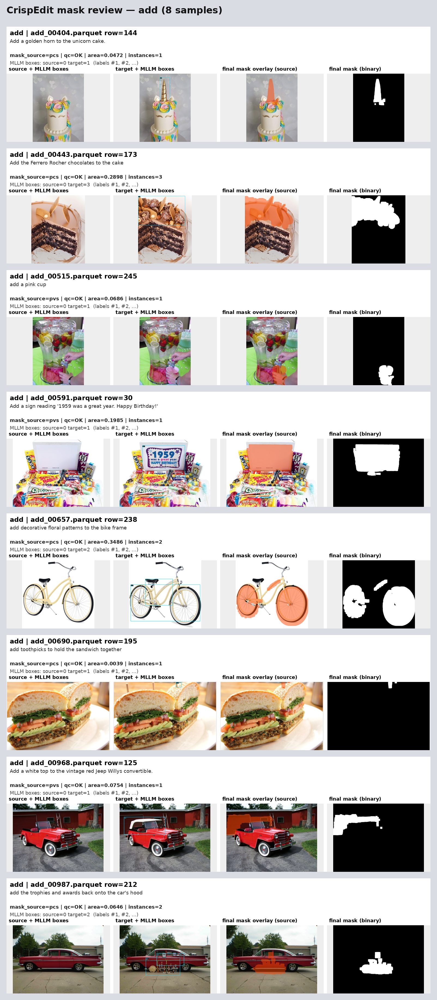

#### Motion change

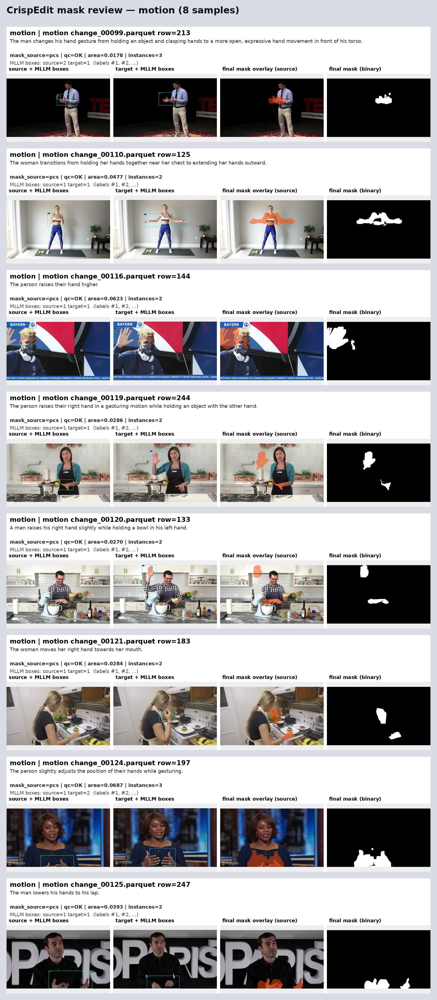

#### Remove

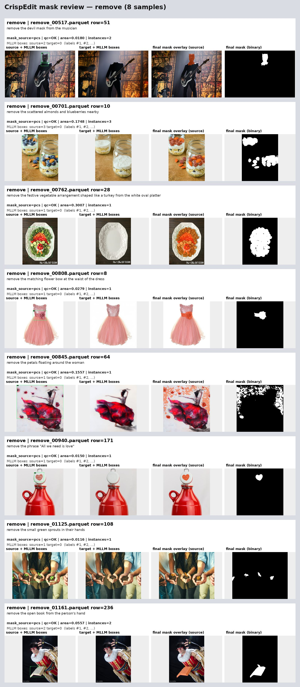

#### Replace

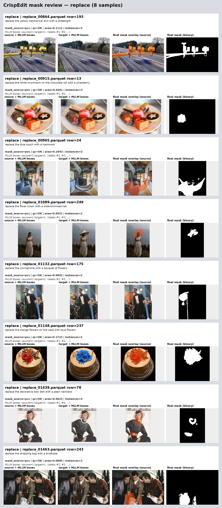

### 首批结果代表性可视化

以下样本直接从全量 mask parquet 和原始图片重建。每张依次展示 source + bbox、target +
bbox、source 坐标系 mask overlay 和二值 mask；具体选择记录在
[`full_run_selection.json`](../docs_assets/mask_pipeline/full_run_selection.json)。

#### Add

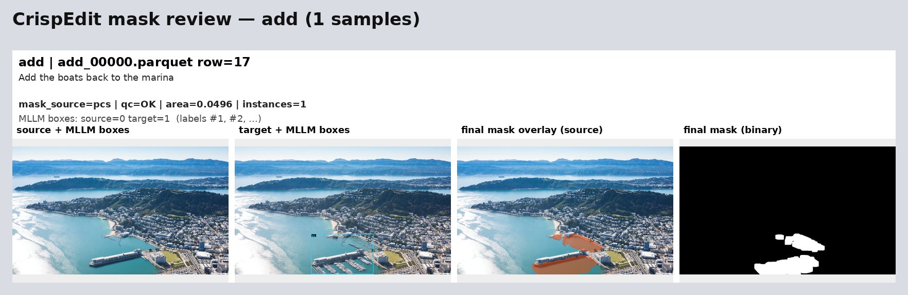

#### Background

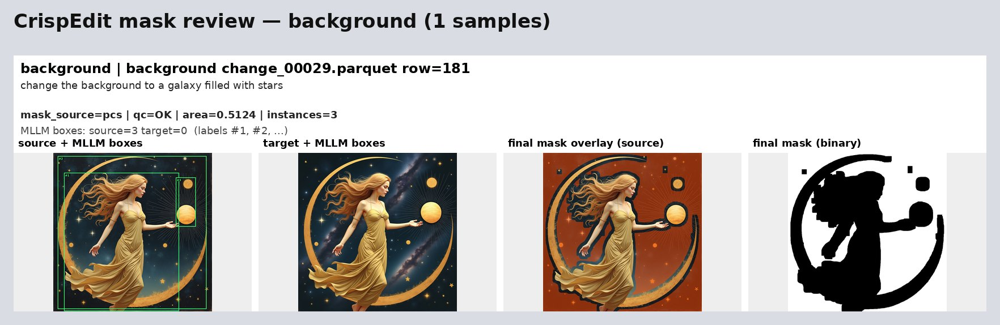

#### Color

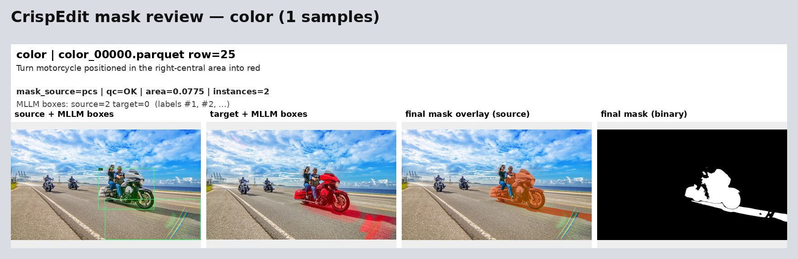

#### Motion

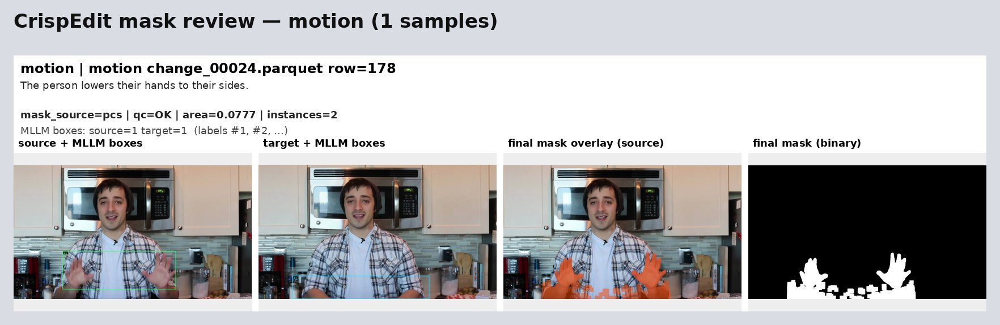

#### Remove

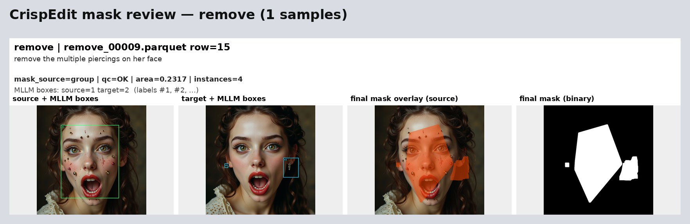

#### Replace

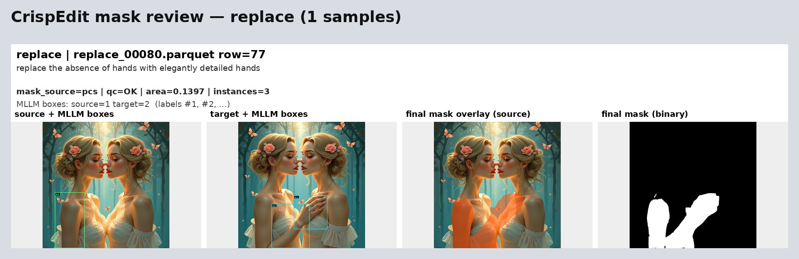

#### Style

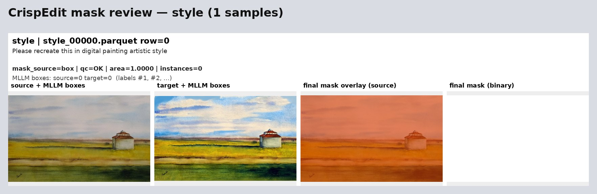

## 7. 可视化与小批量回归

### 历史 mask 难例：47 条

使用仓库内 [eval_selection.json](../docs_assets/mask_pipeline/eval_selection.json) 的 47 条历史
mask 难例，在 GPU 0–7 上分别运行 Qwen3.5 和 SAM3。该评测专门检查 mask 方法，因此没有
应用 prefilter drop：

- grounding：47 rows，0 runtime error，0 `GROUND_FAIL`，46 `OK` + 1 `PARTIAL_OK`；
- region bbox：113；小区域复核 33 requests / 52 candidates，0 refinement parse failure；
- 第一轮 observation 有 1 条长输出 JSON 截断；第二轮 grounding 和最终 mask 正常完成；
- mask：47/47 `OK`，0 runtime error，0 rectangle fallback；
- 样本级 mask source：PCS 40、PVS 3、connected group 4；
- mask area fraction：min 0.0126、median 0.1070、mean 0.1646、max 0.7510；
- 当前仓库单元测试与 manifest 集成测试：55 passed。

这组样本没有像素级 GT，因此面积和来源统计只用于发现异常，最终仍需人工检查。当前已知
边界包括：如果第一轮把完整对象错误改写成材质/纹理短语，SAM 可能只分割其轮廓。例如
`remove_00070.parquet row=133` 的完整兔耳被描述为 `tufts of fur`，当前结果主要覆盖耳缘；
这属于 realized-edit 语义错误，不是 bbox 漏框。

### Prefilter keep 均匀抽样：56 条

从最新 prefilter 全量输出的 keep 数据中按 7 个类别各抽 8 条，并使用同一最终流程运行：

- grounding：56 rows，0 runtime error，0 `GROUND_FAIL`，48 `OK` + 8 `STYLE_FULL_IMAGE`；
- region bbox：97；小区域复核 30 requests / 35 candidates，0 refinement parse failure；
- 第一轮 observation 有 5 条长输出 JSON 截断，集中在不依赖局部 grounding 的
  style/background 路线，均未影响最终 mask；
- mask：56/56 `OK`，0 runtime error，0 rectangle fallback；
- 样本级 mask source：PCS 22、PVS 26、style full-image box 8；
- mask area fraction：min 0.0054、median 0.1474、mean 0.3161、max 1.0000。

下面六张图是当前最终流程在 47 条历史难例上的分类可视化。每行依次展示 source 与 MLLM
bbox、target 与 MLLM bbox、映射到 source 的最终 mask overlay，以及二值 mask。

### Add

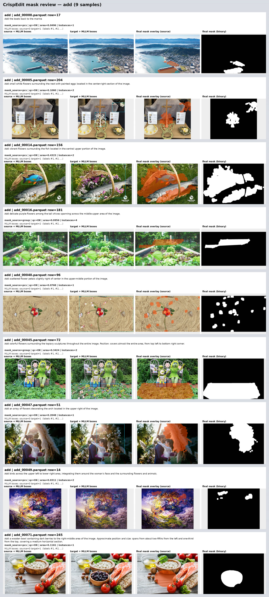

### Background

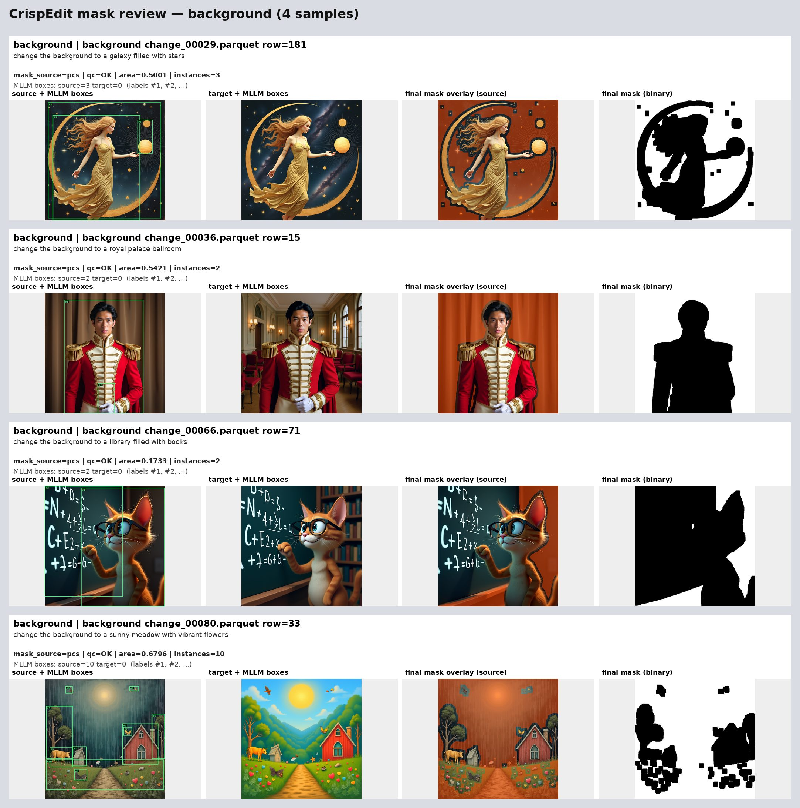

### Color

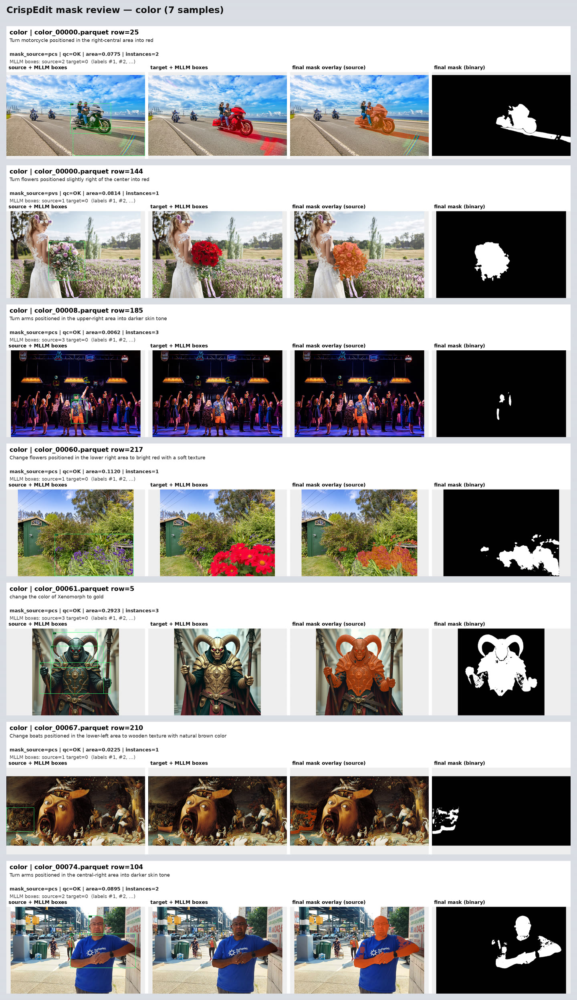

### Motion

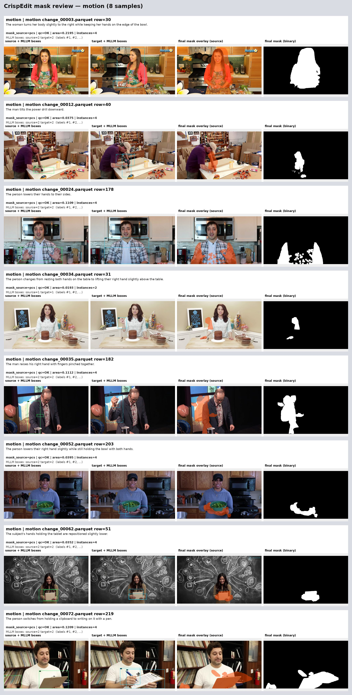

### Remove

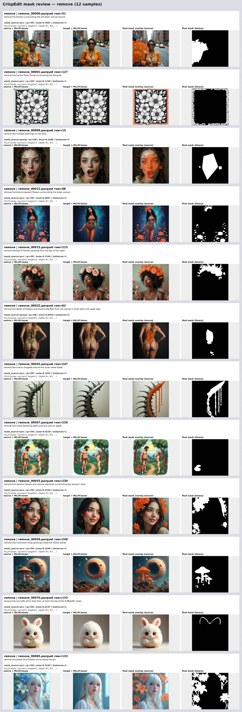

### Replace

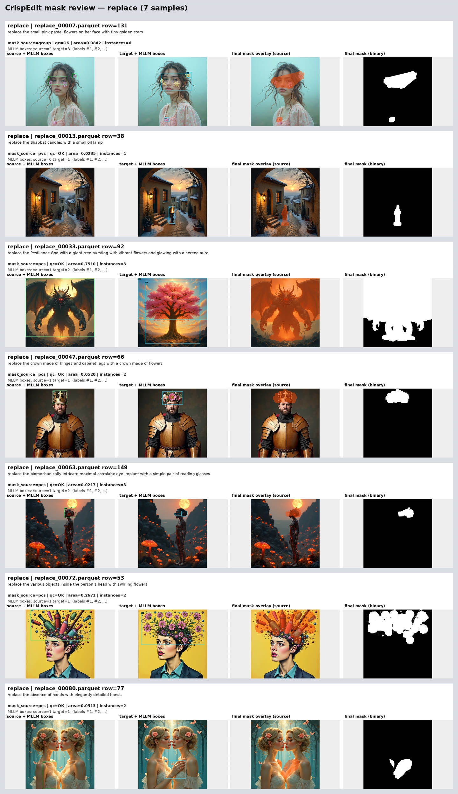

## 8. 验证与断点续跑

```bash
.venv-crispedit-runtime/bin/python -m pytest -q \
  tests/test_crispedit_prefilter_policy.py \
  tests/test_crispedit_grounded_mask_pipeline.py

.venv-crispedit-runtime/bin/python -m py_compile \
  crispedit/prefilter/*.py crispedit/mask/*.py crispedit_*.py

bash -n scripts/setup_env.sh scripts/setup_vllm_env.sh \
  scripts/setup_crispedit_envs.sh
```

三个 runner 默认会跳过已完成的 shard。只有在 prompt/policy 版本变更或明确要重算时
才使用 `--overwrite`，并应优先写入新输出目录。对齐验收至少检查：输入/audit/
manifest/grounding/mask 同名 shard 数，逐 shard 行数，`row_idx`，`PREFILTER_SKIP`，
`mask_sum > 0` 以及 PNG/RLE 面积一致性。
