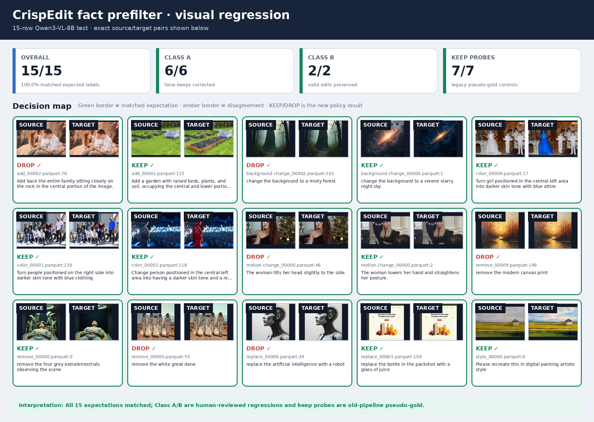
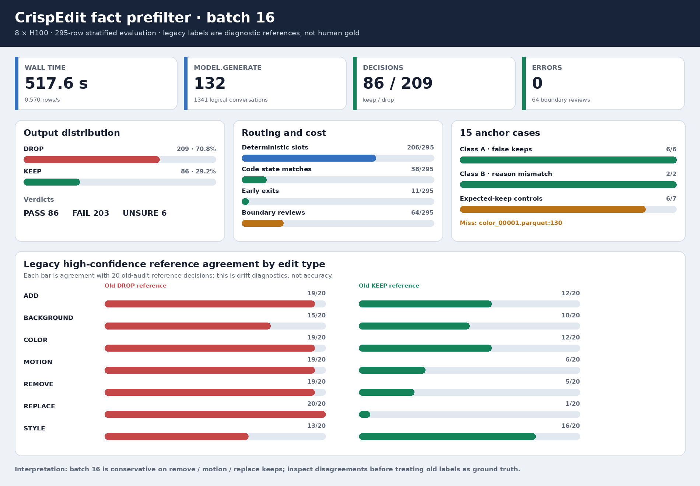
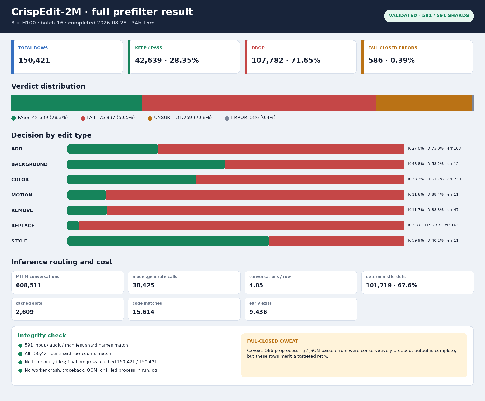
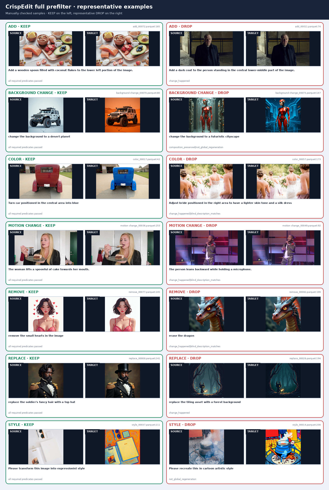

# CrispEdit fact prefilter

本文档是当前 prefilter 的唯一说明，覆盖方法、代码实现、复现实验、全量运行和已知边界。当前方法直接读取 CrispEdit 原始 parquet，不读取旧 audit，也不对旧结果做二次过滤。

## 1. 目标与输出

输入每行包含 `input_img`、`output_img`、`instruction` 和 `type`。prefilter 判断 source→target 是否完成指定编辑且没有破坏无关内容，输出：

- `audit/<shard>.parquet`：完整事实、谓词、原因、调用路径和最终决定；
- `manifest/<shard>.parquet`：与原始 shard 逐行对齐的下游入口；
- `run.log`：tqdm、分片状态和全局汇总。

稳定标识为：

```text
prefilter_method = fact
prefilter_evidence_schema = fact_evidence
```

最终映射固定为 `PASS → keep`，`FAIL / UNSURE / error → drop`。Qwen3-VL 只提取事实，不输出 `change_supported`、keep/drop 或 verdict；最终决定全部由代码生成。

## 2. 方法

### 2.1 事实级联

```text
instruction + source + target
        │
        ├─ Step 0：解析原子 subgoals
        ├─ Step 1：source 单图事实
        ├─ Step 2：target 单图事实
        ├─ fast path：确定的 add/replace no-op 提前 drop
        ├─ Step 3：隐藏 instruction 的成对差异描述
        ├─ Step 4：差异文本与 subgoals 匹配
        ├─ Step 5：预算内边界样本的独立局部状态复核
        │
        └─ 代码谓词 → PASS / FAIL / UNSURE
```

Step 0 将复合指令拆成 add、remove、replace、color、motion、background、style 原子目标。严格模板由代码解析，其他指令才调用文本 MLLM；重复指令使用每个 worker 独立的有界 LRU cache。

Step 1/2 分别提取场景、主体、目标物存在性、数量、属性、姿态和 bbox。add、replace、background、style 的 source/target 会合并进同一次 `_generate_json`；remove、color、motion 依赖小目标定位，target 等待 source bbox 后使用放大 crop。

Step 3 同时观察两张完整图，但不提供 instruction，输出主体一致性、构图保持、无关区域保持、编辑范围和可见差异。Step 4 只判断这些盲差异是否覆盖各 subgoal。对事实已经明确的 add/remove/replace 正向状态，匹配可直接由代码生成。

Step 5 仅用于预算选中的边界样本。source/target 仍是独立对话和独立事实，但合并到一次 batched generation；最终仍由代码比较状态，不向模型询问是否支持编辑。

### 2.2 确定性裁决

每个 subgoal 先生成 `subgoal_i_change` 与 `subgoal_i_blind_match`，再合并为以下必需谓词：

- `instruction_actionable`
- `change_happened`
- `blind_description_matches`
- `same_subject`
- `composition_preserved`
- `not_global_regeneration`
- `confidence_sufficient`
- `review_consistent`
- 非 background/style 还要求 `unrelated_regions_preserved`

任一必需谓词为 `FALSE` 时通常得到 `FAIL`；存在未解决或可复核冲突时得到 `UNSURE`。两者都按 fail-closed 规则 drop。style 允许整图风格变化，但内容、主体和构图仍需保持。

### 2.3 加速点

- 严格 instruction 模板走确定性 slot parser；
- 重复 instruction 复用 slot cache，不复用图像证据；
- source 与不需要引导 crop 的 target 合并 generation；
- 只对 remove/color/motion 串行生成 source-guided target crop；
- 高置信 add/replace no-op 在 Step 2 后提前结束；
- 明确的离散物体状态由代码生成 text match；
- Step 5 的 source/target 对话合并成一个 generation；
- shard 分配到 8 个独立 GPU worker，单卡内部 batch inference。

## 3. 代码结构

| 文件 | 作用 | 是否生产必需 |
|---|---|---:|
| `crispedit_mllm_prefilter.py` | 多卡调度、Qwen3-VL prompts、crop、batching、parquet I/O | 是 |
| `crispedit_prefilter_policy.py` | 证据归一化、状态转换、代码谓词与 verdict | 是 |
| `crispedit_mask_dataset_runner.py` | 消费 manifest，写入与原始数据对齐的 mask shard | mask 阶段 |
| `crispedit_mask_pipeline.py` | 单样本 SAM3 mask 逻辑 | mask 阶段 |
| `scripts/build_prefilter_regression_slice.py` | 从原始数据重建人工回归切片 | 实验 |
| `scripts/evaluate_prefilter_regression_slice.py` | 对齐 audit 并计算回归结果 | 实验 |
| `scripts/visualize_prefilter_regression.py` | 生成回归图板和 batch dashboard | 实验 |
| `tests/test_crispedit_prefilter_policy.py` | slot、crop、状态转换和裁决单测 | 验证 |

## 4. 运行

环境要求 Python 3.11、CUDA、8 张 GPU 和本地 Qwen3-VL-8B。仓库环境可用 `bash scripts/setup_env.sh --python-bin python3.11` 创建。

### 4.1 全量 prefilter

当前生产输出根目录为：

```text
/mnt/bn/strategy-mllm-train/user/tanyue/datasets/CrispEdit-2M-fact-prefilter
├── audit
├── manifest
└── run.log
```

使用 tmux 后台运行并把 tqdm 写入日志：

```bash
mkdir -p /mnt/bn/strategy-mllm-train/user/tanyue/datasets/CrispEdit-2M-fact-prefilter/audit
mkdir -p /mnt/bn/strategy-mllm-train/user/tanyue/datasets/CrispEdit-2M-fact-prefilter/manifest

tmux new-session -d -s crispedit_fact_prefilter \
  "cd /opt/tiger/tanyue/sam3-crispedit && \
   python -u crispedit_mllm_prefilter.py \
     --input-dir /mnt/bn/strategy-mllm-train/user/tanyue/datasets/CrispEdit-2M \
     --audit-dir /mnt/bn/strategy-mllm-train/user/tanyue/datasets/CrispEdit-2M-fact-prefilter/audit \
     --keep-manifest-dir /mnt/bn/strategy-mllm-train/user/tanyue/datasets/CrispEdit-2M-fact-prefilter/manifest \
     --devices 0,1,2,3,4,5,6,7 \
     --batch-size 16 \
     --max-new-tokens 512 \
     --slot-cache-size 20000 \
     --confidence-threshold 0.6 \
     --boundary-review-fraction 0.05 \
     --progress-mininterval 5 \
     > /mnt/bn/strategy-mllm-train/user/tanyue/datasets/CrispEdit-2M-fact-prefilter/run.log 2>&1"
```

不加 `--overwrite` 时，已有的完整 audit+manifest shard 会被跳过；修改方法或配置后应使用新的输出目录，避免混合结果。

### 4.2 下游 mask

```bash
python crispedit_mask_dataset_runner.py \
  --input-dir /mnt/bn/strategy-mllm-train/user/tanyue/datasets/CrispEdit-2M \
  --keep-manifest-dir /mnt/bn/strategy-mllm-train/user/tanyue/datasets/CrispEdit-2M-fact-prefilter/manifest \
  --output-dir /mnt/bn/strategy-mllm-train/user/tanyue/datasets/CrispEdit-2M-fact-mask \
  --devices 0,1,2,3,4,5,6,7 \
  --batch-size 8
```

drop 行保留 `PREFILTER_SKIP` 占位，不进入 SAM3。

## 5. 实验

### 5.1 15 行人工回归与 crop 消融

测试集包含 6 条历史 no-op false keep、2 条有效编辑/reason mismatch 和每种 edit type 各 1 条 expected-keep control。原始行从 CrispEdit-2M 重建，不携带旧 decision。

```bash
python scripts/build_prefilter_regression_slice.py \
  --input-dir /mnt/bn/strategy-mllm-train/user/tanyue/datasets/CrispEdit-2M \
  --output-dir /tmp/crispedit_fact_smoke/input \
  --include-positive-controls \
  --shards-per-type 2 \
  --overwrite

python -u crispedit_mllm_prefilter.py \
  --input-dir /tmp/crispedit_fact_smoke/input \
  --audit-dir /tmp/crispedit_fact_smoke/audit \
  --keep-manifest-dir /tmp/crispedit_fact_smoke/manifest \
  --devices 0,1,2,3,4,5,6,7 \
  --batch-size 2 \
  --max-new-tokens 512 \
  --slot-cache-size 20000 \
  --confidence-threshold 0.6 \
  --boundary-review-fraction 1.0 \
  --overwrite

python scripts/evaluate_prefilter_regression_slice.py \
  --input-dir /tmp/crispedit_fact_smoke/input \
  --audit-dir /tmp/crispedit_fact_smoke/audit \
  --output-json /tmp/crispedit_fact_smoke/report.json
```

| 分组 | 结果 |
|---|---:|
| no-op false keep | 6/6 drop |
| 有效编辑/reason mismatch | 2/2 keep |
| expected-keep control | 7/7 keep |
| 总体 | 15/15，0 error |

相对未加速完整路径，当前 crop 级联保持 15/15，同时 conversations 从 85 降到 66（-22.4%），`model.generate` 从 73 降到 46（-37.0%），小批量耗时约从 85 秒降到 75.2 秒。完全取消 crop 的对照只有 13/15，虽然 generate 降到 40、耗时 55.1 秒，但漏掉两条小主体肤色变化，因此没有采用。



### 5.2 历史 prefilter bad cases

另对 7 条人工发现的历史 false keep 使用当前方法复查，结果均为 drop：

| 类型 | Case | 当前结果 |
|---|---|---:|
| motion | `motion change_00060.parquet:183` | drop |
| remove | `remove_00011.parquet:225` | drop |
| remove | `remove_00023.parquet:208` | drop |
| remove | `remove_00071.parquet:249` | drop |
| motion | `motion change_00007.parquet:219` | drop |
| motion | `motion change_00038.parquet:194` | drop |
| motion | `motion change_00048.parquet:176` | drop |

复查切片可在构建命令中加入 `--include-prefilter-bad-cases`；这些样例的期望结果保存在构建脚本中。

### 5.3 295 行 batch-size 对照

同一 295 行、14 mini-shard 输入只改变 `--batch-size`。其中 15 条是上述 anchors/controls，另外 280 条是每类各 20 条旧 audit 高置信 keep 和 drop；后者只用于检查漂移，不是人工 gold。所有实验均使用 8 × H100、`--boundary-review-fraction 1.0`：

```bash
for batch_size in 2 4 8 16; do
  python -u crispedit_mllm_prefilter.py \
    --input-dir /tmp/crispedit_fact_benchmark/input \
    --audit-dir /tmp/crispedit_fact_benchmark/batch${batch_size}/audit \
    --keep-manifest-dir /tmp/crispedit_fact_benchmark/batch${batch_size}/manifest \
    --devices 0,1,2,3,4,5,6,7 \
    --batch-size ${batch_size} \
    --max-new-tokens 512 \
    --slot-cache-size 20000 \
    --confidence-threshold 0.6 \
    --boundary-review-fraction 1.0 \
    --overwrite
done
```

| batch | 耗时 | rows/s | generate | keep/drop | 人工 anchors | 旧 drop 一致 | 旧 keep 一致 |
|---:|---:|---:|---:|---:|---:|---:|---:|
| 2 | 789.1 s | 0.374 | 625 | 86/209 | 14/15 | 124/140 | 62/140 |
| 4 | 640.5 s | 0.461 | 368 | 85/210 | 12/15 | 123/140 | 62/140 |
| 8 | 560.6 s | 0.526 | 199 | 86/209 | 13/15 | 124/140 | 63/140 |
| 16 | 517.6 s | 0.570 | 132 | 86/209 | 14/15 | 124/140 | 62/140 |

batch 16 相对 batch 2 耗时下降 34.4%、吞吐提高 52.5%、generate 次数下降 78.9%，8 卡均为 0 error，最高单卡显存约 49 GiB。batching 并非逐样本数值严格等价，batch 16 与 batch 2 的 decision 一致率为 287/295；因此 anchors 比旧 pseudo-label 更可信。



### 5.4 CrispEdit-2M 全量运行

2026-08-28 使用 8 × H100、batch 16 完成 591 个 shard、150,421 行，耗时 34 小时 15 分。

| 类型 | 行数 | keep | drop | keep 率 | error |
|---|---:|---:|---:|---:|---:|
| add | 21,504 | 5,797 | 15,707 | 27.0% | 103 |
| background | 21,504 | 10,059 | 11,445 | 46.8% | 12 |
| color | 21,294 | 8,154 | 13,140 | 38.3% | 239 |
| motion | 21,559 | 2,497 | 19,062 | 11.6% | 11 |
| remove | 21,504 | 2,509 | 18,995 | 11.7% | 47 |
| replace | 21,504 | 716 | 20,788 | 3.3% | 163 |
| style | 21,552 | 12,907 | 8,645 | 59.9% | 11 |
| **总计** | **150,421** | **42,639** | **107,782** | **28.35%** | **586** |

verdict 为 PASS 42,639、FAIL 75,937、UNSURE 31,259、ERROR 586。共执行 608,511 个逻辑 conversations、38,425 次 `model.generate`；确定性 slot 101,719 行、slot cache 2,609 行、代码 match 15,614 行、early exit 9,436 行。

完整性检查通过：input/audit/manifest 均为 591 个同名 shard，逐 shard 行数全部一致，没有 `.tmp` 残留，日志中没有 worker crash、traceback、OOM 或 killed process。



下图每类各展示一个人工复核的高置信 keep 和代表性 drop。background/style 的 drop 有些完成了文字目标，但被识别为整体重生成。



## 6. 已知边界

1. 全量有 586 行（0.39%）在图像预处理或 JSON 解析阶段 fail-closed：step1/source 130、step2/target 282、step3/pair 172、step4/text match 2。建议隔离 batch、增加极端长宽比保护和 JSON retry 后定向重跑。
2. add/replace no-op fast path 只比较存在性和数量。`add_00046.parquet:84` 中 source 的小花束与 target 新增的中央大花瓶被视为同一类对象且数量相同，导致 false drop；位置敏感或多实例 add 应补充 bbox/位置对应后再提前结束。
3. background/style 对全局重生成采用严格策略：即使文字目标实现，主体构图或无关内容明显改变仍会 drop。
4. batch size 会影响边界样本生成；目前人工 anchors 数量有限，旧高置信标签只能用于漂移诊断，不能当作 ground truth。
5. 586 条 error 和人工发现的 add false drop 说明“产物完整”不等同于“决策完全无误”；开始 mask 前应优先定向修复并重跑这些行。

## 7. 验证

```bash
python -m pytest -q tests/test_crispedit_prefilter_policy.py
python -m py_compile \
  crispedit_mllm_prefilter.py \
  crispedit_prefilter_policy.py \
  scripts/build_prefilter_regression_slice.py \
  scripts/evaluate_prefilter_regression_slice.py \
  scripts/visualize_prefilter_regression.py
```
