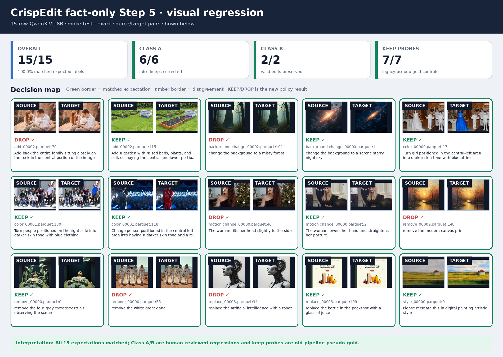

# CrispEdit fact prefilter

当前分支的 prefilter 方法名为 `fact`。主入口是 `crispedit_mllm_prefilter.py`，它直接读取原始 CrispEdit parquet 的 source、target、instruction 和 type；不读取旧 audit，也不对已有 prefilter 结果做二次过滤。

## 方法

模型只提取事实，最终 verdict 由代码裁决：

1. 纯文本解析 instruction，拆分原子 subgoals；
2. source-only 和 target-only 单图事实提取；
3. 隐藏 instruction 的 source/target 配对差异描述；
4. 文本匹配 instruction 与差异；
5. `crispedit_prefilter_policy.py` 按 edit type 计算变化、目标状态、主体保持和置信度谓词；
6. 对预算内边界样本，独立提取 source/target 局部状态，再由代码比较。

模型不输出 `change_supported`、keep/drop 或 verdict。`change_happened`、`target_match` 和最终 `PASS / FAIL / UNSURE` 全部由事实和代码生成。

主要代码：

- `crispedit_mllm_prefilter.py`：多卡 prefilter runner；
- `crispedit_prefilter_policy.py`：证据归一化与确定性裁决；
- `crispedit_mask_dataset_runner.py`：读取 manifest 并进入 SAM3 mask；
- `scripts/build_prefilter_regression_slice.py`：从原始数据构建回归切片；
- `scripts/evaluate_prefilter_regression_slice.py`：评估回归结果。

manifest 使用稳定字段：

```text
prefilter_method = fact
prefilter_evidence_schema = fact_evidence
```

不写 prompt/filter 数字版本字段。最终决策规则为：`PASS -> keep`，`FAIL/UNSURE/error -> drop`。

## 运行

建议为当前方法使用独立输出目录，避免旧 final shard 触发 resume：

```bash
mkdir -p /mnt/bn/strategy-mllm-train/user/tanyue/datasets/CrispEdit-2M-fact-audit
mkdir -p /mnt/bn/strategy-mllm-train/user/tanyue/datasets/CrispEdit-2M-fact-manifest

nohup python -u crispedit_mllm_prefilter.py \
  --input-dir /mnt/bn/strategy-mllm-train/user/tanyue/datasets/CrispEdit-2M \
  --audit-dir /mnt/bn/strategy-mllm-train/user/tanyue/datasets/CrispEdit-2M-fact-audit \
  --keep-manifest-dir /mnt/bn/strategy-mllm-train/user/tanyue/datasets/CrispEdit-2M-fact-manifest \
  --devices 0,1,2,3,4,5,6,7 \
  --batch-size 2 \
  --max-new-tokens 512 \
  --confidence-threshold 0.6 \
  --boundary-review-fraction 0.05 \
  --progress-mininterval 5 \
  > /mnt/bn/strategy-mllm-train/user/tanyue/datasets/CrispEdit-2M-fact-audit/run.log 2>&1 < /dev/null &
```

mask 阶段直接消费对应 manifest：

```bash
python crispedit_mask_dataset_runner.py \
  --input-dir /mnt/bn/strategy-mllm-train/user/tanyue/datasets/CrispEdit-2M \
  --keep-manifest-dir /mnt/bn/strategy-mllm-train/user/tanyue/datasets/CrispEdit-2M-fact-manifest \
  --output-dir /mnt/bn/strategy-mllm-train/user/tanyue/datasets/CrispEdit-2M-fact-mask \
  --devices 0,1,2,3,4,5,6,7 \
  --batch-size 8
```

## 8 卡小批量验证

验证输入由 CrispEdit-2M 原始 shard 重新抽取，不包含旧 prefilter decision：

```bash
python scripts/build_prefilter_regression_slice.py \
  --input-dir /mnt/bn/strategy-mllm-train/user/tanyue/datasets/CrispEdit-2M \
  --output-dir /tmp/crispedit_fact_pipeline_smoke/input \
  --include-positive-controls \
  --shards-per-type 2 \
  --overwrite

python crispedit_mllm_prefilter.py \
  --input-dir /tmp/crispedit_fact_pipeline_smoke/input \
  --audit-dir /tmp/crispedit_fact_pipeline_smoke/audit \
  --keep-manifest-dir /tmp/crispedit_fact_pipeline_smoke/manifest \
  --devices 0,1,2,3,4,5,6,7 \
  --batch-size 2 \
  --max-new-tokens 512 \
  --confidence-threshold 0.6 \
  --boundary-review-fraction 1.0 \
  --overwrite

python scripts/evaluate_prefilter_regression_slice.py \
  --input-dir /tmp/crispedit_fact_pipeline_smoke/input \
  --audit-dir /tmp/crispedit_fact_pipeline_smoke/audit \
  --output-json /tmp/crispedit_fact_pipeline_smoke/report.json
```

2026-08-26，8 × H100，13 个 mini-shard、15 行：

| 分组 | 期望 | 结果 |
|---|---:|---:|
| no-op false keep | drop | 6/6 |
| 有效编辑/reason mismatch | keep | 2/2 |
| expected-keep controls | keep | 7/7 |
| 总体 | 一致 | 15/15 |

运行统计：`errors=0`、`keep=9`、`drop=6`、`review_triggered=5`，耗时约 85 秒。`motion change_00000.parquet:2` 的 review 只输出独立 source/target 手部与姿态事实，代码得到 `review_change=TRUE` 和 `review_target_match=TRUE`，最终 `PASS / keep`。

运行产物：

```text
/tmp/crispedit_fact_pipeline_smoke/audit
/tmp/crispedit_fact_pipeline_smoke/manifest
/tmp/crispedit_fact_pipeline_smoke/report.json
```

## 可视化与边界



Class A 6/6 drop、Class B 2/2 keep、expected-keep controls 7/7 keep 的完整图板位于 `docs_assets/prefilter_improved_eval/`。

该验证集只有 15 行，controls 不是完整人工 gold。全量替换前仍应扩展按 edit type 分层的人工 gold 和新旧分歧抽查。
