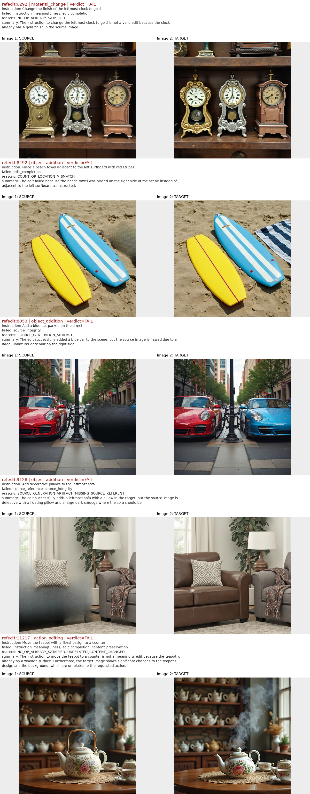
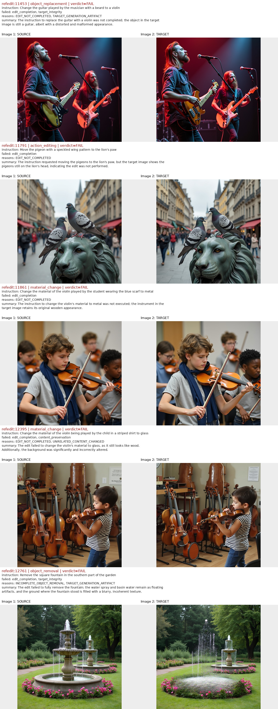
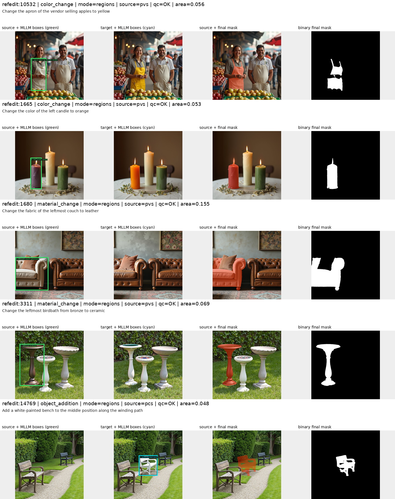
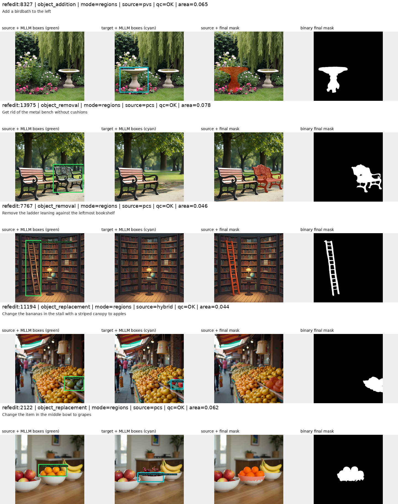

# RefEdit quality prefilter 与 mask 打标

## 1. 目标与数据

RefEdit 的最终生产流程固定为：

```text
native RefEdit
  -> Qwen3.8 pair-quality prefilter
  -> PASS-only Qwen3.5 planner + bbox locator
  -> SAM3 mask
  -> mask QC
  -> strict final dataset
```

源数据来自 `bpathir1/RefEdit`，固定 revision 为
`794df41659bb52e3fb1375bbbdf73143a3ea1732`。本机只读路径为：

```text
/mnt/bn/strategy-mllm-train/user/tanyue/datasets/RefEdit
```

数据包含 105 个 `data/train-*.parquet` shard、18,249 条样本。原生字段为：

```text
img_id, source_img, instruction, target_img
```

所有 runner 只读源 Parquet。prefilter、grounding、mask、audit 和可视化均写入独立目录，
不会改写源数据。

## 2. Pipeline

### 2.1 Stage 1：源编辑对质量 prefilter

Qwen3.8-27B 每条样本通常调用一次，同时接收 source、target、instruction，并独立判断六个
维度：

1. `source_reference`：指令描述的对象、属性、方位、数量和关系在 source 中成立。
2. `instruction_meaningfulness`：要求的状态没有在 source 中提前满足。
3. `edit_completion`：target 对正确对象完成了所要求的颜色、材质、动作、位置、数量等变化。
4. `source_integrity`：source 没有明显模糊、涂抹、结构缺失或生成瑕疵。
5. `target_integrity`：target 没有孔洞、残留、畸形、悬浮或不合理几何。
6. `content_preservation`：无关内容保持基本一致。

每个维度输出 `PASS/FAIL/UNSURE + image-grounded evidence`。最终 verdict 由代码确定，模型
不能自行放宽：仅六项全部 PASS 才进入 manifest；任一 FAIL 即 FAIL；没有 FAIL 但存在
UNSURE 时单独记为 UNSURE。JSON 不合法时只进行一次格式纠正 retry。

prefilter 使用 8 个 TP=1 vLLM worker，一卡一份 Qwen3.8-27B。输出分为：

```text
audit/      每条源数据一行，保存 verdict、六维判断、reason code、raw response 和错误
manifest/   只包含严格 PASS 的行，是后续 grounding 的唯一选择入口
```

当前版本：

```text
model:          Qwen3.8-27B
prompt version: refedit_pair_quality_qwen38_v1
```

### 2.2 PASS manifest 与 source 的连接

`refedit/selection.py` 对每个 PASS manifest shard 做 fail-closed 校验：

- manifest shard basename 必须与 `source_relative_path` 一致；
- `row_idx` 必须严格递增且落在对应源 shard 范围内；
- `sample_id == refedit:<img_id>`；
- manifest 与 source 的 `img_id`、instruction 必须逐字一致；
- 全局不允许重复 `sample_id`。

grounding 的 `--prefilter-manifest-dir` 与手工 `--img-id/--selection-file` 互斥。续跑时不只
比较 shard 行数和版本，还比较完整 sample identity 序列，避免不同选择集恰好行数相同而
误复用旧结果。

### 2.3 Stage 2a：两轮 MLLM grounding

仅对 prefilter PASS 样本调用 Qwen3.5-35B-A3B：

1. Planner 同时读取 source、target、instruction，输出局部编辑计划、应在 source/target
   定位的实例描述、实例角色、mask extent 和 SAM text prompt，不输出坐标。
2. Locator 接收图像和第一轮整理出的实例描述，使用短 bbox-only prompt，输出归一化
   `[0,1000]` 的 `bbox_2d`。

普通样本共两次 MLLM 调用；只有解析失败或少量 viewpoint 修正才 retry。8 卡运行时加载四个
TP=2 vLLM worker。RefEdit 强制局部 `regions` route，非局部 route fail closed。

```text
model:          Qwen3.5-35B-A3B
prompt version: refedit_edit_plan_bbox_locator_v1_scaleedit_v18
```

### 2.4 Stage 2b：SAM3 与 mask 后处理

每张 GPU 加载一份 SAM3，共八个单卡 worker。bbox 是定位 anchor；crop 适度扩张以恢复被框
截断的边界。候选由 PVS/PCS/Hybrid 策略选择，随后清理远离 anchor 的零散连通域。target
mask 映射回 source 坐标，多个实例取并集，最终保存二值 PNG、实例 RLE、bbox、面积和审计
字段。

```text
checkpoint:          /mnt/bn/strategy-mllm-train/common/models/sam3/sam3.pt
mask policy version: refedit_sam3_hybrid_mask_v1_scaleedit_v12
```

### 2.5 Stage 3：最终训练集

`scripts/build_refedit_final_mask_dataset.py` 再次严格连接 prefilter、source、grounding 和
mask，只保留：

```text
prefilter_verdict == PASS
grounding_status == OK
qc_flag == OK
mask_png is present
```

最终 Parquet 保持现有 `MASK_SCHEMA`，不改动 mask payload。`final_manifest.parquet` 记录
prefilter、grounding、mask 的 provenance；未通过 mask QC 的 PASS 样本进入
`rejected_mask_qc.parquet`，不进入训练数据。

## 3. 代码结构

```text
refedit/io.py                              原生 shard 读取与 sample identity
refedit/policy.py                          任务粗分类与局部编辑合约
refedit/quality_prefilter.py               prefilter prompt、parser、确定性 verdict
refedit/quality_runner.py                  Qwen3.8/vLLM 八卡 prefilter
refedit/selection.py                       PASS manifest/source 严格连接
refedit/grounding_runner.py                PASS-only 两轮 Qwen3.5 grounding
refedit/mask_runner.py                     SAM3 mask 与八卡调度
refedit/finalize.py                        最终 QC 数据集构建

refedit_quality_prefilter.py               prefilter CLI
refedit_mllm_grounding.py                  grounding CLI
refedit_grounded_mask_runner.py            mask CLI

scripts/run_refedit_quality_prefilter_full.sh  只运行 prefilter
scripts/run_refedit_filtered_mask_full.sh      只对 PASS 做 grounding、mask、验证和 final
scripts/run_refedit_full.sh                    顺序运行完整 pipeline
scripts/build_refedit_final_mask_dataset.py    final dataset CLI
scripts/validate_refedit_quality_prefilter.py  prefilter audit/manifest 深度验证
scripts/validate_refedit_masks.py              中间 selected run 深度验证
scripts/validate_refedit_final_mask_dataset.py 最终数据 PNG/RLE 深度验证
scripts/visualize_refedit_quality_prefilter.py prefilter source/target 可视化
scripts/visualize_refedit_masks.py             bbox/mask 四联可视化
```

ScaleEdit 共用实现只增加可覆盖的 planner hook 和可选 vLLM engine 参数，默认 prompt 和运行
行为保持不变，并由回归测试覆盖。

## 4. 一键安装环境

```bash
cd /opt/tiger/tanyue/sam3-crispedit
bash scripts/setup_refedit_vllm_env.sh
```

默认生成：

```text
/opt/tiger/tanyue/sam3-crispedit/.venv-refedit-vllm
```

可用 `REFEDIT_ENV_DIR=/absolute/path` 改变安装位置。脚本从零安装已验证的 PyTorch、vLLM、
transformers、Pillow、PyArrow、SAM3 等依赖，不修改模型权重和数据。

模型路径：

```text
/mnt/bn/strategy-mllm-train/user/tanyue/models/pretrained_models/Qwen3.8-27B
/mnt/bn/strategy-mllm-train/common/models/Qwen3.5-35B-A3B
/mnt/bn/strategy-mllm-train/common/models/sam3/sam3.pt
```

## 5. 运行方法

### 5.1 推荐：先 prefilter，再 mask 打标

第一步，在 tmux 中运行 prefilter：

```bash
mkdir -p /mnt/bn/strategy-mllm-train/user/tanyue/datasets/RefEdit-quality-prefilter-qwen38/logs

tmux new-session -d -s refedit_quality_prefilter \
  "cd /opt/tiger/tanyue/sam3-crispedit && \
   bash scripts/run_refedit_quality_prefilter_full.sh \
   2>&1 | tee -a /mnt/bn/strategy-mllm-train/user/tanyue/datasets/RefEdit-quality-prefilter-qwen38/logs/full_prefilter.log"

tail -f /mnt/bn/strategy-mllm-train/user/tanyue/datasets/RefEdit-quality-prefilter-qwen38/logs/full_prefilter.log
```

确认 `run_summary.json` 后，第二步只对 PASS 样本运行 grounding 与 SAM3：

```bash
tmux new-session -d -s refedit_filtered_mask \
  "cd /opt/tiger/tanyue/sam3-crispedit && \
   bash scripts/run_refedit_filtered_mask_full.sh"

tail -f /mnt/bn/strategy-mllm-train/user/tanyue/datasets/RefEdit-mask-prefiltered-qwen38/logs/full_labeling.log
```

第二个脚本会依次运行 prefilter 完整性验证、PASS-only grounding、SAM3、selected-run
validation、finalization 和 final validation。已有且版本、行数、identity 全部匹配的 shard
会断点续传跳过；只有明确传入 `--overwrite` 才重算。

### 5.2 一条命令运行全部阶段

```bash
mkdir -p /mnt/bn/strategy-mllm-train/user/tanyue/datasets/RefEdit-mask-prefiltered-qwen38/logs

tmux new-session -d -s refedit_full_pipeline \
  "cd /opt/tiger/tanyue/sam3-crispedit && \
   bash scripts/run_refedit_full.sh \
   2>&1 | tee -a /mnt/bn/strategy-mllm-train/user/tanyue/datasets/RefEdit-mask-prefiltered-qwen38/logs/pipeline.log"
```

环境变量可覆盖默认路径：

```text
REFEDIT_PYTHON_BIN
REFEDIT_SOURCE_ROOT
REFEDIT_QUALITY_ROOT
REFEDIT_OUTPUT_ROOT
REFEDIT_QUALITY_MODEL_PATH
```

### 5.3 手工运行 PASS-only grounding

```bash
.venv-refedit-vllm/bin/python -u refedit_mllm_grounding.py \
  --input-dir /mnt/bn/strategy-mllm-train/user/tanyue/datasets/RefEdit \
  --prefilter-manifest-dir /mnt/bn/strategy-mllm-train/user/tanyue/datasets/RefEdit-quality-prefilter-qwen38/manifest \
  --output-dir /mnt/bn/strategy-mllm-train/user/tanyue/datasets/RefEdit-mask-prefiltered-qwen38/grounding \
  --devices 0,1,2,3,4,5,6,7 \
  --tensor-parallel-size 2 \
  --batch-size 8 \
  --request-batch-size 4
```

### 5.4 验证最终数据

```bash
.venv-refedit-vllm/bin/python scripts/validate_refedit_final_mask_dataset.py \
  --input-dir /mnt/bn/strategy-mllm-train/user/tanyue/datasets/RefEdit \
  --final-dir /mnt/bn/strategy-mllm-train/user/tanyue/datasets/RefEdit-mask-prefiltered-qwen38/final \
  --report-json /mnt/bn/strategy-mllm-train/user/tanyue/datasets/RefEdit-mask-prefiltered-qwen38/final/audit/validation_report.json
```

## 6. 输出路径与字段

### 6.1 Prefilter

```text
/mnt/bn/strategy-mllm-train/user/tanyue/datasets/RefEdit-quality-prefilter-qwen38/
  audit/          105 个全量审计 shard
  manifest/       105 个 PASS-only shard
  logs/
  run_config.json
  run_summary.json
```

### 6.2 Mask 与最终数据

```text
/mnt/bn/strategy-mllm-train/user/tanyue/datasets/RefEdit-mask-prefiltered-qwen38/
  grounding/      从头运行时生成，只含 prefilter PASS
  masks/          从头运行时生成，只含 prefilter PASS
  logs/
  audit/prefilter_drop_selection_20260915.json
  audit/mask_pass_selection_seed20260915.json
  visualization/prefilter_drop/
  visualization/mask_pass/
  final/
    data/         105 个最终 mask Parquet，仅 PASS + mask QC OK
    audit/final_manifest.parquet
    audit/rejected_mask_qc.parquet
    audit/validation_report.json
    run_summary.json
```

最终 `data/train-*.parquet` 的主要字段：

```text
row_idx, sample_id, source_relative_path,
edit_task, final_task, original_instruction, final_instruction,
ground_json, mask_png, instance_masks, mask_source, area_frac,
qc_flag, qc_flags_json, mask_height, mask_width, mask_sum,
grounding_status, mllm_model, prompt_version,
sam_version, mask_policy_version
```

图像继续由 `source_relative_path + row_idx` 从只读 RefEdit 源数据读取，避免复制两份大图。
训练应读取 `final/audit/final_manifest.parquet` 或直接遍历 `final/data/`，不要使用中间
`masks/` 中被 QC 拒绝的候选。

## 7. 全量结果（2026-09-15）

### 7.1 Prefilter 结果

| verdict | 数量 | 比例 |
| --- | ---: | ---: |
| PASS | 7,836 | 42.939% |
| FAIL | 10,410 | 57.044% |
| ERROR | 3 | 0.016% |
| 合计 | 18,249 | 100% |

105 个 source/audit/manifest shard 完整对应，18,249 个 `sample_id` 唯一，PASS manifest 与
audit 逐行一致。8 个 worker exit code 均为 0；3 条超长、未闭合 JSON 记录为 ERROR 并安全
排除，没有进入后续 mask 阶段。

主要失败维度为 `edit_completion` 8,642、`target_integrity` 3,367、
`content_preservation` 2,958；一个样本可以同时失败多个维度，因此数字不相加。

### 7.2 最终 mask 结果

| 阶段 | 数量 |
| --- | ---: |
| 源数据 | 18,249 |
| prefilter PASS，进入 mask 选择集 | 7,836 |
| mask QC OK，最终保留 | 7,804 |
| prefilter PASS 但 mask QC 拒绝 | 32 |

32 条二次拒绝由 `SEMANTIC_QC` 21、`BOX_FALLBACK` 6、`GROUND_FAIL` 5 构成。最终集相对
prefilter PASS 的保留率为 99.59%，相对原始数据为 42.76%。任务分布：

```text
object_addition      2,909
color_change         1,663
object_replacement   1,270
object_removal       1,163
material_change        799
```

独立 validator 已逐条解码 7,804 张 PNG、9,836 个实例 RLE，并核验 source identity、
instruction、尺寸、二值像素、面积及版本：`validation_error_count = 0`。mask 面积占比中位数
0.061539，均值 0.079396。

本次最终数据由先前相同 grounding/mask 版本的完整 RefEdit 打标结果
`/mnt/bn/strategy-mllm-train/user/tanyue/datasets/RefEdit-mask` 通过严格 identity 与版本连接
物化，mask payload 未重新推理。新的标准生产入口则在 grounding 前直接读取 PASS manifest，
因此从头运行不会再为 10,413 条未通过 prefilter 的样本调用 Qwen3.5 或 SAM3。

## 8. 最新可视化

### 8.1 Prefilter：只展示 DROP 样本

prefilter 可视化只放被过滤掉的 FAIL/DROP case，不混入 PASS：

```text
/mnt/bn/strategy-mllm-train/user/tanyue/datasets/RefEdit-mask-prefiltered-qwen38/audit/prefilter_drop_selection_20260915.json
```

共 10 条，覆盖未完成编辑、错误位置、源图生成瑕疵、target 畸形、无效 no-op、移除残留和
无关内容变化。包含最初人工指出的 `refedit:11791`、`12395`、`11861`、`9128`、`12761`
和 `11217`。每行是 source、target、失败维度、reason code 与模型证据。





### 8.2 Mask：只展示进入打标的 PASS 样本

mask 可视化使用另一份选择文件，10 条样本均满足 prefilter PASS、mask QC OK 且 prefilter
confidence 不低于 0.95：

```text
/mnt/bn/strategy-mllm-train/user/tanyue/datasets/RefEdit-mask-prefiltered-qwen38/audit/mask_pass_selection_seed20260915.json
```

以下 mask 图每行从左到右是 source + MLLM bbox、target + MLLM bbox、source + final mask、
binary final mask。





目检中，这 10 条的编辑对均满足指令，left/leftmost/middle 等指代正确；bbox 覆盖目标实例，
最终 mask 没有明显远端碎片。示例覆盖 PVS、PCS 和 Hybrid 三种 mask source。

## 9. 注意事项

- RefEdit 原生数据没有 task 字段。`task/final_task` 是确定性规则产生的粗分类；含颜色词的
  指代从句偶尔会触发错误类别，因此不能把它当作人工真值。source/target/instruction 和
  mask identity 不受影响。
- `prefilter PASS` 判断编辑对是否适合训练，`mask qc=OK` 判断打标结果是否可用，两者不能
  互相替代。
- `qc=OK` 是自动 QC，不等于逐条人工确认；训练前仍可按具体任务做额外抽样审查。
- 不要把 prefilter ERROR、FAIL 或 `final/audit/rejected_mask_qc.parquet` 中的样本加入训练。
