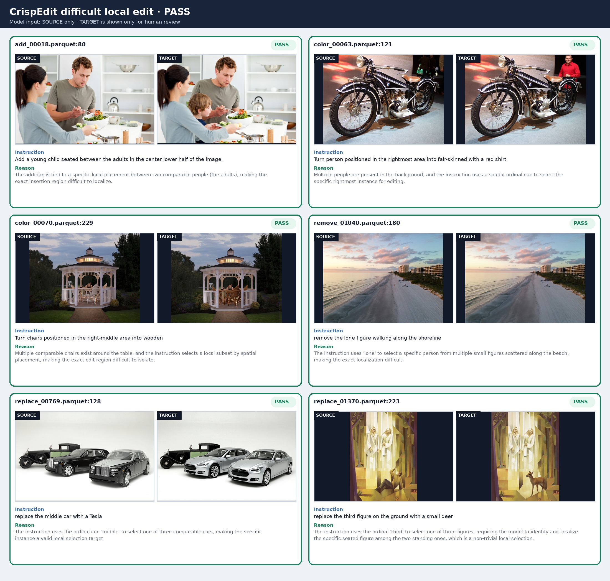
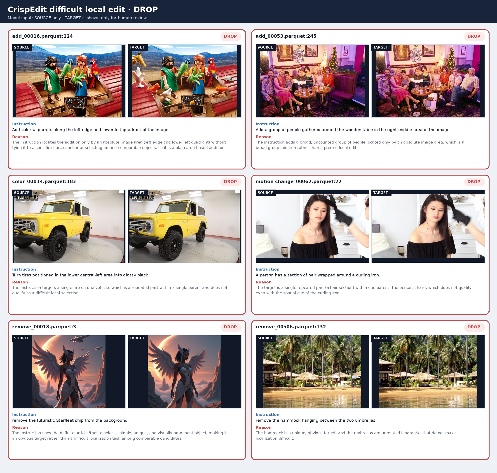

# CrispEdit 难定位局部编辑筛选

## 目标

本阶段从 Qwen3.8 pair-quality prefilter 的 `PASS` 样本中，继续筛选与 SAMTok benchmark
接近的原始编辑场景：细粒度、局部、多实例指代，并且精确编辑区域较难定位。

它与前一阶段 prefilter 相互独立：prefilter 判断图像对是否可用；本阶段判断编辑场景是否有足够
的定位难度。本阶段只读取 source image、instruction 和 edit type，不读取 target image、mask，
也不调用 SAM。

输入路径：

```text
raw:       /mnt/bn/strategy-mllm-train/user/tanyue/datasets/CrispEdit-2M
prefilter: /mnt/bn/strategy-mllm-train/user/tanyue/datasets/CrispEdit-2M-qwen38-pair-prefilter/manifest
model:     /mnt/bn/strategy-mllm-train/user/tanyue/models/pretrained_models/Qwen3.8-27B
```

上一轮 prefilter 共保留 215,779 条，其中 add/remove/replace/color/motion 174,131 条，
background/style 41,648 条。

## 方法

入口是 [crispedit_benchmark_scene_filter.py](../crispedit_benchmark_scene_filter.py)，prompt 与解析位于
[benchmark_scene.py](../crispedit/difficulty/benchmark_scene.py)，8 卡 vLLM runner 位于
[scene_runner.py](../crispedit/difficulty/scene_runner.py)。

流程只有二分类：

1. raw parquet 与 pair-quality manifest 按 `row_idx` 严格对齐，只处理 prefilter `PASS`。
2. background/style 确定性 `DROP`，不调用模型。
3. 其余类型一次 source-only Qwen3.8 调用，直接返回 `PASS` 或 `DROP` 及简短理由。

`PASS` 表示编辑区域确实难定位，主要包括：

- 从多个可比较对象中选择一个、局部子集或紧凑多实例组；
- 按空间或外观属性选择多个细小、分离的局部区域；
- 先从多个可比较 parent 中选中一个，再编辑其部件；
- 用可见对象之间的明确关系定位局部新增；
- 小目标、背景目标、空间词、序数词和相对关系均可作为有效指代。

`DROP` 包括：唯一且明显的目标、歧义或源图不可解析的目标、全局/背景/风格编辑、没有局部选择
的全体编辑、只有绝对画布区域的新增，以及宽泛群组新增。同一 parent 内的轮胎、手、发束等重复
部件不作为独立候选；无关地标也不能把唯一目标变成困难样本。无选择器的 `one of` 为歧义；
模型也不能用指令未提供的中心性或视觉显著性自行补出选择器。

prompt 不要求实例分割、画框、枚举或计数。模型只输出一个小 JSON：`verdict`、`target`、
`reference`、`reason`。最终标签始终只有 `PASS/DROP`；后三项仅用于审计，不是中间状态。
解析失败也写为 `DROP`，同时置 `scene_parse_ok=false`，使该 shard 在断点续跑时自动重跑。
当前 prompt 模板连同输出约束约 313 个英文空白分词；它围绕“可比较候选、指令内选择器、局部
区域”展开，不要求模型预测实例数量或几何区域。

## 运行

8 卡全量命令：

```bash
cd /opt/tiger/tanyue/sam3-crispedit-vllm-labeling-pipelines

/opt/tiger/tanyue/sam3-crispedit/.venv-scaleedit-vllm/bin/python -u \
  crispedit_benchmark_scene_filter.py \
  --input-dir /mnt/bn/strategy-mllm-train/user/tanyue/datasets/CrispEdit-2M \
  --prefilter-manifest-dir /mnt/bn/strategy-mllm-train/user/tanyue/datasets/CrispEdit-2M-qwen38-pair-prefilter/manifest \
  --output-dir /mnt/bn/strategy-mllm-train/user/tanyue/datasets/CrispEdit-2M-difficult-local-edit \
  --model-path /mnt/bn/strategy-mllm-train/user/tanyue/models/pretrained_models/Qwen3.8-27B \
  --devices 0,1,2,3,4,5,6,7 \
  --tensor-parallel-size 1 \
  --batch-size 4 \
  --vllm-max-num-seqs 4 \
  --vllm-max-model-len 8192 \
  --max-new-tokens 256 \
  --parse-retries 1
```

输出包含 `run_config.json`、`run_summary.json`、逐 shard 的 `audit/` 和轻量 `manifest/`。
`scene_decision` 是最终 `PASS/DROP`，`scene_pass` 是对应布尔值。默认跳过已完整且可解析的 shard；
只有 `--overwrite` 会覆盖。

## 小批量验证

固定评测集包含 46 条开发回归和随后独立抽取的 40 条盲样本，覆盖关系新增、空间/序数/属性子集、
紧凑多实例组、小背景目标、selected-parent part、唯一目标、全体编辑、绝对区域新增、同一 parent
重复部件、身份歧义和无关地标。开发过程中最重要的结果如下：

| 实验 | 样本 | 与人工判断一致 | 主要发现 |
| --- | ---: | ---: | --- |
| 初始简短二分类 | 32 | 27/32 | 漏掉小目标与区域子集 |
| 边界回归 | 17 | 14/17 | 轮胎误保留，小背景人物误丢弃 |
| 过度简化 prompt | 46 | 38/46 | 丢失必要概念边界，未采用 |
| 191 词抽象判据 | 86 | 73/86 | 过度保守，误丢关系新增和小目标 |
| 236 词抽象判据 | 86 | 69/86 | 过度宽松，任意相对词均被当作有效选择器 |
| 最终开发回归 | 46 | **46/46** | 所有已知正负边界稳定 |
| 最终盲样本复核 | 40 | **40/40** | 争议样本逐图裁定后全部一致 |
| 最终合并评测 | 86 | **86/86** | `PASS 21 / DROP 65`，0 解析错误 |

最终完整评测使用 Qwen3.8-27B、8 个单卡 vLLM worker、batch size 4；84 条调用模型，2 条按类型
直接 `DROP`，8 个 worker 均以 exit code 0 退出。结果位于：

```text
/opt/tiger/tanyue/crispedit-difficult-local-edit-binary-86-final-20260918
```

`color_00059.parquet:216` 曾被初标为 `DROP`，复核 source/target 后改为 `PASS`：中央骑士周围有多名
相似穿甲人物，编辑骑士盔甲既是细粒度局部编辑，也需要用语义角色在相似实例中定位。这里修正的
是过严的人工标签，没有为该单例向 prompt 加专门规则。

固定案例见 [evaluation_cases.json](../docs_assets/benchmark_scene_filter/evaluation_cases.json)。复现：

```bash
# 在上面的全量命令末尾增加：
--case-file docs_assets/benchmark_scene_filter/evaluation_cases.json --overwrite
```

代表性 PASS：



代表性 DROP：



图中的 target 只用于离线人工核对，从未输入筛选模型。可视化可用
[visualize_benchmark_scene_filter.py](../scripts/visualize_benchmark_scene_filter.py) 重新生成。

## 验证

```bash
/opt/tiger/tanyue/sam3-crispedit/.venv-scaleedit-vllm/bin/pytest -q
```

单元测试覆盖 source-only prompt、二分类解析、类型预筛、异常行仍保持二分类，以及只选择上游
prefilter `PASS` 且保持 `row_idx` 对齐。
