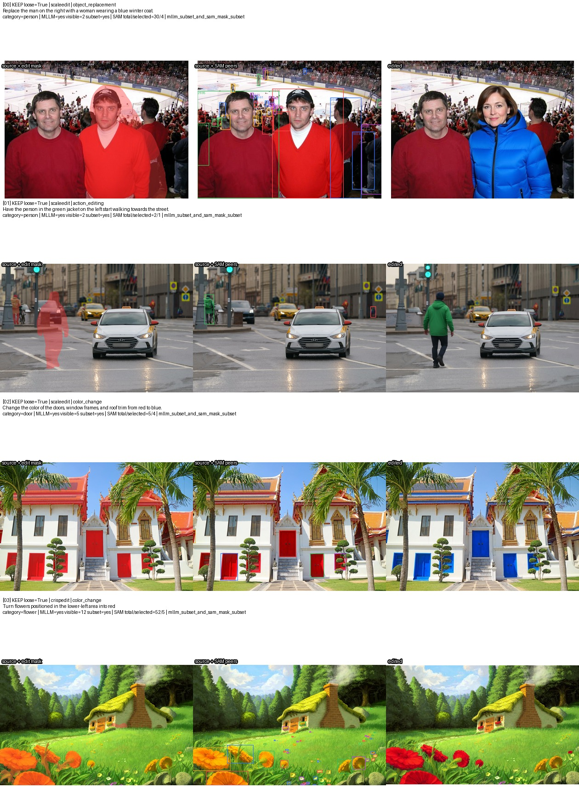
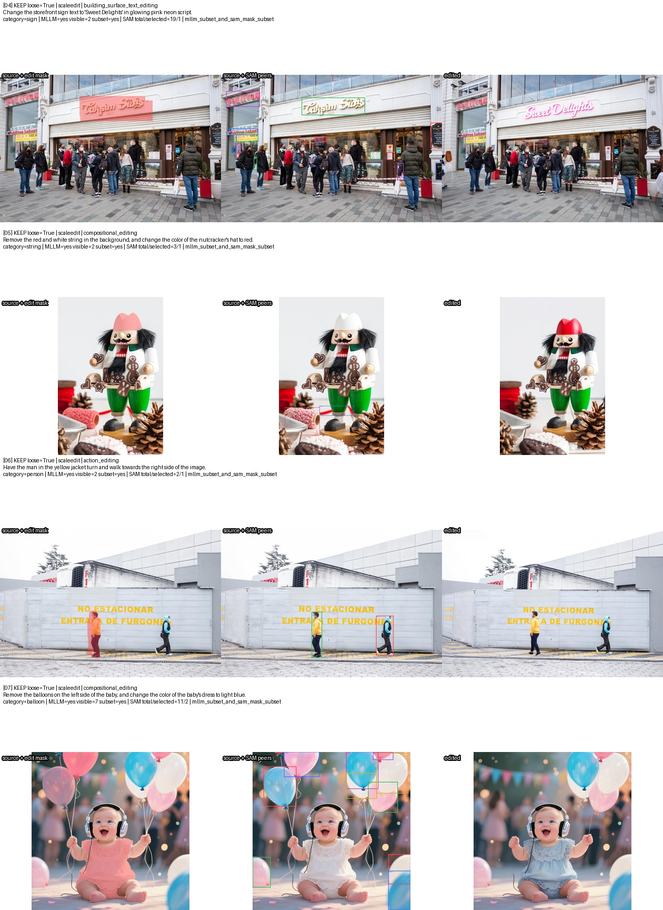
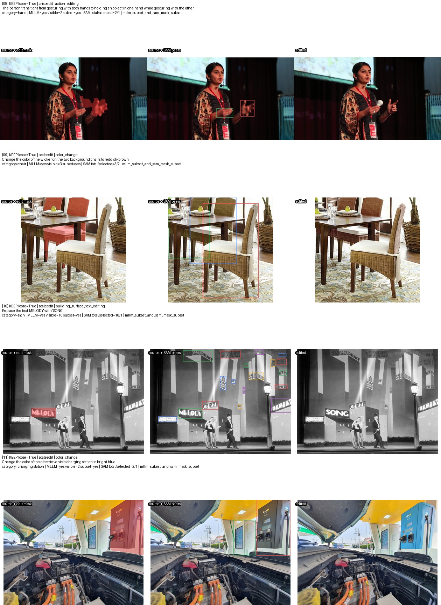
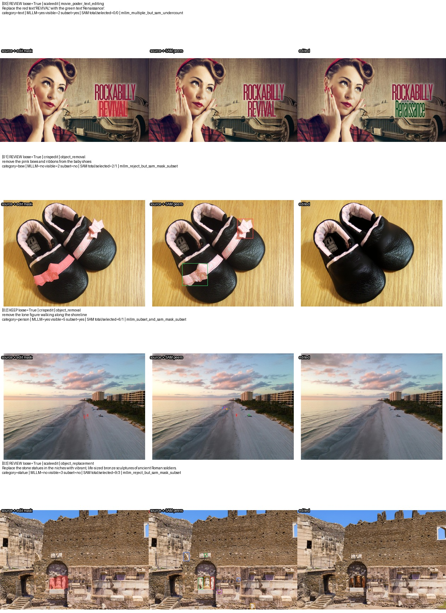
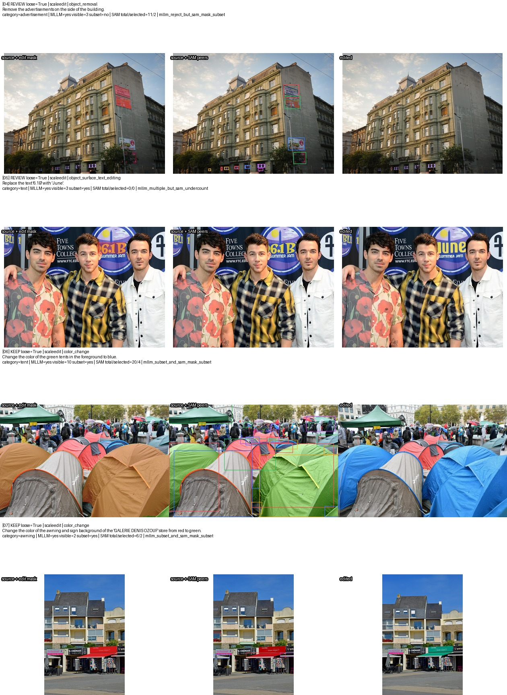
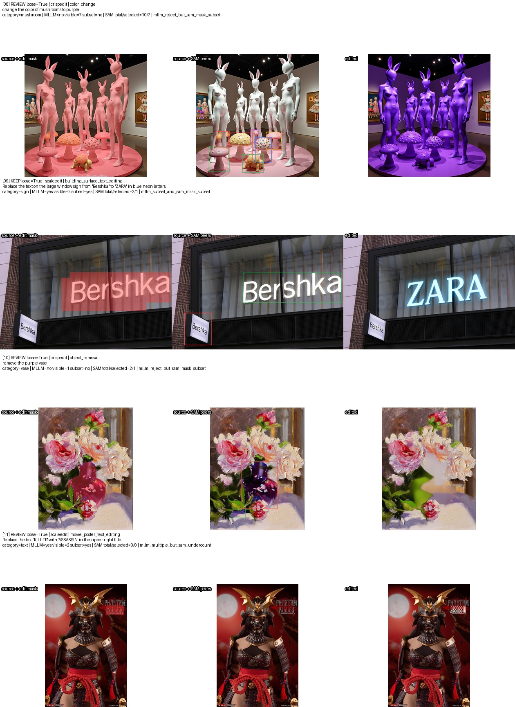

# 同类多实例细粒度指代编辑筛选

## 1. 目标与输入

本流程从已经通过 mask QC、且已经统一字段的 CrispEdit 与 ScaleEdit 训练数据中，筛选：

1. 源图中存在至少两个可数的同类实例；
2. 指令只编辑其中一个或真子集，而不是编辑全部同类实例；
3. 指令通过方位、数量、顺序、关系、外观或身份等信息指代被编辑实例。

统一输入数据集只读路径：

```text
/mnt/bn/strategy-mllm-train/user/tanyue/datasets/ScaleEdit-CrispEdit-mask-train
├── crispedit/data/*.parquet   # 68,496 rows
└── scaleedit/data/*.parquet   # 98,849 rows
```

总计 167,345 条。字段和原始数据来源见 [UNIFIED_MASK_DATASET.md](UNIFIED_MASK_DATASET.md)。
筛选器只读该目录；小批量候选、中间证据、manifest 和可视化都写入显式指定的输出路径。

本流程不修改 CrispEdit/ScaleEdit 的 vLLM 打标 prompt、SAM3 打标逻辑或现有 mask，属于打标完成后的独立难度筛选。

## 2. 总体流程

```text
统一 mask 数据集
  -> 确定性任务预筛
  -> Qwen3.5 单次语义判断 + 编辑主体/无属性类别抽取
  -> SAM3 开放词汇同类实例计数
  -> 已有 edit mask 与每个 SAM 实例求交
  -> 三方证据融合
  -> strict keep / review / drop + 可视化
```

实现中 Qwen 位于 SAM3 之前，是因为 SAM3 需要一个短、无属性、单数的开放词汇类别提示。
这不增加 MLLM 调用：每个通过预筛的样本只调用一次 Qwen，该次调用同时输出语义判断和 SAM 类别。
Qwen 只看到源图与指令，不看到编辑后图或筛选答案。

代码入口：

- 可测试策略函数：[difficulty_filter/referential.py](../difficulty_filter/referential.py)
- 分阶段命令：[scripts/filter_referential_edits.py](../scripts/filter_referential_edits.py)
- 全量 8 卡与 shard 断点续跑：[scripts/run_referential_filter_full.py](../scripts/run_referential_filter_full.py)
- tqdm elapsed/ETA 监视器：[scripts/watch_referential_filter_progress.py](../scripts/watch_referential_filter_progress.py)
- 单元测试：[tests/test_referential_filter.py](../tests/test_referential_filter.py) 和
  [tests/test_referential_filter_full.py](../tests/test_referential_filter_full.py)

## 3. 各阶段方法

### 3.1 确定性预筛

以下样本不调用模型，直接 `drop`：

- `mask_mode != regions`；
- `background_replacement`、`style_transfer`、`tone_adjustment`、
  `visual_beautification`、`viewpoint_transformation`、`part_extraction`；
- 纯 `object_addition`。纯新增即使使用“在某物旁边”等参照，也没有从源图已有同类实例中选择编辑对象。

混合的“新增 + 修改”若属于 compositional edit，仍交给后续语义判断。

代码还提取空间、序数、数量和关系词，仅用于分层抽样与审计，绝不单独决定保留，避免把
“change both objects”或“move the only object to the left”误当成目标样本。

### 3.2 一次 MLLM 调用

模型为 Qwen3.5-35B-A3B，使用 vLLM tensor parallel。输入包括：

- 一张源图；
- edit instruction；
- edit type；
- 原 mask 打标 `ground_json` 中的少量 source-first 描述，只作为提示。

模型先从 instruction 复制 `edited_subject_phrase`，再仅从该短语派生
`object_category`。这一步可避免把未编辑的参照锚点当成类别。例如：

```text
instruction: The subject shifts the position of their right hand ... on the surface of a sink.
edited_subject_phrase: right hand
object_category: hand
```

不会因为图中有多个 sink 而错误地用 `sink` 计数。类别会去掉颜色、数量、位置、所有关系和状态，
以便 SAM3 检出全部同类实例，而不是只检出指令选中的子集。

结构化输出字段：

| 字段 | 含义 |
| --- | --- |
| `edited_subject_phrase` | 从指令抽出的实际被编辑主体短语 |
| `object_category` | 给 SAM3 的无属性类别词 |
| `visible_same_class_count` | MLLM 视觉估计的同类实例数 |
| `selected_instance_count` | 指令选择的实例数，不确定时为 null |
| `subset_relation` | `yes / likely / no / uncertain` |
| `reference_cues` | spatial、ordinal、cardinality、relation、appearance、identity 或 none |
| `fine_grained_referential` | `yes / likely / no` |
| `confidence`、`reason` | 置信度和简短依据 |

完整、带版本号的 prompt 保存在 `build_mllm_prompt()` 中，也逐条写入 MLLM parquet 的
`prompt` 字段。当前版本为 `qwen35_referential_subset_audit_v4`。推理固定
`temperature=0`、`top_p=1`、`seed=0`，不做解析失败重试。

### 3.3 SAM3 同类实例计数

SAM3 在源图上只跑一次文本提示 `object_category`。当前默认值：

- confidence threshold：0.30；
- 实例面积占比：`[0.00003, 0.90]`；
- 最多保留分数最高的 100 个原始 proposal；
- mask IoU ≥ 0.80、互相包含率 ≥ 0.92 或 box IoU ≥ 0.90 时去重。

去重前先检查 box 是否相交，因此 `person`、`text` 等宽类别产生很多 proposal 时，不会对所有
百万像素 mask 做 O(n²) 比较。

只知道“图中有多个同类”仍不足以判断指令是否编辑真子集。因此流程将已经完成打标的 edit mask
和每个 SAM 实例求交，计算：

- `edit_overlap_instance_fraction`；
- `edit_overlap_containment`；
- `edit_overlap_image_fraction`；
- `selected_by_edit_mask`。

默认满足“相交占实例 ≥ 2% 或 containment ≥ 10%”，且相交占全图 ≥ 0.001%，就认为该实例被编辑。
由此得到 `sam_count`、`sam_selected_count` 和 `sam_unselected_count`。该检查不调用额外 MLLM。

### 3.4 证据融合

最终输出分三档：

| 条件 | 决策 |
| --- | --- |
| 确定性预筛不通过 | `drop` |
| MLLM 强判定为真，SAM ≥ 2，edit mask 覆盖非空真子集 | `keep` |
| edit mask 覆盖 ≥ 90% 的 SAM 同类实例 | `drop` |
| MLLM 强判定为真但 SAM 少计或未命中 mask | `review` |
| MLLM 拒绝，但 SAM 与 edit mask 独立给出明确真子集证据 | `review` |
| 其余证据不足、单实例、全实例编辑 | `drop` |

`selected_manifest.parquet` 只含 `keep`，是默认高精度训练清单。
`loose_selected_manifest.parquet` 含 `keep + review`，仅适合人工复核或强调召回率的实验。
SAM/MLLM 冲突绝不会自动进入严格清单。

90% 的“近全体覆盖”阈值用于容忍一个 SAM 漏检或伪实例。例如 36 个 proposal 中 35 个都与
edit mask 重合时，不会因为剩下一个噪声 proposal 而错误认定为真子集。

## 4. 环境与小批量运行

使用 ScaleEdit 已有的一键环境脚本：

```bash
cd /opt/tiger/tanyue/sam3-crispedit
bash scripts/setup_scaleedit_vllm_env.sh
```

示例在临时目录中分层抽 50 条：CrispEdit/ScaleEdit 各 25 条；每个来源包含 14 条有词法线索候选、
6 条无显式线索 local control 和 5 条确定性排除项。

```bash
cd /opt/tiger/tanyue/sam3-crispedit
OUT=/tmp/codex-tanyue-referential-filter-20260913

.venv-scaleedit-vllm/bin/python scripts/filter_referential_edits.py prepare \
  --dataset-root /mnt/bn/strategy-mllm-train/user/tanyue/datasets/ScaleEdit-CrispEdit-mask-train \
  --datasets crispedit,scaleedit \
  --sample-size 50 \
  --seed 20260913 \
  --output "$OUT/candidates.parquet"

.venv-scaleedit-vllm/bin/python scripts/filter_referential_edits.py mllm \
  --input "$OUT/candidates.parquet" \
  --output "$OUT/mllm.parquet" \
  --model-path /mnt/bn/strategy-mllm-train/common/models/Qwen3.5-35B-A3B \
  --devices 0,1 \
  --tensor-parallel-size 2 \
  --batch-size 8

.venv-scaleedit-vllm/bin/python scripts/filter_referential_edits.py sam \
  --input "$OUT/candidates.parquet" \
  --mllm "$OUT/mllm.parquet" \
  --output "$OUT/sam.parquet" \
  --checkpoint-path /mnt/bn/strategy-mllm-train/common/models/sam3/sam3.pt \
  --devices 0 \
  --store-detection-masks

.venv-scaleedit-vllm/bin/python scripts/filter_referential_edits.py fuse \
  --input "$OUT/candidates.parquet" \
  --mllm "$OUT/mllm.parquet" \
  --sam "$OUT/sam.parquet" \
  --output-dir "$OUT/final"

.venv-scaleedit-vllm/bin/python scripts/filter_referential_edits.py visualize \
  --input "$OUT/candidates.parquet" \
  --sam "$OUT/sam.parquet" \
  --audit "$OUT/final/audit.parquet" \
  --output-dir "$OUT/visualization"
```

各阶段输出采用不同 parquet checkpoint；vLLM 进程退出后再启动 SAM3，避免两个大模型争用显存。
重复写已有输出时必须显式增加 `--overwrite`。可视化所需的 SAM 实例 mask 只在测试时用
`--store-detection-masks` 保存，正式大规模筛选可以关闭以减小结果体积。

## 5. 50 条小批量结果（2026-09-13）

实际测试中 10 条确定性排除项未调用 Qwen；其余 40 条 Qwen 结果全部解析成功，无重试。
SAM3 40 条成功、10 条随确定性预筛跳过。最终：

| 来源 | keep | review | drop |
| --- | ---: | ---: | ---: |
| CrispEdit | 6 | 3 | 16 |
| ScaleEdit | 6 | 5 | 14 |
| 合计 | 12 | 8 | 30 |

严格训练清单 12 条，宽松复核清单 20 条。该样本是为了覆盖候选、对照和排除项而做的分层样本，
因此 12/50 不是全量数据保留率估计。

本次全部临时结果：

```text
/tmp/codex-tanyue-referential-filter-20260913/
├── candidates-v2.parquet
├── mllm-v4.parquet
├── sam-final.parquet
├── final/
│   ├── audit.parquet
│   ├── selected_manifest.parquet
│   ├── loose_selected_manifest.parquet
│   └── summary.json
└── visualization-final-v2/
    ├── index.json
    └── page-01.jpg ... page-09.jpg
```

可视化每行从左到右为：源图叠加已有 edit mask、源图叠加 SAM3 同类实例、编辑后图。
编辑后图仅用于人工看板，从未输入筛选 MLLM。

## 6. 已知边界与使用建议

- `text`、日历数字和很小目标上，SAM3 开放词汇计数可能为 0；MLLM 强判定样本会进入
  `review`，不会静默丢失或进入严格集。
- 宽类别可能产生过分割，例如一个 patch 被分成多个 proposal；当它与 MLLM 的单实例判断冲突时
  也只进入 `review`。
- 物体“实例”的粒度有天然歧义，例如多滑道结构可视为一个设施或多条 slide。审计表同时保留
  MLLM count、SAM count、mask-overlap count 和理由，便于后续调整口径。
- 小批量入口用于抽样分析；全量入口按源 parquet shard 保存证据并最终汇总轻量 manifest，
  不会把 167,345 条图像复制到单个中间 parquet。

## 7. 全量 8 卡运行

全量 supervisor 使用外部 data parallel：

- MLLM：4 个独立 vLLM engine × TP=2，共使用 GPU 0–7；
- SAM3：MLLM 完成后启动 8 个单卡 worker，共使用 GPU 0–7；
- 每个源 shard 对应一个 MLLM evidence 和一个 SAM evidence parquet；
- `--resume` 自动验证行数和 policy version，只重跑缺失或不完整 shard；
- 合法的 0-row 源 shard 会生成并接受 0-row evidence，不会阻断下一阶段；
- 最终 manifest 只保存回源 locator 和筛选结论，不复制图像。

生产输出路径：

```text
/mnt/bn/strategy-mllm-train/user/tanyue/datasets/ScaleEdit-CrispEdit-mask-referential-filter
├── run_config.json
├── logs/
│   ├── progress.log
│   ├── tqdm-progress.log
│   ├── mllm-worker-00.log ... mllm-worker-03.log
│   └── sam-worker-00.log ... sam-worker-07.log
├── progress/*.json
├── mllm/{crispedit,scaleedit}/*.parquet
├── sam/{crispedit,scaleedit}/*.parquet
├── audit/{crispedit,scaleedit}/*.parquet
├── final/
│   ├── selected_manifest.parquet
│   ├── loose_selected_manifest.parquet
│   └── summary.json
└── _SUCCESS
```

直接运行：

```bash
cd /opt/tiger/tanyue/sam3-crispedit
.venv-scaleedit-vllm/bin/python -u scripts/run_referential_filter_full.py supervise \
  --dataset-root /mnt/bn/strategy-mllm-train/user/tanyue/datasets/ScaleEdit-CrispEdit-mask-train \
  --output-root /mnt/bn/strategy-mllm-train/user/tanyue/datasets/ScaleEdit-CrispEdit-mask-referential-filter \
  --model-path /mnt/bn/strategy-mllm-train/common/models/Qwen3.5-35B-A3B \
  --checkpoint-path /mnt/bn/strategy-mllm-train/common/models/sam3/sam3.pt \
  --batch-size 8
```

后台任务的总体进度看 `logs/progress.log`；单 worker 的 vLLM/SAM 详情看对应 worker log。
若任务被中断，原命令重新运行即可按 shard 恢复。

可在独立终端启动只读 tqdm 监视器，显示完成比例、阶段累计耗时、ETA、吞吐、shard、
worker 和 error 数；启动或退出监视器不会改变推理进程与 checkpoint：

```bash
.venv-scaleedit-vllm/bin/python scripts/watch_referential_filter_progress.py \
  --output-root /mnt/bn/strategy-mllm-train/user/tanyue/datasets/ScaleEdit-CrispEdit-mask-referential-filter \
  --interval 10
```

它同时追加干净的文本快照到 `logs/tqdm-progress.log`。本机生产任务也可直接查看：

```bash
tmux attach -t referential_filter_tqdm
tail -f /mnt/bn/strategy-mllm-train/user/tanyue/datasets/ScaleEdit-CrispEdit-mask-referential-filter/logs/tqdm-progress.log
```

MLLM 与 SAM3 技术上可以分配到不同 GPU 后并行流水，但当前 Qwen3.5-35B-A3B 的 MLLM
阶段是主要瓶颈。将 8 卡拆为 4 卡 MLLM + 4 卡 SAM 会把 vLLM engine 从 4 个 TP=2
降到 2 个，通常使总耗时增加；把两者同卡运行又有显存溢出和算力争用风险。因此生产默认仍是
“MLLM 独占 8 卡，结束后 SAM 独占 8 卡”。只有额外 GPU 可用时，跨 GPU 并行流水才会稳定提速。

若 MLLM 只存在少量 `parse_error`，可以在恢复前定向补推。该命令只重试失败行，使用 vLLM
structured JSON 和短 reason 约束，不重算已经成功的样本：

```bash
.venv-scaleedit-vllm/bin/python -u scripts/run_referential_filter_full.py repair-mllm \
  --dataset-root /mnt/bn/strategy-mllm-train/user/tanyue/datasets/ScaleEdit-CrispEdit-mask-train \
  --output-root /mnt/bn/strategy-mllm-train/user/tanyue/datasets/ScaleEdit-CrispEdit-mask-referential-filter \
  --devices 0,1 \
  --tensor-parallel-size 2
```

## 8. 全量结果与随机抽样（2026-09-14）

全量任务在 2026-09-14 04:03:39 UTC 完成，并写入 `_SUCCESS`。输入、MLLM、SAM 和
audit 均覆盖 1,337 个 shard；最终输入计数为 167,345，未发生行丢失或 locator 错位。

运行状态：

| 项目 | 数量 |
| --- | ---: |
| 输入总行数 | 167,345 |
| 确定性预筛跳过 MLLM | 77,042 |
| MLLM 成功解析 | 90,303 |
| SAM3 成功计数 | 90,040 |
| SAM3 无类别安全跳过 | 77,305 |
| 最终 MLLM/SAM runtime error | 0 / 0 |

初次推理中的 5 条截断/解析失败使用 `repair-mllm` 的 structured JSON 定向补推，最终
90,303 个需调用 MLLM 的样本全部解析成功。`SAM3 无类别安全跳过` 包含 77,042 个确定性
排除样本，以及 263 个 MLLM 未给出可用开放词汇类别的样本；这些不是 runtime error，且不会
进入严格集合。

最终决策：

| 来源 | 总数 | keep | review | drop | 宽松 keep + review |
| --- | ---: | ---: | ---: | ---: | ---: |
| CrispEdit | 68,496 | 4,377（6.390%） | 3,771（5.505%） | 60,348（88.104%） | 8,148（11.896%） |
| ScaleEdit | 98,849 | 12,718（12.866%） | 19,518（19.745%） | 66,613（67.389%） | 32,236（32.611%） |
| 合计 | 167,345 | 17,095（10.215%） | 23,289（13.917%） | 126,961（75.868%） | 40,384（24.132%） |

生产清单：

```text
/mnt/bn/strategy-mllm-train/user/tanyue/datasets/ScaleEdit-CrispEdit-mask-referential-filter/final/selected_manifest.parquet
  # strict keep，17,095 rows

/mnt/bn/strategy-mllm-train/user/tanyue/datasets/ScaleEdit-CrispEdit-mask-referential-filter/final/loose_selected_manifest.parquet
  # keep + review，40,384 rows
```

### 8.1 固定随机抽样看板

使用固定种子 `20260914` 分别抽取 12 条：严格样本全部来自 `selected_manifest`；宽松样本
直接从 `loose_selected_manifest` 均匀抽取，恰好包含 4 条 `keep` 和 8 条 `review`。
选择清单保存在 [summary.json](../docs_assets/referential_filter/full_run/summary.json)、
[strict/samples.json](../docs_assets/referential_filter/full_run/strict/samples.json) 和
[loose/samples.json](../docs_assets/referential_filter/full_run/loose/samples.json)，其中保留了
sample ID、源 parquet locator、指令、MLLM/SAM 计数和最终理由。

每行从左到右为：源图与已有 edit mask、源图与 SAM3 同类实例框、编辑后图。生产运行为减小
结果体积没有保存 SAM proposal mask，因此中栏展示可复核的 proposal box；编辑后图只用于
人工检查，从未输入筛选 MLLM。

严格集合（12 条，CrispEdit 2 / ScaleEdit 10）：







宽松集合（12 条，CrispEdit 4 / ScaleEdit 8；标题标明 `KEEP` 或 `REVIEW`）：







## 9. 验证

```bash
cd /opt/tiger/tanyue/sam3-crispedit
.venv-scaleedit-vllm/bin/python -m pytest -q \
  tests/test_referential_filter.py tests/test_referential_filter_full.py
```

专项测试覆盖确定性预筛、线索提取、两种 ground JSON、MLLM JSON 解析、SAM proposal 去重、
严格保留、近全体剔除、MLLM/SAM 冲突复核、SAM 少计复核、全量 shard 分配、evidence 版本检查
和 full fusion manifest 对齐。
