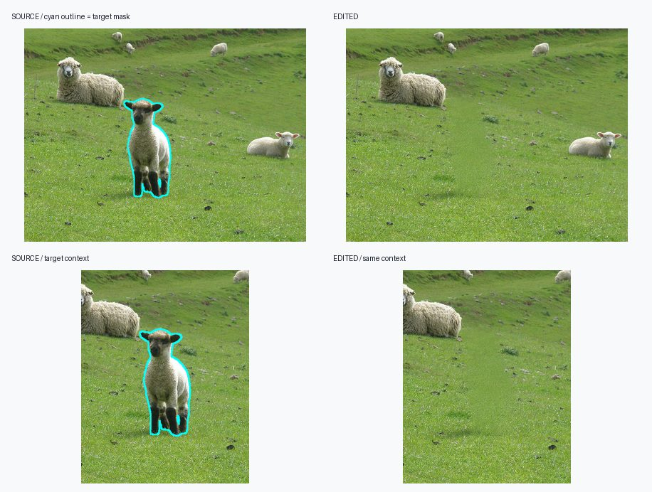
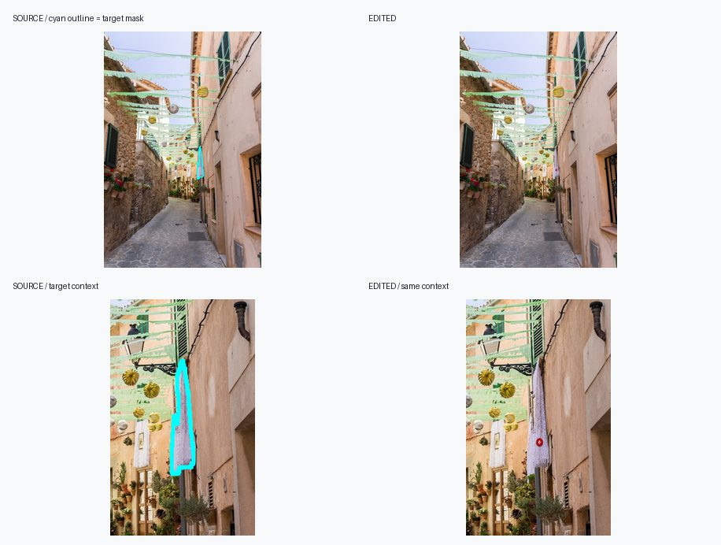
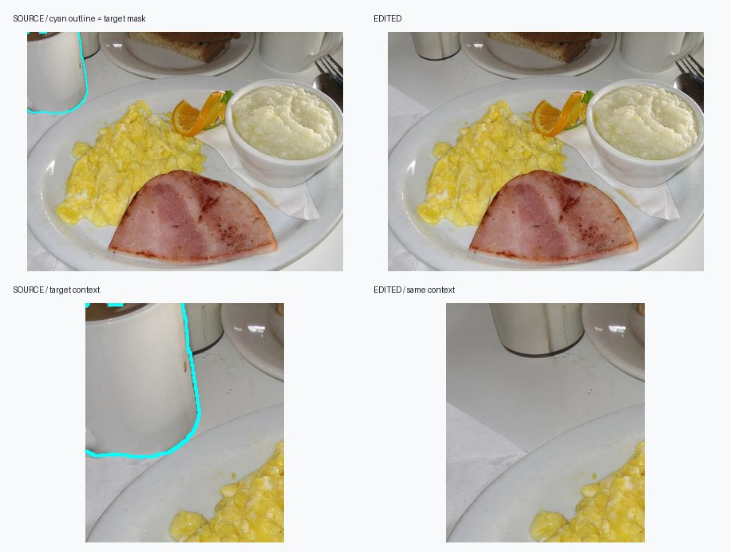
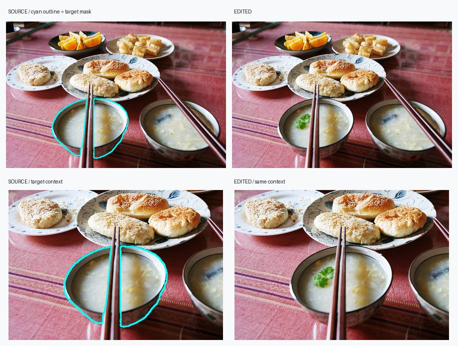
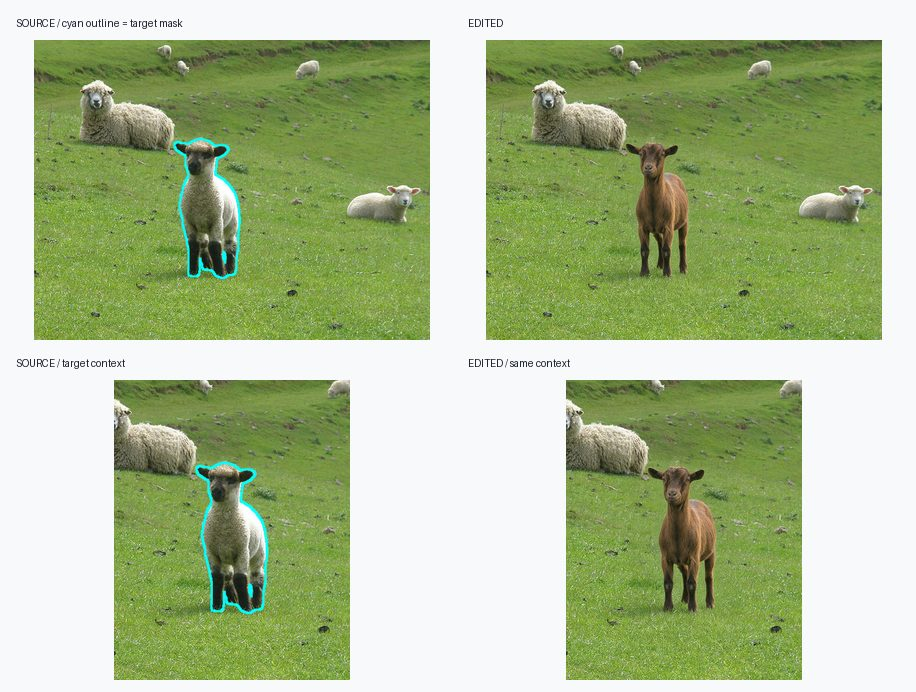
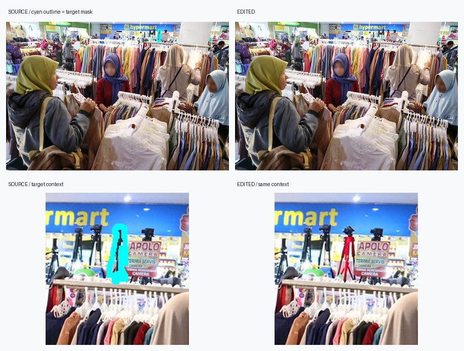
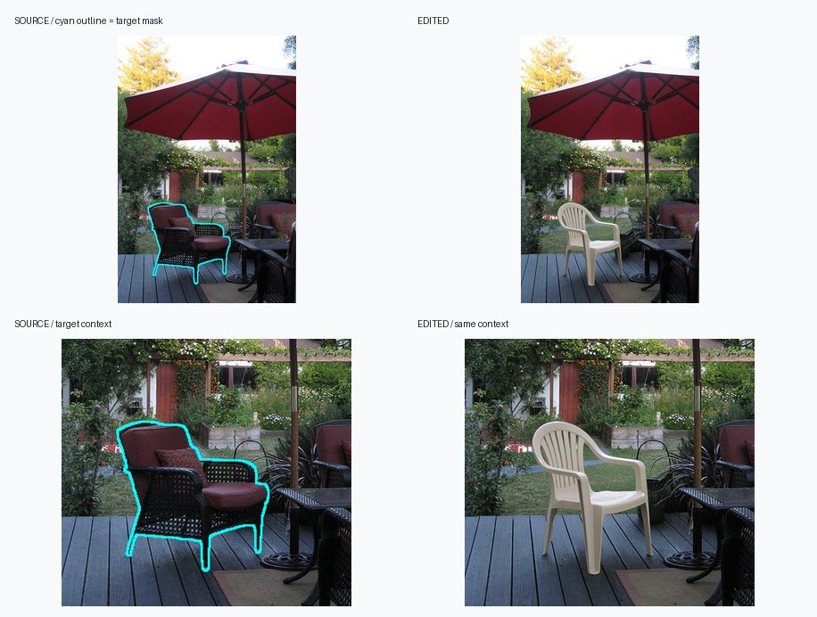
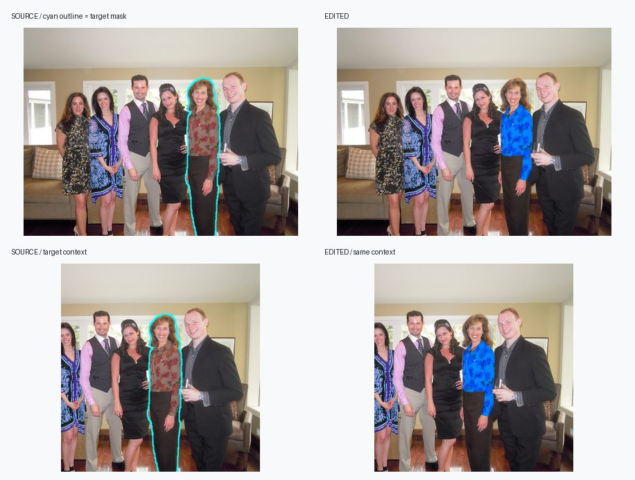

# SAMTok 四类细粒度编辑数据：正式交付

本页记录 2026-09-28 完成的 GRES-8k / VER-4k 派生编辑数据。四类编辑共享同一份源
parquet，但 `remove` 和 `add/replace/attribute` 分别由两个正式四机 run 生成，再以
**模型审核通过** 为准合并。`model_pass` 不是逐条人工验收标签；下文的可视化仅用于抽查。

## 1. 源数据与交付路径

| 用途 | 路径 | 内容 |
|---|---|---|
| 源训练数据 | `/mnt/bn/strategy-mllm-train/user/tanyue/datasets/SAMTok_Training_Data/mix_gres8k_ver4k_train.parquet` | SAMTok GRES-8k 与 VER-4k 的原图、指代问题/答案和实例 COCO RLE mask |
| remove 正式 run | `/mnt/bn/strategy-mllm-train/user/tanyue/experiments/SAMTok_Derived_Edit_Labeling/four_node/samtok-derived-4n-20260925/` | `relations-v16` 规划、Qwen-Image-2.1 出图、27B remove 专项审核 |
| 三类型正式 run | `/mnt/bn/strategy-mllm-train/user/tanyue/experiments/SAMTok_Derived_Edit_Labeling/four_node/samtok-add-replace-attribute-4n-20260926/` | 同一 source/mask 各派生 add、replace、attribute，`resume-012` 完成通用审核 |
| 四类交付目录 | `/mnt/bn/strategy-mllm-train/user/tanyue/datasets/SAMTok_Derived_Edit_Labeling/combined/` | 自包含的通过样本清单、原图、编辑图、RLE mask、审核字段与可视化 |

源 parquet 共 12,337 行。`prepare_samtok_data.py` 的 positive index 去掉 4,666 条
GRES `No target`，留下 7,671 张正例原图（GRES 3,671、VER 4,000）。同一原图的每个
mask 都独立派生 case，不把一图多 mask 合成一次多区域编辑。共有 10,633 个原始正例
region。三类型 run 物化时发现 `gres_r480_m0` 的 RLE 为空，分片前剔除了它的三条
类型 case，故三类型有效输入是 31,896 而非 31,899。

交付目录结构：

```text
combined/
├── summary.json
├── manifest.jsonl                  # 四类合并的统一训练/检查清单
├── by_type/{remove,add,replace,attribute}/manifest.jsonl
├── images/
│   ├── sources/{remove,multitype}/source_*.png
│   └── edited/{remove,add,replace,attribute}/*.png
├── provenance/                     # 两个正式 run 的原始完整结果与审核 JSONL
└── gallery/
    ├── index.html                  # 单文件可预览，图片内嵌
    ├── selection.json
    └── assets/*.jpg
```

`manifest.jsonl` 每行包含 `case_id`、`task_type`、最终 `editing_instruction`、
相对于 `combined/` 的 `source_image` / `edited_image`、单区域 `mask_rle`、
`original_mask_rle`（若与执行 mask 不同）、GRES/VER 来源及 parquet 行号、mask 序号、
源指代问题/答案、目标定位与 `region_contract`、规划状态、模型审核理由/结构化判断/像素
指标，以及原 run 的追溯路径。`mask_rle` 是 COCO 压缩 RLE，`size=[高度,宽度]`。
不同正式 run 中同名 source PNG 的编码字节并不相同，因此按 `remove` / `multitype`
命名空间保留其实际输入文件。图片是普通**硬链接文件**，不是指向实验目录的软链接；
删除原 run 的一个路径不会使交付图片失效，但不要原位改写这些共享 inode。
通过样本实际涉及 6,238 张 remove 源图和 6,936 张三类型源图；同图多 case 在各自
命名空间内只保留一份 source PNG。

## 2. 正式构造 pipeline 与代码入口

```text
源 parquet → positive index / 逐 mask 物化 → 目标与依附关系规划
          → Qwen-Image-2.1 指定区域编辑 → 原图/编辑图的 27B 审核
          → model_pass 汇总 → 四类统一交付 + HTML 抽查
```

| 阶段 | remove | add / replace / attribute |
|---|---|---|
| 输入准备 | `synthesis_pipeline/prepare_removal_inputs.py`：每个正例 mask 一条 remove case | `synthesis_pipeline/prepare_multitype_inputs.py`：每个正例 mask 展开三类，空 mask 提前剔除 |
| 正例索引与图像画布 | 两者共用 `synthesis_pipeline/prepare_samtok_data.py`；复用原图、指代与 RLE，并将 source/mask 对齐到 Qwen 画布 | 同左 |
| 规划 | `synthesis_pipeline/run_relation_cohort.py`：Qwen3.8-27B `relations-v16` 判断目标、邻居与随目标编辑的附件，无法自洽者 defer | `synthesis_pipeline/plan_dataset_regions.py`：27B 对单个 mask 做 grounding/scope、编辑类型兼容性和短指令设计；不适合该 mask/类型者拒绝 |
| 出图 | `run_relation_cohort.py` 调 Qwen-Image-2.1 / vLLM-Omni，并用 relation/guard/visible/composition 约束区域与融合 | `synthesis_pipeline/experiment_edit_quality.py` 的 `context_grounded_v4_qwen21`，Qwen-Image-2.1 / vLLM-Omni，40 steps、seed 0，逐 case checkpoint |
| 审核 | `synthesis_pipeline/audit_removal_concise.py`：27B 检查完整移除、指令匹配、背景与邻居，带像素 veto | `synthesis_pipeline/audit_edit_pairs.py`：27B 根据具体类型对原图和编辑图做一次审核，给出结构化理由及局部像素指标 |
| 四机调度与汇总 | `synthesis_pipeline/run_multinode_labeling.py` | `synthesis_pipeline/run_multinode_multitype_labeling.py` |
| 交付 | `synthesis_pipeline/materialize_combined_samtok_dataset.py`：统一字段并硬链接通过样本图片；`synthesis_pipeline/build_combined_samtok_gallery.py`：标注 mask 轮廓并做内嵌 HTML | 同左 |

两次正式运行都在 Arnold 使用 4 个 worker、每个 worker 8 张 H100；入口从远端
`sam3-crispedit` 的 `samtok-derived-edit-labeling` 分支 clone 到节点本地，安装锁定的
cu129 环境，日志写入共享 experiments 目录。完整的 Arnold 配置、首次运行入口和中断
续传入口见 [四机运行指南](SAMTOK_LABELING_四机运行指南.md) 第 2、3 节。
remove 最终 attempt 为 `resume-002`；三类型最终 attempt 为 `resume-012`。运行结束标记
分别在各 attempt 的 `control/finalize.ok.json`，最终统计在各 run 的 `reports/final.json`。

当前交付目录可用以下命令从两个已完成的正式 run 重建（要求同一共享文件系统支持硬链接）：

```bash
cd /opt/tiger/tanyue/samtok-derived-edit-labeling
ROOT=/mnt/bn/strategy-mllm-train/user/tanyue
python3 -m synthesis_pipeline.materialize_combined_samtok_dataset \
  --remove-run "$ROOT/experiments/SAMTok_Derived_Edit_Labeling/four_node/samtok-derived-4n-20260925" \
  --multitype-run "$ROOT/experiments/SAMTok_Derived_Edit_Labeling/four_node/samtok-add-replace-attribute-4n-20260926" \
  --out-root "$ROOT/datasets/SAMTok_Derived_Edit_Labeling/combined" --workers 16
python3 -m synthesis_pipeline.build_combined_samtok_gallery \
  --dataset-root "$ROOT/datasets/SAMTok_Derived_Edit_Labeling/combined" \
  --selection-json docs/assets/combined_final_selection.json \
  --doc-assets docs/assets/combined_final
```

物化程序会检查正式 run 的完成状态、全部 pass 审核记录、case ID 唯一性及硬链接目标；
同一目标已是正确硬链接时可续跑。只有全部图片链接成功，才写出最终 manifest/summary。
可从统一清单直接读取：

```python
import json
from pathlib import Path
from PIL import Image
from pycocotools import mask as coco_mask

root = Path('/mnt/bn/strategy-mllm-train/user/tanyue/datasets/SAMTok_Derived_Edit_Labeling/combined')
row = json.loads((root / 'manifest.jsonl').open(encoding='utf-8').readline())
source = Image.open(root / row['source_image'])
edited = Image.open(root / row['edited_image'])
mask = coco_mask.decode(row['mask_rle'])  # H×W；只标注本条选中的 region
instruction = row['editing_instruction']
```

## 3. 正式运行结果

| 编辑类型 | 有效输入 | 规划接受 / 出图 / 审核 | 审核通过 | 审核失败 | 未形成可执行规划 |
|---|---:|---:|---:|---:|---:|
| remove | 10,633 | 9,436 | **7,990** | 1,446 | 1,197 |
| add | 10,632 | 6,413 | **6,269** | 144 | 4,219 |
| replace | 10,632 | 5,298 | **5,016** | 282 | 5,334 |
| attribute | 10,632 | 8,926 | **8,682** | 244 | 1,706 |
| **合计** | **42,529** | **30,073** | **27,957** | **2,116** | **12,456** |

四节点均写入 `node<N>.done.json` 和最终 `finalize.ok.json`。进入出图的 30,073 条
都有编辑 PNG 和审核记录；合并的 27,957 条为模型判 `pass`。最终 `manifest.jsonl`
的图片路径以交付目录为根解析，不需要读取原 run 的软链接。三类型审核 `resume-012`
在约 11:43 UTC 完成，平均每节点审核 5,100 多条；这次续跑复用了之前已正确生成的
规划与编辑 checkpoint，主要耗时在 27B 审核。

模型通过样本按源子集分布：

| 类型 | GRES | VER |
|---|---:|---:|
| remove | 3,689 | 4,301 |
| add | 2,841 | 3,428 |
| replace | 2,487 | 2,529 |
| attribute | 4,042 | 4,640 |
| **合计** | **13,059** | **14,898** |

当前结果的主要数量损失发生在出图前：尤其 `replace` 有 5,334 条因 mask 对目标
范围或替代任务不合适而没有可执行规划。最终通过率不应解释为模型在任意随机输入
上的出图成功率。审核 `pass` 也仍可能含误判，正式训练前应结合下方可视化抽检。

## 4. 代表性可视化

完整的 [四类通过样例 HTML](</mnt/bn/strategy-mllm-train/user/tanyue/datasets/SAMTok_Derived_Edit_Labeling/combined/gallery/index.html>) 内嵌图片，
单文件打开即可查看。每条上排为带青色 mask 轮廓的 source 与 edited 全图，下排为
同坐标局部放大；展开卡片可看审核理由和文件路径。下面每类展示两条。

| remove：同类实例与小物体 | add：局部新增 |
|---|---|
|  |  |
|  |  |

| replace：指定实例替换 | attribute：局部属性修改 |
|---|---|
|  |  |
|  |  |
