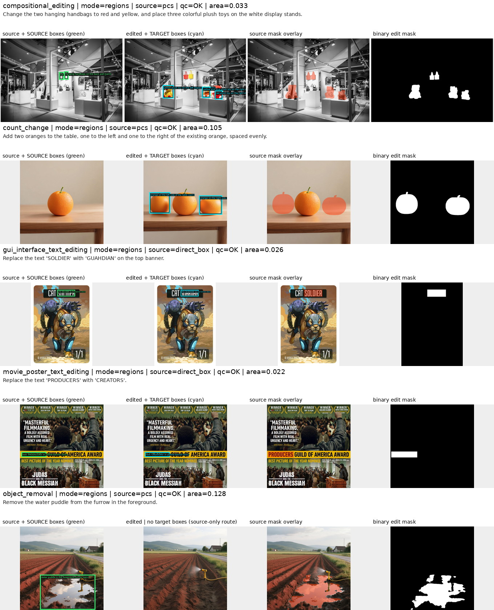

# ScaleEdit 完整 mask 打标流程

本文只描述仓库中当前使用的 ScaleEdit 实现。它从已经清洗并带有 `final_task` 的
source/edited image pair 出发，先用 Qwen3.5-35B-A3B 生成编辑区域合同，再用 SAM3 生成
source 坐标系下的二值 mask。Qwen 调用由 vLLM 批处理执行，正常路径仍为 planner + locator
两轮；当前版本额外强化了输出长度、Qwen 原生 grounding 格式、严格安全解析和损坏图片跳过。
当前还加入了多实例定位、编辑范围规范化、对齐表面外观编辑的低频图像对补全、文字框的成对
图像校验、稠密集合 recall margin，以及强证据下的全局变化路由修正。局部差分只用于严格门控的
bbox 校验或增加独立 SAM3 搜索锚框；不会直接阈值化为最终 mask。截断 JSON 和单查询多子框的
安全恢复会进入语义 QC。这些规则都不增加 MLLM 调用，也没有 crop/refinement 第三轮 MLLM。

## 入口与代码位置

- `scaleedit_mllm_grounding.py`：MLLM grounding 入口。
- `scaleedit_grounded_mask_runner.py`：SAM3 mask 入口。
- `scaleedit/policy.py`：planner/locator prompt、严格 JSON 解析和少量确定性任务约束。
- `scaleedit/grounding_runner.py`：Qwen 多卡调度、两阶段调用和 parquet 输出。
- `scripts/setup_scaleedit_vllm_env.sh`：从零创建独立的 vLLM/CUDA 12.9 环境。
- `scaleedit/sam3_backend.py`：从 v18 生产版原样隔离的 SAM3 底层候选与融合实现。
- `scaleedit/mask_pipeline.py`：SAM/box/full-image/inverse/negative-space 路由及后处理。
- `scaleedit/mask_runner.py`：SAM3 多卡调度和最终 parquet schema。
- `scripts/validate_scaleedit_masks.py`：行对齐、PNG、RLE 和统计验证。
- `scripts/visualize_scaleedit_masks.py`：bbox、mask 和实例信息的 review page。

当前版本标识定义在 `scaleedit/__init__.py`：

```text
prompt_version = scaleedit_edit_plan_bbox_locator_v18_qwen_native_correspondence
mask_policy_version = scaleedit_sam3_hybrid_mask_v12_compact_completion
```

当前生产数据和结果使用以下固定路径。源数据目录只读；grounding、mask 和日志只写入
独立结果根目录。不要将其与 CrispEdit 的 manifest/grounding 混用。

| 内容 | 路径 |
| --- | --- |
| 100k 源数据集（只读） | `/mnt/bn/strategy-mllm-train/user/tanyue/datasets/ScaleEdit-filtered-balanced-final-task-100k` |
| 全量结果根目录 | `/mnt/bn/strategy-mllm-train/user/tanyue/datasets/ScaleEdit-filtered-balanced-final-task-100k-vllm-labeled` |
| 全量 grounding | `/mnt/bn/strategy-mllm-train/user/tanyue/datasets/ScaleEdit-filtered-balanced-final-task-100k-vllm-labeled/grounding` |
| 全量 mask | `/mnt/bn/strategy-mllm-train/user/tanyue/datasets/ScaleEdit-filtered-balanced-final-task-100k-vllm-labeled/masks` |
| 全量日志 | `/mnt/bn/strategy-mllm-train/user/tanyue/datasets/ScaleEdit-filtered-balanced-final-task-100k-vllm-labeled/logs` |
| grounding 运行摘要 | `/mnt/bn/strategy-mllm-train/user/tanyue/datasets/ScaleEdit-filtered-balanced-final-task-100k-vllm-labeled/grounding/run_summary.json` |
| mask 运行摘要 | `/mnt/bn/strategy-mllm-train/user/tanyue/datasets/ScaleEdit-filtered-balanced-final-task-100k-vllm-labeled/masks/run_summary.json` |
| 全量运行日志 | `/mnt/bn/strategy-mllm-train/user/tanyue/datasets/ScaleEdit-filtered-balanced-final-task-100k-vllm-labeled/logs/full_pipeline.log` |
| 仓库内回归校验快照 | `docs_assets/scaleedit/current/validation.json` |
| 仓库内可视化快照 | `docs_assets/scaleedit/current/key_cases.jpg` 和 `key_cases_page_2.jpg` |

## 输入数据

`--input-dir` 中的每个 parquet shard 必须至少包含以下字段：

- `sample_id`：全数据集唯一的样本 ID；
- `final_task`：规范化后的编辑任务类别；
- `final_instruction`：最终编辑指令；
- `source_image`：原图的二进制图片数据；
- `edited_image`：编辑后图片的二进制图片数据。

grounding 和 mask 输出沿用输入 shard 文件名及行顺序。runner 会检查字段、样本 ID 和行对齐，
因此不能把不同版本数据的 input、grounding 与 mask 目录混用。

## 总体流程

```text
source + edited image + final_task + final_instruction
  -> Round 1: edit planner（语义与路由，不输出坐标）
  -> 确定性 plan policy（显式数量、完整人物、表面 residual）
  -> Round 2: bbox locator（只做视觉定位）
  -> candidate_id 确定性合并
  -> 文字 source/target 对齐差分校正 + dense/aggregate 有界 recall margin
  -> 对齐 surface_region 的低频差分补充独立 SAM 锚框
  -> 强全局图像对变化 + 大背景/前景 grounding 的 full_image 路由修正
  -> full_image / protect_foreground / regions 路由
  -> SAM3 或 direct box
  -> 连通域清理、紧凑交互 PCS 补全、target->source 映射、union
  -> PNG + instance RLE + audit metadata
```

### MLLM 调用次数

- 普通 `regions` / `protect_foreground`：2 次，planner 一次、locator 一次。
- `full_image`：1 次，planner 已决定全图，不需要 bbox locator。
- 明确的单物体旋转或视角编辑若被 planner 错判为 `full_image`：增加一次窄范围语义纠错，
  随后再调用 locator，因此该少数路径共 3 次。
- JSON 解析失败时，`--parse-retries` 会把上一次错误回复和具体解析错误放入纠错对话，再重试
  同一轮；默认值为 1。这是异常恢复，不是正常 pipeline 的固定轮次。每次尝试及纠错 prompt
  都保存在 `ground_json` 的 `attempts` 中。

当前没有把首轮长 JSON、mask metadata 或历史回答交给第二轮，也没有额外 crop MLLM 调用。
确定性 plan policy、可选 residual、低频表面补全、全局路由修正和紧凑交互 mask 补全都在这两轮
内部/之后运行，不增加模型请求。
两轮 prompt 的完整实现分别位于 `scaleedit.policy.build_observation_prompt` 和
`scaleedit.policy.build_grounding_prompt`；每行 grounding 的 `ground_json` 也保存实际 prompt、原始
回复及解析结果，便于逐样本审计。

### vLLM 后端边界

vLLM 只替换 `transformers.generate` 的执行框架。每个请求使用相同的两张完整图片和
`AutoProcessor.apply_chat_template(..., enable_thinking=False)`。Planner 与 locator 的长度上限
分别为 2048 和 1024 tokens，避免复杂 planner JSON 在 1024 tokens 处截断，同时不放宽短小的
locator 回答。生成参数等价于原来的 `do_sample=False`：temperature 为 0，
禁用 top-k/top-p/min-p 截断，惩罚项为中性值，并固定 seed。生成文本仍经过原有严格 JSON
解析和 candidate 合并，后续代码没有 vLLM 专用的语义分支。

runner 默认使用 `--inference-backend vllm`，同时保留 `--inference-backend transformers` 作为
审计回退。每个 worker 建立一个常驻 vLLM engine；`--tensor-parallel-size 2` 时，每两张 GPU
放置一份模型。任务仍按输入 parquet shard 分配，因此 8 GPU 全量运行应保留多个 shard，才能
让四个 TP=2 worker 同时工作。单 shard 的小批量只会启动一个 worker。

不同框架使用不同的 attention/MoE kernel 和张量并行归约顺序。即使使用贪心解码，也只能保证
方法合同和输入一致，不能保证逐 token、逐像素 bitwise 相同；数值扰动可能使语义等价的描述或
bbox 边界略有变化。因此框架迁移需要用重合样本统计 mask IoU 并做可视化复核，而不能只比较
JSON 字符串。

## Round 1：edit planner

输入包含两张完整图片、`final_task`、修正后的 instruction 和该 task 的语义提示。模型负责：

1. 根据图片对确认实际发生的编辑；
2. 选择 `mask_mode`；
3. 列出第二轮需要定位的每个可见实例；
4. 决定实例应使用 SAM 还是 filled box；
5. 标记编辑区域是否为负空间。

当前输出合同为：

```json
{
  "realized_edit": "one precise sentence",
  "mask_mode": "regions|protect_foreground|full_image",
  "localization_items": [
    {
      "image_side": "source|target",
      "role": "edit_region|protected_foreground",
      "edit_op": "add|remove|change|protect",
      "ref": "concrete visible entity",
      "spatial_hint": "instance-disambiguating location",
      "geometry": "semantic_object|dense_region|sparse_marks",
      "mask_method": "sam|box",
      "region_mode": "object|aggregate_region|multi_instance",
      "selection_mode": "single|compact_region|all_matching",
      "mask_extent": "whole_object|whole_actor|subpart|surface_region",
      "expected_count": null,
      "mask_density": "object|dense|sparse",
      "negative_space": false,
      "carrier_ref": ""
    }
  ],
  "confidence": "high|medium|low"
}
```

约束要点：

- `regions` 分别列出 source 上消失/改变的实例和 target 上出现/改变的实例。
- 纯新增不列 source 的空桌面、展台或背景；纯删除不列 target 中露出的背景。
- checklist 硬性限制为最多 8 个“语义查询组”，不是最多 8 个物理实例。单实例使用
  `object/single`；分离的复数或 all-matching 集合使用一个 `multi_instance/all_matching` 查询，
  第二轮可以为同一 candidate ID 返回任意多个成员框；只有空间连续的紧凑足迹才使用
  `aggregate_region/compact_region` 联合框。
- `expected_count` 只有在指令中明确给出数量并能与该查询名词绑定时才保留。第一轮仅凭图片猜出的
  数量不会进入 locator 提示或 QC，避免把人数、单件物体和餐具堆等不同计数单位混淆。
- `mask_extent` 明确区分完整物体、完整人物、局部子部件和表面区域。动作编辑中，同一人物若被第一轮
  独立识别出两个以上变化部位，会在第二轮前合并为 source/target 各一个 `whole_actor` 查询；真正只改
  一个孤立肢体时仍保留 `subpart`。
- `protect_foreground` 只列稳定前景，最终取其 mask 的反集。
- `full_image` 的 `localization_items` 必须为空。
- 文字、细线、路径、裂纹、点状或稀疏标记使用 `mask_method=box`。
- 洞、缺口、开口、咬痕等留白使用 `negative_space=true`，同时给出形成边界的
  `carrier_ref`。

解析器只接受当前合同，不再兼容旧的 `changes`、`source/target bbox` 单轮输出格式。

## Round 2：bbox locator

第二轮是新的独立对话，文本只包含第一轮已经确认的可见候选：

```text
candidate_id=N | [Image 1/2 |] complete object/material/text + spatial_hint
```

它不再读取首轮长 JSON，也不再决定 `mask_mode`、edit operation 或 SAM 策略，只输出紧凑的
Qwen visual-grounding JSON：

```json
[
  {"bbox_2d": [x1, y1, x2, y2], "candidate_id": 0}
]
```

普通 source-only 或 target-only 定位只发送对应的一张完整图片；同时包含两侧候选时发送两张，
而 `surface_region` 即使只有 source candidate 也保留图像对，因为其 footprint 由前后变化定义。
这与 [Qwen3-VL 官方 2D grounding cookbook](https://github.com/QwenLM/Qwen3-VL/blob/main/cookbooks/2d_grounding.ipynb)
及 [Qwen-MM-Plugins 官方 grounding 实现](https://github.com/QwenLM/Qwen-MM-Plugins/blob/main/src/capabilities/api/qwen_mm_plugins_api/vl/grounding.py)
采用的短提示、单图优先和 `[0,1000]` JSON 合同一致。

`bbox_2d` 是相对于指定完整图片的 0–1000 归一化坐标。显式 ID 完整时按 ID 合并，即使模型改变
输出顺序也可恢复；Qwen 只返回语义 label 时，仅在数组长度与 checklist 完全一致时按请求顺序
绑定。不同图片中的相同坐标框会保留为两个独立结果，不做跨图片去重。必要 ID 缺框、退化框或
混合 ID 与顺序冲突仍会失败关闭并进入纠错重试，避免静默错位。对于同一 JSON object 中重复
`bbox_2d` key 的畸形输出，也只在原始 key 数量恰好等于 checklist 时按位置恢复。
`multi_instance` ID 的重复框会保留为独立成员并分别送入 SAM3；完全相同的重复检测会去重。
`aggregate_region` ID 如果返回多个框则取外接 union。若全部必要 candidate 都存在、但普通
object 被 Qwen 拆成多个子框，则取这些子框的外接 union，同时记录
`BBOX_SINGLE_QUERY_UNION_RECOVERY` 并标为 `SEMANTIC_QC`。长 `multi_instance` 回答被截断时，
仅恢复其中完整、带显式 candidate ID 的 JSON object；如果所有必要 ID 仍可满足则保留结果并记录
`BBOX_PARTIAL_JSON_RECOVERY`，否则继续失败关闭。表面外观编辑的可选 residual 不再交给 Qwen
猜测；locator 只定位明确命名的主表面，额外相邻表面由下述对齐差分在强证据下补出。

### 文字框成对校验与稠密集合边界

文字任务的 locator prompt 要求分别读取 source 中的旧 token 和 target 中的新 token，精确框出
glyph block，并明确要求 target 使用旧文字的对应位置、忽略画面中其他既有同名短词。由于文字
使用 direct box、SAM3 无法补救偏框，grounding 还会在 source/target 对齐、全局变化很小且局部
差分足够紧凑时，从 MLLM 框附近提取共线文字变化组件，把成对框校正到同一真实文字行。如果两侧
planner 位置词高度重合、但 target 框相对文字高度发生显著偏移，则以更不歧义的 source 旧文字框
作为差分搜索锚点。全局重构、文字确实移动、长宽比变化或差分过大时自动禁用；原始框、阈值和
最终框记录在 `bbox_refinement`。

对于一个容器/分区内的大量接触小物体或材料，planner 使用
`dense_region + aggregate_region/compact_region`，locator 必须检查最左、最右、最上、最下成员。
随后只增加水平 8%、垂直 15%（且至少 8/1000）的有界 margin，避免最外圈直接落在 SAM crop
之外。该 margin 不作用于文字、普通单物体、多实例或结构表面；显式表面补全仍使用自己的严格
成对证据规则。

## 损坏图片

grounding 在每个 batch 内分别解码 source/edited image。无法被 PIL 解码的样本会输出一条
`SKIP_CORRUPT_IMAGE` 日志，并在 `run_summary.json` 的 `skipped_images`、`skipped_samples` 中记录
shard、原始 `row_idx`、`sample_id`、出错字段和异常；该行不会送入 Qwen，也不会写入 grounding
parquet。其他同 batch 样本继续运行。后续 mask runner 按 grounding 中保存的原始 `row_idx`
回查源数据，因此跳过坏行不会造成行错位。

## mask 路由

### `full_image`

直接生成与 source 同尺寸的全 1 mask，不调用 SAM3。产品摄影式主体提取如果包含重排、缩放或
白底重构，也按全图处理，避免旧主体位置残留空洞。

### `protect_foreground`

在 source 上分割所有稳定前景，合并并做小幅膨胀，然后取反：

```text
editable mask = 1 - dilate(union(protected foreground))
```

### `regions`

source 实例直接在 source 上生成 mask；target 实例先在 target 上生成 mask，再按图像尺寸映射
回 source 坐标系。若长宽比有差异会记录 `AR_MISMATCH`。所有实例最终取 union。

## SAM3 与后处理

### 普通语义物体

locator bbox 是实例锚点。SAM3 会在更宽的搜索区域内比较 PVS（phrase + visual bbox）和 PCS
（phrase-conditioned semantic）候选，以补全被 bbox 轻微裁掉的头、脚、手柄或边缘；搜索框
本身不会被填入输出。

最终 mask 使用一个比 locator bbox 略大的 output guard，并只保留：

- 与原 bbox 锚点相交且面积足够的连通域；
- 若没有满足条件的连通域，则保留 guard 内最大连通域。

因此，SAM 搜索阶段可以适当扩大召回，但远处的小点、货架碎片和不相关区域不会因为位于宽
搜索框内而自动进入最终 mask。`dense_region`、`aggregate_region` 和 `sparse` 不使用这套普通
物体连通域过滤，因为其合法编辑可能本来就是不连续的。

target mask 映射到 source 后只使用小幅、按几何类型调整的 dilation：box/negative-space/sparse
为 0.2%，细轮廓普通物体为 0.25%，dense/aggregate 为 0.4%，实体普通物体为 0.5%。

### 手部与手持电话的 PCS 局部补全

手指遮挡电话、方向盘遮挡手部时，PCS 可能在正确 box 内产生小孔洞或相邻碎片。当前只对
`mask_source=pcs`、普通 object/multi-instance 且语义明确包含 hand/finger/phone 的实例执行
椭圆核 closing；半径取定位框较短边的 2.5%，限制在 2--6 像素，并裁回原 output guard。随后只
填充与图像边缘不连通的小孔洞，孔洞面积同时受实例面积 3% 和全图面积 0.1% 限制。

该规则不会作用于 PVS、镜框、杯把、文字、dense/aggregate 或负空间，避免把合法开口填实。
实例 audit 保存 `completion_applied`、半径、新增面积、填洞面积和处理前后连通域数。

### 对齐表面区域补全

仅当 item 是由 appearance-surface policy 明确登记的 source-side `surface_region`，且
source/target 长宽比一致时，grounding 会把图像对
缩小到 160 像素宽并做强模糊，在 Lab 空间寻找与主 Qwen bbox 有足够重合、面积受限且向框外
延伸的低频变化连通域。全图中位差过大时自动禁用，避免用于相机变换或全局重构。

locator 不再请求含糊的可选 residual 框。若强变化证据存在，就把变化连通域相对主框最大的
外延方向裁成一个独立 residual bbox，再让 SAM3 对主表面和 residual 表面分别分割并取并集。
这样不会出现“扩大一个大框后 SAM 仍只选择主墙面”的问题。低频差分本身永远不写入最终 mask，
详细阈值、原始框、变化组件框和外延方向保存在 `bbox_refinement` audit 中。普通物体、多实例、
文字、负空间和未对齐图片不走此规则。

### 强全局变化路由修正

若 planner 选择 `regions`，但已定位的 `surface_region` 背景宽度至少覆盖归一化画布的 85%、
高度至少 50%，并接触四条边界中的至少三条，同时还存在独立前景编辑，系统会检查对齐后的
160-pixel 宽低频 Lab 差分。仅当全部 grounded bbox 的包络至少覆盖 90% 宽、75% 高，差分中位数
至少 52，且超过 44 的像素比例至少 90% 时，才确定性提升为 `full_image`。

这是高精度路由保护，不把差分阈值化结果当作 mask；最终仍使用标准全 1 mask。原 source/target
items、包络和差分统计保存在 `global_route_override`，局部变色、单个大物体和普通背景替换不会
因为面积大就自动触发。

### direct box

`mask_method=box` 直接填充 locator bbox，只增加极小的栅格边缘，用于文字、符号、细线和稀疏
区域。这一路径不调用 SAM3；文字任务会先经过上一节所述的成对坐标校验。

### negative space

负空间不能用普通“前景分割”处理。当前实现会：

1. 使用 `carrier_ref` 在整张对应图片上获得 carrier 的 PCS mask；
2. 选择与负空间 bbox 相邻的 carrier 实例；
3. 对 carrier 建立凸包并减去真实前景，得到候选凹口/缺口；
4. 只保留与负空间 bbox 相交的连通域；
5. 做约 0.3% 的边界膨胀，并限制在扩展后的局部搜索区内。

若 carrier 或局部反向区域不可用，才退化为 `negative_space_box`，并将 `BOX_FALLBACK` 写入 QC。

## 输出与 QC

grounding parquet 与输入 shard 同名，保留 `row_idx`、`sample_id`、原始字段、完整
`ground_json`、model/prompt version、状态和耗时。`ground_json` 内含首轮 prompt/raw JSON、
第二轮 prompt/raw JSON、解析结果以及确定性 route override audit。

mask parquet 同样逐行对齐，主要字段包括：

- `mask_png`：source 分辨率的 0/255 PNG；
- `instance_masks`：每个实例的 COCO RLE、bbox、实际语义轮廓框、PVS/PCS 选择信息、连通域
  清理统计、紧凑交互补全统计和 negative-space audit；
- `mask_source`、`area_frac`、`mask_sum`；
- `qc_flag`、`qc_flags_json`；
- MLLM、SAM 和 mask policy version。

主 QC 值包括 `OK`、`GROUND_FAIL`、`EMPTY_MASK`、`BOX_FALLBACK` 和 `AR_MISMATCH`。
`DIRECT_BOX`、`FULL_IMAGE`、`INVERSE_FOREGROUND` 等正常生成路径记录在 `qc_flags_json`。

## 完整运行命令

首次使用时从零创建统一运行环境。vLLM 0.28.0 CUDA 12.9 wheel 使用 Python 3.12；脚本会固定
Torch 2.13.0+cu129、Transformers 5.15.1，安装 SAM3/校验依赖，并验证 Qwen3.5 MoE 架构、
SAM3 import 和可见 GPU。若 `.venv-scaleedit-vllm` 已存在，脚本拒绝复用；需要另选一个全新
`VENV_DIR`。

```bash
cd /opt/tiger/tanyue/sam3-crispedit

bash scripts/setup_scaleedit_vllm_env.sh
```

配置路径。以下变量名只作用于当前 shell，不依赖仓库外的默认配置：

```bash
SCALEEDIT_DATASET=/mnt/bn/strategy-mllm-train/user/tanyue/datasets/ScaleEdit-filtered-balanced-final-task-100k
SCALEEDIT_RESULTS=/mnt/bn/strategy-mllm-train/user/tanyue/datasets/ScaleEdit-filtered-balanced-final-task-100k-vllm-labeled
SCALEEDIT_QWEN=/mnt/bn/strategy-mllm-train/common/models/Qwen3.5-35B-A3B
SCALEEDIT_SAM3=/mnt/bn/strategy-mllm-train/common/models/sam3/sam3.pt
```

依次运行 grounding、mask、校验和可视化：

```bash
.venv-scaleedit-vllm/bin/python -u scaleedit_mllm_grounding.py \
  --input-dir "$SCALEEDIT_DATASET" \
  --output-dir "$SCALEEDIT_RESULTS/grounding" \
  --model-path "$SCALEEDIT_QWEN" \
  --inference-backend vllm \
  --devices 0,1,2,3,4,5,6,7 \
  --tensor-parallel-size 2 \
  --batch-size 8 \
  --request-batch-size 4 \
  --planner-max-new-tokens 2048 \
  --locator-max-new-tokens 1024

.venv-scaleedit-vllm/bin/python -u scaleedit_grounded_mask_runner.py \
  --input-dir "$SCALEEDIT_DATASET" \
  --grounding-dir "$SCALEEDIT_RESULTS/grounding" \
  --output-dir "$SCALEEDIT_RESULTS/masks" \
  --checkpoint-path "$SCALEEDIT_SAM3" \
  --devices 0,1,2,3,4,5,6,7

.venv-scaleedit-vllm/bin/python scripts/validate_scaleedit_masks.py \
  --input-dir "$SCALEEDIT_DATASET" \
  --grounding-dir "$SCALEEDIT_RESULTS/grounding" \
  --mask-dir "$SCALEEDIT_RESULTS/masks" \
  --report-json "$SCALEEDIT_RESULTS/validation.json"

.venv-scaleedit-vllm/bin/python scripts/visualize_scaleedit_masks.py \
  --input-dir "$SCALEEDIT_DATASET" \
  --grounding-dir "$SCALEEDIT_RESULTS/grounding" \
  --mask-dir "$SCALEEDIT_RESULTS/masks" \
  --output-dir "$SCALEEDIT_RESULTS/review-all" \
  --samples-per-task 1000 \
  --rows-per-page 8
```

已有同名且 `prompt_version` 与当前代码一致的 grounding shard 时默认跳过；旧版本 shard 会自动
重算，避免 prompt/解析逻辑升级后静默混用。确认需要强制重算当前版本时再增加 `--overwrite`。
定位单个问题样本时，grounding 支持重复传入 `--sample-id SAMPLE_ID`，无需重跑整个数据集。

## 全量结果

当前 v18 产物与运行摘要均位于上文固定的 `...-vllm-labeled` 根目录。源数据
100,000 行中有 34 行图像无法解码，grounding 按设计记录后跳过；其余 99,966 行
均产生了同名 grounding 和 mask 记录，352/352 个 shard 完整对齐，Qwen/SAM3
worker 退出码全部为 0。

| mask QC | 行数 |
| --- | ---: |
| `OK` | 98,853 |
| `SEMANTIC_QC` | 790 |
| `GROUND_FAIL` | 212 |
| `BOX_FALLBACK` | 95 |
| `AR_MISMATCH` | 12 |
| `EMPTY_MASK` | 4 |

mask mode 为 regions 81,729、protect_foreground 4,155、full_image 13,880、unresolved 202。
全量 launcher 最后的验证阶段因 `GROUND_FAIL` 空 `mask_png` 无法被旧 validator 解码而退出 1；
这不是 grounding 或 SAM3 worker crash。当前 validator 已能识别这种合法的失败占位，
仍会对 4 条真正的 `EMPTY_MASK` 报告非零校验错误。训练数据发布应继续按
`qc_flag`、`mask_sum` 和 PNG/RLE 一致性做 fail-closed 筛选。

## 可视化结果

### v18 Qwen-native locator 回归（66 条）

回归集合沿用 20 条历次人工报告的 bad case 与 46 条普通抽样。所有源数据均只读。Qwen3.5-35B
使用 8 GPU、四个 TP=2 vLLM worker 完成两轮 grounding；随后用 SAM3 重放 66 条。v18 第二轮
只保留候选描述、位置、最小几何词和数值 ID；mask 路由元数据全部留在第一轮输出中。

| 指标 | 结果 |
| --- | ---: |
| 输入 / grounding 错误 / SAM3 错误 | 66 / 0 / 0 |
| grounding/mask `OK` | 66 / 66 |
| 第二轮 prompt 字符数（中位数 / 最大值） | 609 / 2078 |
| locator 纠错重试 | 1 |
| 最终实例数 / 结构校验错误 | 161 / 0 |
| 全量测试 | 121 passed |

四条新增 case 的最终归一化 bbox 为：

- 左篮番茄 `[13, 502, 400, 909]`，粉色盆内番茄 `[236, 381, 362, 456]`；两块稠密内容保持独立。
- `SPENCER` / `ART`：两侧 `[559.867, 275, 747.228, 385]`，不再包含下一行既有 `ART GALLERY`。
- `SOLDIER` / `GUAHDIAN`：两侧 `[428, 88, 720, 167]`。
- `PRODUCERS` / `CREATORS`：两侧 `[15, 568, 315, 630]`，target 不再落到下一行。

橙子 case 的两个 target 框稳定为
`[66,378,323,638]` 与 `[663,416,944,651]`；建筑 facade 不再让 Qwen 猜测错误的右侧 residual，
而由配准差分补出左侧相邻墙面 `[212.5,214.953,447.5,971.963]`。

原始 `/tmp` 回归目录已在完成审计后清理；持久可复现记录是仓库内的两张重点样本快照
和对应 `validation.json`。每行依次展示 source 与语义框、edited 与语义框、source 上的
最终 mask overlay 和二值 mask；标题包含 task、路由、mask 来源、QC 与面积比例。




## 验证

代码回归：

```bash
.venv-scaleedit-vllm/bin/python -m pytest -q
.venv-scaleedit-vllm/bin/python -m py_compile \
  scaleedit/*.py scaleedit_*.py \
  scripts/validate_scaleedit_masks.py scripts/visualize_scaleedit_masks.py
```

当前 66-case 回归的机器校验快照位于
[`docs_assets/scaleedit/current/validation.json`](../docs_assets/scaleedit/current/validation.json)：

| 指标 | 结果 |
| --- | ---: |
| 行数 / 唯一 sample | 66 / 66 |
| task / instance | 23 / 161 |
| `qc_flag=OK` | 66 |
| 校验错误 / 空 mask | 0 / 0 |
| mode: regions / full_image / protect_foreground | 56 / 9 / 1 |
| area fraction: median / mean | 0.055195 / 0.221968 |

`mask_source` 分布为 PCS 25、direct box 11、hybrid 11、PVS 8、full image 9、inverse
foreground 1、negative-space inverse 1。机器校验保证行对齐、sample ID、图片尺寸、PNG/RLE
面积和 full-image 完整性，不替代对 bbox 与语义边界的人工视觉检查。
