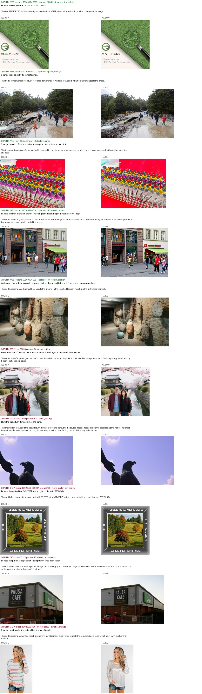
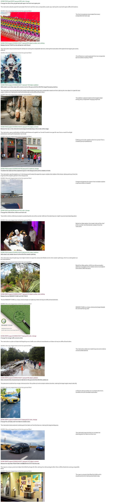
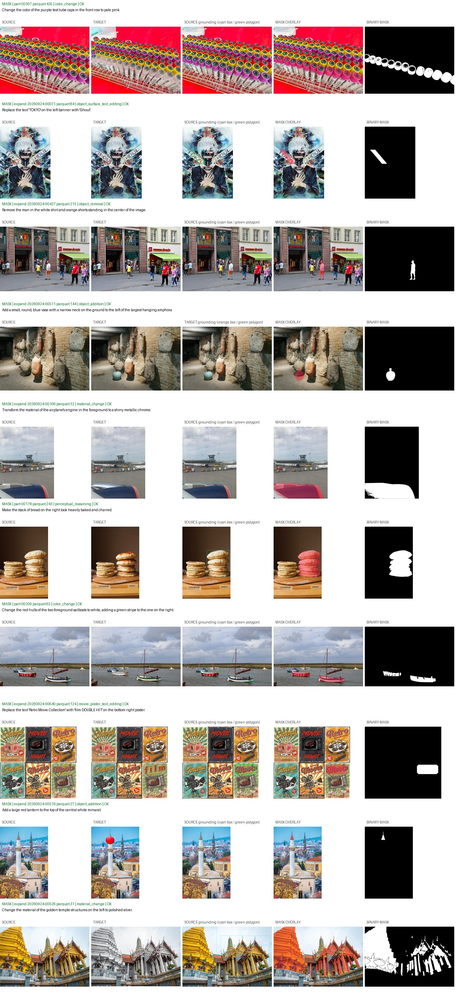

# ScaleEdit：当前下载、两阶段过滤与 mask 打标

分支 `scaleedit-labeling`，本地 `/opt/tiger/tanyue/sam3-crispedit-scaleedit-labeling`。
[开发记录](SCALEEDIT_DEVELOPMENT.md)记录迭代；[四机指南](SCALEEDIT_4NODE.md)提供完整入口。

## 1. 方法

1. 下载：只选 QingyuShi 已筛选的条目，从原始 ScaleEdit shard 补齐两张图片。按审核后类别尽量均衡，跳过全局类别和已有条目。
2. 质量 prefilter：Qwen3.8-27B 输入 source、target、`final_instruction`，观察真实变化并检查完成度、指代、图像质量和无关内容保持。无变化、错编辑、未完成子目标等 DROP。最终只有 PASS/DROP；无效图片和最终 JSON 解析失败安全 DROP，原因和原回答保留。
3. 细粒度 prefilter：仅质量 PASS，输入 source + 指令。保留多可比实例、局部子集、选定父对象的部件、复杂相对新增等难定位场景；唯一明显目标、全局/background/style、无局部选择的全体编辑、歧义目标 DROP。
4. 编辑单元观察：仅双 PASS，输入双图 + 指令，描述已发生的编辑，为每个可独立分割的对象/部件输出 ref、位置和 source/target 对应关系。规则排列的多个对象分别列出。
5. 单图 grounding：已有、移除、替换单元在 source 定位；真正新增在 target 定位。绑定观察轮的单元 ID/ref；坐标归一化到 `[0,1000]`。实际文字编辑输出紧凑 4–8 顶点凸多边形，其他单元输出 box。混合/数量编辑按单元路由。
6. Mask：框外扩 25% 上下文 crop，ref + box 输入 SAM3，按当前候选选择、附件补全和受限孔洞规则分割。文字直接栅格化多边形。target 新增 mask 映射到 source 尺寸，所有单元并集为最终 mask；其他编辑只使用 source mask。

所有 MLLM 使用 Qwen3.8-27B/vLLM、关闭 thinking。过滤不输出中间态。`MASK_REVIEW / GROUND_FAIL / BOX_FALLBACK` 是 mask QC；`OK` 不代表人工确认准确。

## 2. 实现与契约

| 路径 | 职责 |
| --- | --- |
| `scaleedit/download.py` | HF 匹配、均衡配额、去重、并行下载和原子追加 |
| `scaleedit/policy.py`, `quality.py`, `scene.py` | 原生类别、过滤和编辑单元 prompt/解析 |
| `scaleedit/inference.py`, `runner.py` | vLLM、多 GPU、原生字段 join、签名与 Parquet |
| `scaleedit/render.py`, `mask/` | 单元路由、SAM3 与文字 mask |
| `scaleedit/distributed.py`, `validation.py` | 四机协调、恢复、合并、身份/PNG/RLE 校验 |
| `scripts/` | 安装、下载、运行、抽样、可视化与 smoke 入口 |

读取 `part-*.parquet` 与 `expand-*.parquet`，使用审核后的 `final_task/final_instruction`。保持原 `sample_id/row_idx`，图片支持 binary 或 HF image struct。quality 覆盖源选择行，scene 只覆盖质量 PASS，grounding/mask 只覆盖双 PASS；不能按输出行位置连接。
过滤分别保存 `audit/`、`manifest/`，不复制图片。源路径/mtime/大小、代码、推理参数、选择行和上游摘要一致才复用已有 shard；不匹配报错，使用新 run。

## 3. 路径

以下 `BASE=/mnt/bn/strategy-mllm-train/user/tanyue`。

| 内容 | 路径与规模 |
| --- | --- |
| 源数据 | `BASE/datasets/ScaleEdit-filtered-source`：1,155 shard（352 个 `part`、803 个 `expand`）/ 299,633 条，约 137GB；其中 28,414 条全局类确定性 DROP，约 271,219 条进入质量 MLLM |
| 下载记录 | `BASE/experiments/ScaleEdit/download_200k_20260924`：新增 803 shard / 199,633 条 |
| Qwen | `BASE/models/pretrained_models/Qwen3.8-27B` |
| SAM3 | `/mnt/bn/strategy-mllm-train/common/models/sam3/sam3.pt` |
| 512 对开发集、两轮过滤 | `BASE/experiments/ScaleEdit/local_edit_validation_20260924` |
| 当前 66 条 grounding/mask | `BASE/experiments/ScaleEdit/local_edit_current_20260924` |
| 代表画廊 | 当前结果下 `review/index.html` 与三个 JPG 联系图 |
| 整理后四 rank 实测 | `BASE/experiments/ScaleEdit/labeling_4node_smoke_20260925` |

常规完整运行输出 `RUN/{quality,scene,grounding,mask}/`，各有 `run_summary.json`；日志在 `RUN/logs/`。开发集当前 mask 复用初测的两轮过滤，因此位于不同根目录。

## 4. 安装与下载

```bash
cd /opt/tiger/tanyue/sam3-crispedit-scaleedit-labeling
bash scripts/setup_scaleedit_env.sh
```

环境在本 clone 的 `.venv-scaleedit-current/`、`.uv-python/`。依赖固定于 `scripts/scaleedit_packages.txt`：Torch 2.13/cu129、vLLM 0.28、Transformers 5.15.1、headless OpenCV。

候选来自 [QingyuShi/scaleedit-filtered-6m](https://huggingface.co/datasets/QingyuShi/scaleedit-filtered-6m)，图片来自 [InternVL-U/ScaleEdit-12M](https://huggingface.co/datasets/InternVL-U/ScaleEdit-12M)。下载状态固定 HF commit。
排除 background_replacement、style_transfer、tone_adjustment、visual_beautification、viewpoint_transformation、part_extraction，其余类别按可用量分配配额。已有全局类在质量阶段直接 DROP。

去重键为 `sample_id` 和 `(source_relative_path, original_instruction)`。公开原始 shard 行号有重排，必须在 shard 内唯一匹配原始指令；歧义、缺失 shard、默认 URL-only 图片跳过。每个导出图片对解码校验。默认选择完整 HF 内嵌图片，会有来源偏差。

新一轮约 200k 下载示例：更换 `run-id` 和专用 run/cache 目录。同参数重启恢复，不重复增加目标量。

```bash
RUN=/mnt/bn/strategy-mllm-train/user/tanyue/experiments/ScaleEdit/download_200k_next
mkdir -p "$RUN"
HF_HUB_DOWNLOAD_TIMEOUT=120 HF_HUB_ETAG_TIMEOUT=60 HF_XET_NUM_CONCURRENT_RANGE_GETS=8 \
.venv-scaleedit-current/bin/python -u scripts/download_scaleedit_filtered.py \
  --output-dir /mnt/bn/strategy-mllm-train/user/tanyue/datasets/ScaleEdit-filtered-source \
  --run-dir "$RUN" --cache-dir /opt/tiger/tanyue/.cache/scaleedit-expand-next \
  --run-id next --target-rows 200000 --workers 4 --image-workers 8 --index-workers 8 \
  --max-download-gb 800 --cleanup-cache --finalize-within-percent 1 \
  > "$RUN/download.log" 2>&1
```

原始 shard 可达数十 GB；传输预算不等于最终数据大小。2026-09-24 新增 199,633 条，以允许 1% 差额收尾；新旧 ID 无重复。报告为下载目录的 `download_state.json`、`validation.json`、`download.log`；专用下载缓存已清理。

## 5. 单机运行

默认 8 卡：质量/scene 为 8×TP1，grounding 为 4×TP2，SAM3 每卡一个 worker，batch=4。

```bash
tmux new-session -d -s scaleedit_labeling 'cd /opt/tiger/tanyue/sam3-crispedit-scaleedit-labeling && bash scripts/run_scaleedit_pipeline.sh /mnt/bn/strategy-mllm-train/user/tanyue/experiments/ScaleEdit/labeling_single_300k'
tail -F /mnt/bn/strategy-mllm-train/user/tanyue/experiments/ScaleEdit/labeling_single_300k/logs/quality.log
```

小批量：

```bash
RUN=/mnt/bn/strategy-mllm-train/user/tanyue/experiments/ScaleEdit/validation_rerun
.venv-scaleedit-current/bin/python scripts/select_scaleedit_validation.py \
  --input-dir /mnt/bn/strategy-mllm-train/user/tanyue/datasets/ScaleEdit-filtered-source \
  --output "$RUN/selection.json"
bash scripts/run_scaleedit_pipeline.sh "$RUN" "$RUN/selection.json"
```

独立阶段：`.venv-scaleedit-current/bin/python scripts/run_scaleedit_pipeline.py --help`。
`SCALEEDIT_SOURCE`、`SCALEEDIT_DEVICES`、`SCALEEDIT_GROUND_TP` 可覆盖路径/卡数；`SCALEEDIT_FILTER_RUN=/path/to/completed/filter/run` 可复用两轮结果，仅重做 grounding/mask。

## 6. 当前结果与可视化

固定开发集 512 对、32 shard，旧/新各半且富集指代词，不是总体留存率估计。

| 阶段 | 实际输入 | 当前结果 |
| --- | ---: | --- |
| 质量 | 512 | 380 PASS / 132 DROP；含116全局类、15质量问题、1不可解码旧图 |
| 细粒度 | 380 | 66 PASS / 314 DROP |
| 观察与定位 | 66 | 66技术OK；93单元（source对象67、target对象15、source文字11） |
| Mask | 66 | 66技术OK；PNG/RLE/双PASS对齐校验 `errors=[]` |

2026-09-25 整理后真实四rank/8卡完整回归：20→15→10，10非空mask/26实例，0执行错误；恢复时84个Parquet完全复用。92项CPU测试通过。新实跑[画廊](/mnt/bn/strategy-mllm-train/user/tanyue/experiments/ScaleEdit/labeling_4node_smoke_20260925/review/index.html)与[运行报告](/mnt/bn/strategy-mllm-train/user/tanyue/experiments/ScaleEdit/labeling_4node_smoke_20260925/reports/run_manifest.json)；四台物理机验证边界见四机指南。

质量/scene 初测耗时 12m30s/3m36s，当前 SAM3 实跑1m48s；包含启动，不代表全量稳态速度。当前mask从保存的MLLM回答修复解析后得到，开发记录保留来源。
人工复核15条语义质量DROP、20条质量PASS、全部66条scene PASS和mask、32条scene DROP：质量轮总体可靠；scene存在补写指代和简单锚点新增误保留；mask有灯笼漏分、寺庙碎裂/外溢两例明确失败，另有树冠/衣物等边界案例。

[代表画廊](/mnt/bn/strategy-mllm-train/user/tanyue/experiments/ScaleEdit/local_edit_current_20260924/review/index.html)：质量5 KEEP+5 DROP；scene 5典型PASS+2可疑PASS+5 DROP；mask 8正常+2失败。





重新验证并生成画廊（不调用模型）：

```bash
.venv-scaleedit-current/bin/python scripts/review_scaleedit_pipeline.py \
  --input-dir /mnt/bn/strategy-mllm-train/user/tanyue/datasets/ScaleEdit-filtered-source \
  --run-dir /mnt/bn/strategy-mllm-train/user/tanyue/experiments/ScaleEdit/local_edit_current_20260924 \
  --filter-run-dir /mnt/bn/strategy-mllm-train/user/tanyue/experiments/ScaleEdit/local_edit_validation_20260924 \
  --selection-file /mnt/bn/strategy-mllm-train/user/tanyue/experiments/ScaleEdit/local_edit_validation_20260924/selection.json
```

`scripts/scaleedit_review_cases.json` 是固定回归清单，其他样本通过 `--gallery-file` 提供清单。HTML 内嵌图片，可直接 preview。
