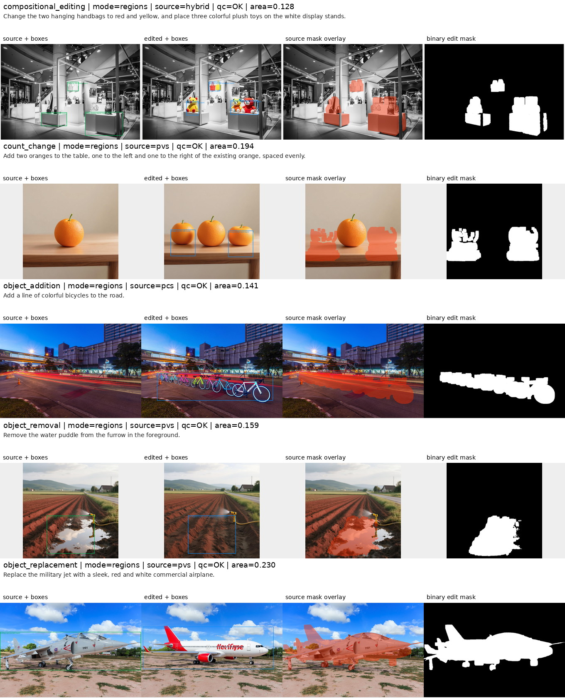
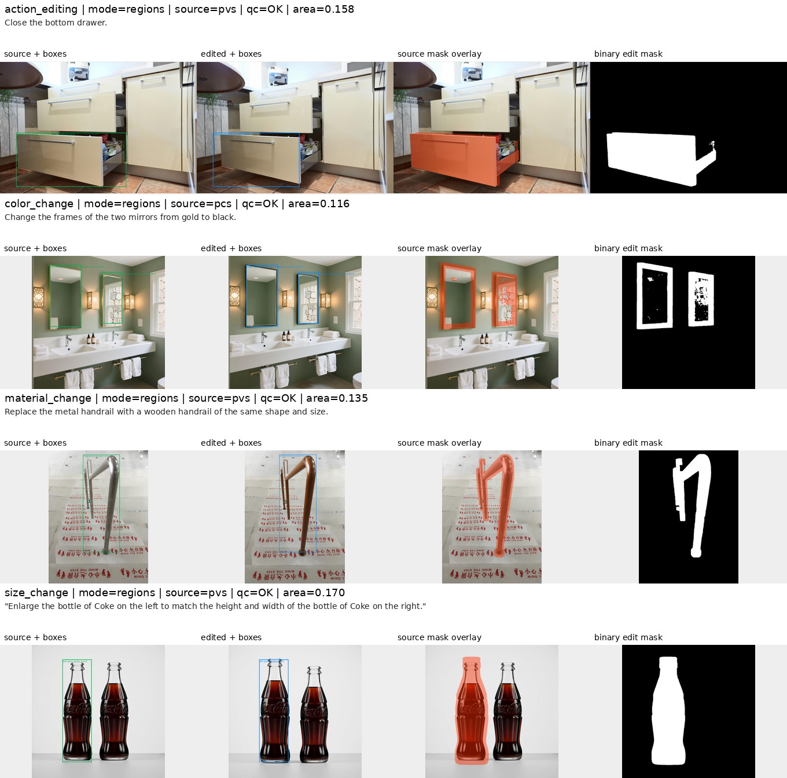
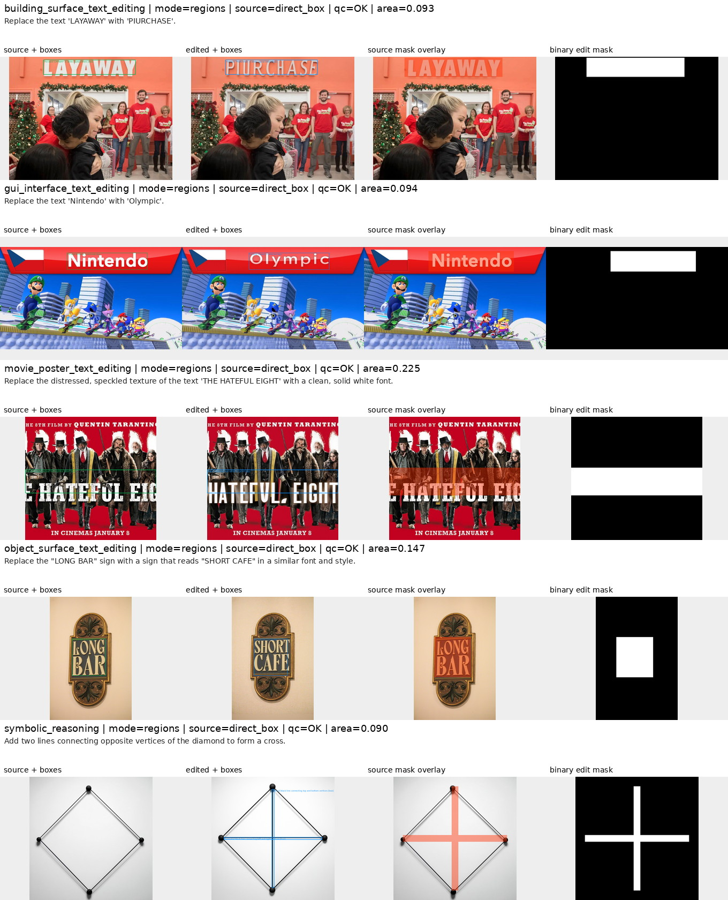
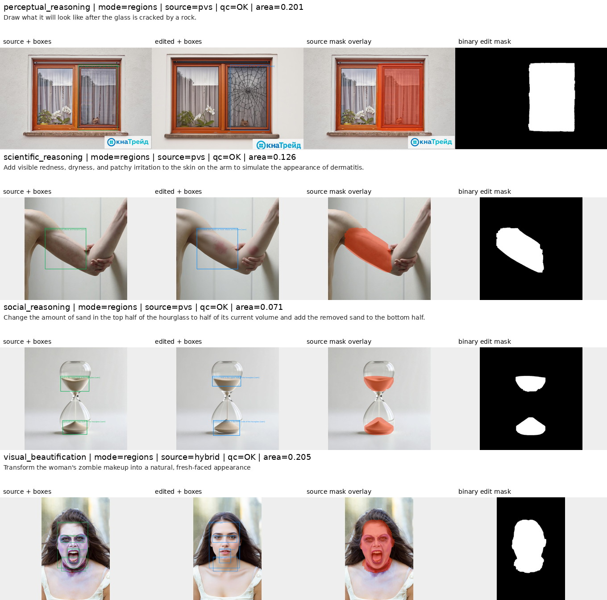
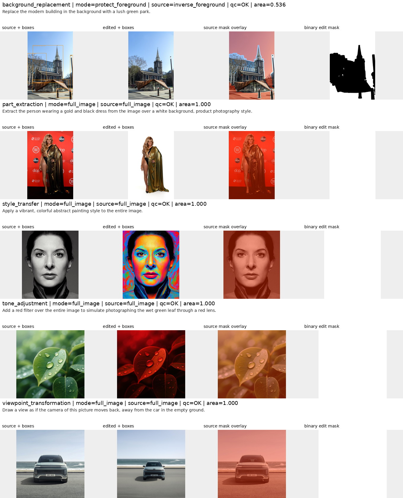

# ScaleEdit 图像编辑区域打标

本流程为 ScaleEdit 单独实现，不修改源数据，也不把 23 个 `final_task` 生硬映射到
CrispEdit 的 7 类规则。输入只读扫描 `part-*.parquet`，输出写到显式指定的新目录。

## 为什么需要独立策略

ScaleEdit 的任务名不能直接决定 mask 形状：

- `style_transfer` 同时包含全图风格化和只改变墙面、招牌、屏幕的局部风格；
- `part_extraction` 同时包含“保留主体、背景变白”和局部去壳/显露内部；
- `tone_adjustment` 既有全图滤镜，也有只改变天空或局部环境光；
- `perceptual/scientific/social/symbolic_reasoning` 内部混合增、删、修复、属性和绘线；
- 四类文字编辑需要覆盖实际字形块，SAM 的普通物体语义 mask 容易漏掉细笔画。

因此第一阶段先比较 source/result 中实际发生的编辑，再决定下面三种合成契约：

| `mask_mode` | 使用场景 | source 坐标系最终 mask |
|---|---|---|
| `regions` | 局部增删替换、属性、动作、文字、修复等 | source 区域 ∪ 映射后的 target 区域 |
| `protect_foreground` | 背景替换且前景主体在原位稳定保留 | NOT(膨胀后的稳定前景) |
| `full_image` | 真正的全图滤镜、全画面风格或相机视角变化 | 全图 |

`regions` 中的连贯物体/表面使用 MLLM bbox + SAM3 双提示分割；文字、glyph、细线、
路径、裂缝、点状小标记使用带小安全边距的直接框 mask，以召回优先避免细结构消失。
target mask 按归一化坐标映射到 source；两图宽高比差异超过 2% 会写入 QC 标记。
商品式 `part_extraction` 通常还会重新居中、缩放或重构主体，因此按全图重构处理；仅有
原位去壳/揭示内部时才使用局部区域。

`viewpoint_transformation` 还需区分两种几何：相机移动、站位改变或整幅场景换视角使用
全图；明确命名的单个物体转到正面/背面/侧面必须使用 source/target 物体区域。若首轮
误判为全图，grounding 会自动发起一次强约束复核，取得真实物体 bbox 后才交给 SAM3；
复核仍失败时保留安全的全图契约，不使用可能把背景反选为前景的整图 bbox。迷宫路径类
会强制搜索框覆盖起止端点，避免 MLLM 只框住路径中段。

## 输入字段

每个 `part-*.parquet` 至少需要：

- `sample_id`
- `source_image` / `edited_image`（binary，亦兼容 Arrow image struct）
- `edit_task` / `final_task`
- `original_instruction` / `final_instruction`

打标只使用清洗后的 `final_task` 和 `final_instruction` 决策，同时将原字段原样传到输出
用于审计。`matched_rows.parquet` 不是图像分片，不会被扫描。

## 验证集运行

以下命令将所有产物写到 workspace 中独立的 `ScaleEdit-results/validation-v1`，不会向验证集
目录写入任何内容。

```bash
cd /opt/tiger/tanyue/sam3-prefilter_improved

python -u scaleedit_mllm_grounding.py \
  --input-dir /mnt/bn/strategy-mllm-train/user/tanyue/datasets/ScaleEdit-filtered-balanced-final-task-200-v5 \
  --output-dir /opt/tiger/tanyue/ScaleEdit-results/validation-v1/grounding \
  --model-path /mnt/bn/strategy-mllm-train/common/models/Qwen3.5-35B-A3B \
  --devices 0,1,2,3,4,5,6,7 \
  --tensor-parallel-size 2 \
  --batch-size 8 \
  --request-batch-size 4 \
  --fail-fast

python scripts/apply_scaleedit_grounding_policy.py \
  --input-dir /opt/tiger/tanyue/ScaleEdit-results/validation-v1/grounding \
  --output-dir /opt/tiger/tanyue/ScaleEdit-results/validation-v1/grounding-final

python -u scaleedit_grounded_mask_runner.py \
  --input-dir /mnt/bn/strategy-mllm-train/user/tanyue/datasets/ScaleEdit-filtered-balanced-final-task-200-v5 \
  --grounding-dir /opt/tiger/tanyue/ScaleEdit-results/validation-v1/grounding-final \
  --output-dir /opt/tiger/tanyue/ScaleEdit-results/validation-v1/masks \
  --checkpoint-path /mnt/bn/strategy-mllm-train/common/models/sam3/sam3.pt \
  --devices 0,1,2,3,4,5,6,7 \
  --fail-fast

python scripts/visualize_scaleedit_masks.py \
  --input-dir /mnt/bn/strategy-mllm-train/user/tanyue/datasets/ScaleEdit-filtered-balanced-final-task-200-v5 \
  --grounding-dir /opt/tiger/tanyue/ScaleEdit-results/validation-v1/grounding-final \
  --mask-dir /opt/tiger/tanyue/ScaleEdit-results/validation-v1/masks \
  --output-dir /opt/tiger/tanyue/ScaleEdit-results/validation-v1/review-by-category \
  --coarse-category-groups

python scripts/validate_scaleedit_masks.py \
  --input-dir /mnt/bn/strategy-mllm-train/user/tanyue/datasets/ScaleEdit-filtered-balanced-final-task-200-v5 \
  --grounding-dir /opt/tiger/tanyue/ScaleEdit-results/validation-v1/grounding-final \
  --mask-dir /opt/tiger/tanyue/ScaleEdit-results/validation-v1/masks \
  --report-json /opt/tiger/tanyue/ScaleEdit-results/validation-v1/validation.json
```

所有 stage 都以 shard 为恢复单位。不加 `--overwrite` 时会跳过已存在输出；prompt 或策略
升级后应换新版本目录，避免混合不同策略。全量数据仍在下载时不要提前启动生产运行，避免
把尚未落稳的 parquet 当成完整分片。

grounding 支持重复传入 `--sample-id`，只重跑指定样本并保留原始 shard `row_idx`。局部
复核结果可用 `scripts/merge_scaleedit_grounding.py` 按 `sample_id + row_idx` 覆盖到完整
grounding 的新目录；脚本会拒绝重复 ID、错位行和原地覆盖。此能力用于审阅后的定向修复，
正常全量运行不需要使用。

## 输出

grounding parquet 与输入逐 shard、逐行对齐，核心字段为 `sample_id`、`row_idx`、
`ground_json`、`grounding_status`、模型和 prompt 版本。`ground_json` 保存两轮 prompt、原始
回答、解析结果、mask mode、两侧 bbox 和每区域的 `sam|box` 策略。

mask parquet 继续逐行对齐，包含：

- `mask_png`：source 原分辨率二值 union mask；
- `instance_masks`：每个区域的 source 坐标 COCO RLE 和来源；
- `mask_source`、`area_frac`、`qc_flag`、`qc_flags_json`；
- `mllm_model`、`prompt_version`、`sam_version`、`mask_policy_version`。

可视化脚本会严格检查 raw/grounding/mask 的行数和 `sample_id`，再生成每类代表样本的
分页 review 图与 `summary.json`。默认按 23 个 `final_task` 选样；加入
`--coarse-category-groups` 后，会生成本文采用的五组粗粒度 review 目录及根目录
`index.json`。该模式不能与 `--task` 或 `--sample-id` 混用。

`product photography` / `product mockup` 式 extraction 还有一条窄范围确定性后处理：即使
MLLM 把它误判为普通背景替换，也强制改为全图，并把原契约保存在 `route_override` 中。
这是为了避免反转前景后在主体旧位置留下漏标空洞。已有 raw grounding 可通过
`scripts/apply_scaleedit_grounding_policy.py` 写到新目录，无需重跑模型。

## 200 条验证集结果

归档结果来自 `ScaleEdit-filtered-balanced-final-task-200-v5`，共覆盖 23 个任务。最终运行目录
使用 `grounding-final-v4` 和 `masks-final`；版本后缀记录验证期间的定向复核，不是生产路径的
硬编码要求。机器校验结果归档在
[`validation_summary.json`](../docs_assets/scaleedit/validation_v1/validation_summary.json)。

| 指标 | 结果 |
|---|---:|
| 样本 / 唯一 sample ID | 200 / 200 |
| 任务数 | 23 |
| instance RLE 数 | 488 |
| 结构校验错误 | 0 |
| `regions` / `full_image` / `protect_foreground` | 178 / 17 / 5 |
| PVS / PCS / hybrid | 81 / 15 / 33 |
| direct box / full image / inverse foreground | 49 / 17 / 5 |
| mask 面积比例，中位数 / 均值 | 0.1156 / 0.2725 |

这里的 `qc=OK` 表示输出对齐、JSON/RLE、尺寸、非空性和 fallback 等机器规则通过，不代表
人工确认语义完全正确。人工抽查已经发现一个 `count_change` 样本中，MLLM 的两个 target
bbox 明显向桌面方向下移；PVS 又接受了与错误框自洽但包含桌面的 mask。该问题应在 100k
生产运行前通过 bbox 复核和语义质量阈值继续改进，不能把本次 200/200 `OK` 解读为
200/200 人工验收通过。

## 粗粒度分类可视化

每个细任务选择一个代表样本。每行从左到右依次为 source 与 bbox、edited result 与 bbox、
source 坐标系 mask overlay、二值 mask。图片和对应选样统计均保存在
`docs_assets/scaleedit/validation_v1/`；五组的任务映射和相对产物路径见
[`index.json`](../docs_assets/scaleedit/validation_v1/index.json)。

### 1. 对象增删与构图

包含 `object_addition`、`object_removal`、`object_replacement`、`count_change` 和
`compositional_editing`。对应的
[选样与统计](../docs_assets/scaleedit/validation_v1/01_object_composition/summary.json)。



### 2. 属性、材质、尺度与动作

包含 `action_editing`、`color_change`、`material_change` 和 `size_change`。对应的
[选样与统计](../docs_assets/scaleedit/validation_v1/02_attribute_action/summary.json)。



### 3. 文本与符号

包含四类表面文字编辑和 `symbolic_reasoning`。对应的
[选样与统计](../docs_assets/scaleedit/validation_v1/03_text_symbol/summary.json)。



### 4. 推理、修复与美化

包含 `perceptual_reasoning`、`scientific_reasoning`、`social_reasoning` 和
`visual_beautification`。对应的
[选样与统计](../docs_assets/scaleedit/validation_v1/04_reasoning_repair/summary.json)。



### 5. 场景、全局变化与主体提取

包含 `background_replacement`、`part_extraction`、`style_transfer`、`tone_adjustment` 和
`viewpoint_transformation`。对应的
[选样与统计](../docs_assets/scaleedit/validation_v1/05_scene_global_extraction/summary.json)。



## 全量切换

100k 数据下载完成后，仅需将三个命令中的 `--input-dir` 换成：

```text
/mnt/bn/strategy-mllm-train/user/tanyue/datasets/ScaleEdit-filtered-balanced-final-task-100k
```

并使用新的输出目录。不要把任何输出放进源数据目录。
