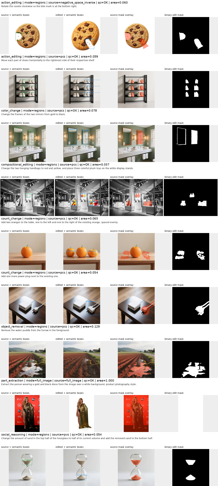

# ScaleEdit 当前 mask 标注流程

本文只描述仓库中当前使用的 ScaleEdit 实现。它从已经清洗并带有 `final_task` 的
source/edited image pair 出发，先用 Qwen3.5-35B-A3B 生成编辑区域合同，再用 SAM3 生成
source 坐标系下的二值 mask。流程不使用 pixel diff，也没有 crop/refinement 第三轮定位。

## 入口与代码位置

- `scaleedit_mllm_grounding.py`：MLLM grounding 入口。
- `scaleedit_grounded_mask_runner.py`：SAM3 mask 入口。
- `scaleedit/policy.py`：planner/locator prompt、严格 JSON 解析和少量确定性任务约束。
- `scaleedit/grounding_runner.py`：Qwen 多卡调度、两阶段调用和 parquet 输出。
- `scaleedit/mask_pipeline.py`：SAM/box/full-image/inverse/negative-space 路由及后处理。
- `scaleedit/mask_runner.py`：SAM3 多卡调度和最终 parquet schema。
- `scripts/validate_scaleedit_masks.py`：行对齐、PNG、RLE 和统计验证。
- `scripts/visualize_scaleedit_masks.py`：bbox、mask 和实例信息的 review page。

当前版本标识定义在 `scaleedit/__init__.py`。本机唯一保留的完整结果目录是：

```text
/opt/tiger/tanyue/ScaleEdit-results/current/
├── grounding/
├── masks/
├── review-all/
└── validation.json
```

当前 200-case 评测使用的具体路径如下：

| 内容 | 路径 |
| --- | --- |
| 输入数据集 | `/mnt/bn/strategy-mllm-train/user/tanyue/datasets/ScaleEdit-filtered-balanced-final-task-200-v5` |
| 当前结果根目录 | `/opt/tiger/tanyue/ScaleEdit-results/current` |
| Grounding 结果 | `/opt/tiger/tanyue/ScaleEdit-results/current/grounding` |
| Mask 结果 | `/opt/tiger/tanyue/ScaleEdit-results/current/masks` |
| 完整可视化 | `/opt/tiger/tanyue/ScaleEdit-results/current/review-all` |
| 重点 case 可视化 | `/opt/tiger/tanyue/ScaleEdit-results/current/review-key-cases` |
| 校验报告 | `/opt/tiger/tanyue/ScaleEdit-results/current/validation.json` |

## 输入数据

`--input-dir` 中的每个 parquet shard 必须至少包含以下字段：

- `sample_id`：全数据集唯一的样本 ID；
- `final_task`：规范化后的编辑任务类别；
- `final_instruction`：最终编辑指令；
- `source_image`：原图的二进制图片数据；
- `edited_image`：编辑后图片的二进制图片数据。

grounding 和 mask 输出沿用输入 shard 文件名及行顺序。runner 会检查字段、样本 ID 和行对齐，
因此不能把不同版本数据的 input、grounding 与 mask 目录混用。

## 总体流程

```text
source + edited image + final_task + final_instruction
  -> Round 1: edit planner（语义与路由，不输出坐标）
  -> Round 2: bbox locator（只做视觉定位）
  -> candidate_id 确定性合并
  -> full_image / protect_foreground / regions 路由
  -> SAM3 或 direct box
  -> 连通域清理、target->source 映射、union
  -> PNG + instance RLE + audit metadata
```

### MLLM 调用次数

- 普通 `regions` / `protect_foreground`：2 次，planner 一次、locator 一次。
- `full_image`：1 次，planner 已决定全图，不需要 bbox locator。
- 明确的单物体旋转或视角编辑若被 planner 错判为 `full_image`：增加一次窄范围语义纠错，
  随后再调用 locator，因此该少数路径共 3 次。
- JSON 解析失败时，`--parse-retries` 可能重试同一轮；默认值为 1。这是异常恢复，不是正常
  pipeline 的固定轮次。

当前没有把首轮长 JSON、mask metadata 或历史回答交给第二轮，也没有额外 crop MLLM 调用。
两轮 prompt 的完整实现分别位于 `scaleedit.policy.build_observation_prompt` 和
`scaleedit.policy.build_grounding_prompt`；每行 grounding 的 `ground_json` 也保存实际 prompt、原始
回复及解析结果，便于逐样本审计。

## Round 1：edit planner

输入包含两张完整图片、`final_task`、修正后的 instruction 和该 task 的语义提示。模型负责：

1. 根据图片对确认实际发生的编辑；
2. 选择 `mask_mode`；
3. 列出第二轮需要定位的每个可见实例；
4. 决定实例应使用 SAM 还是 filled box；
5. 标记编辑区域是否为负空间。

当前输出合同为：

```json
{
  "realized_edit": "one precise sentence",
  "mask_mode": "regions|protect_foreground|full_image",
  "localization_items": [
    {
      "image_side": "source|target",
      "role": "edit_region|protected_foreground",
      "edit_op": "add|remove|change|protect",
      "ref": "concrete visible entity",
      "spatial_hint": "instance-disambiguating location",
      "geometry": "semantic_object|dense_region|sparse_marks",
      "mask_method": "sam|box",
      "region_mode": "object|aggregate_region",
      "mask_density": "object|dense|sparse",
      "negative_space": false,
      "carrier_ref": ""
    }
  ],
  "confidence": "high|medium|low"
}
```

约束要点：

- `regions` 分别列出 source 上消失/改变的实例和 target 上出现/改变的实例。
- 纯新增不列 source 的空桌面、展台或背景；纯删除不列 target 中露出的背景。
- checklist 通常不超过 8 个 item。需要独立操作或彼此分离的重复物体应拆开并用
  `spatial_hint` 区分；大量相邻、接受同一编辑且形成整体足迹的元素按紧凑空间 cluster 聚合，
  使用 `region_mode=aggregate_region`，不能为了缩短输出而漏掉区域。
- `protect_foreground` 只列稳定前景，最终取其 mask 的反集。
- `full_image` 的 `localization_items` 必须为空。
- 文字、细线、路径、裂纹、点状或稀疏标记使用 `mask_method=box`。
- 洞、缺口、开口、咬痕等留白使用 `negative_space=true`，同时给出形成边界的
  `carrier_ref`。

解析器只接受当前合同，不再兼容旧的 `changes`、`source/target bbox` 单轮输出格式。

## Round 2：bbox locator

第二轮是新的独立对话，仍看到 source 和 edited 两张完整图片，但文本只包含第一轮已经确认的：

```text
candidate_id | Image 1/2 | ref + spatial_hint
```

它不再决定 `mask_mode`、edit operation 或 SAM 策略，只输出：

```json
[
  {"candidate_id": 0, "bbox_2d": [x1, y1, x2, y2]}
]
```

`bbox_2d` 是相对于指定完整图片的 0–1000 归一化坐标。解析器要求 candidate 顺序和集合与
planner 完全一致，再由代码按 `candidate_id` 合并坐标与首轮 metadata。对于 Qwen 偶发的
`label: "3 | Image 2 | ..."` 输出，解析器也可从 label 开头恢复 ID。对于重复 `bbox_2d` JSON
key，会先删除完全相同的重复框；只有剩余 bbox 数量恰好等于完整 checklist 时才按位置恢复。
不完整或仍有歧义的回答会失败关闭，避免错位绑定实例。

## mask 路由

### `full_image`

直接生成与 source 同尺寸的全 1 mask，不调用 SAM3。产品摄影式主体提取如果包含重排、缩放或
白底重构，也按全图处理，避免旧主体位置残留空洞。

### `protect_foreground`

在 source 上分割所有稳定前景，合并并做小幅膨胀，然后取反：

```text
editable mask = 1 - dilate(union(protected foreground))
```

### `regions`

source 实例直接在 source 上生成 mask；target 实例先在 target 上生成 mask，再按图像尺寸映射
回 source 坐标系。若长宽比有差异会记录 `AR_MISMATCH`。所有实例最终取 union。

## SAM3 与后处理

### 普通语义物体

locator bbox 是实例锚点。SAM3 会在更宽的搜索区域内比较 PVS（phrase + visual bbox）和 PCS
（phrase-conditioned semantic）候选，以补全被 bbox 轻微裁掉的头、脚、手柄或边缘；搜索框
本身不会被填入输出。

最终 mask 使用一个比 locator bbox 略大的 output guard，并只保留：

- 与原 bbox 锚点相交且面积足够的连通域；
- 若没有满足条件的连通域，则保留 guard 内最大连通域。

因此，SAM 搜索阶段可以适当扩大召回，但远处的小点、货架碎片和不相关区域不会因为位于宽
搜索框内而自动进入最终 mask。`dense_region`、`aggregate_region` 和 `sparse` 不使用这套普通
物体连通域过滤，因为其合法编辑可能本来就是不连续的。

target mask 映射到 source 后只使用小幅、按几何类型调整的 dilation：box/negative-space/sparse
为 0.2%，细轮廓普通物体为 0.25%，dense/aggregate 为 0.4%，实体普通物体为 0.5%。

### direct box

`mask_method=box` 直接填充 locator bbox，只增加极小的栅格边缘，用于文字、符号、细线和稀疏
区域。这一路径不调用 SAM3。

### negative space

负空间不能用普通“前景分割”处理。当前实现会：

1. 使用 `carrier_ref` 在整张对应图片上获得 carrier 的 PCS mask；
2. 选择与负空间 bbox 相邻的 carrier 实例；
3. 对 carrier 建立凸包并减去真实前景，得到候选凹口/缺口；
4. 只保留与负空间 bbox 相交的连通域；
5. 做约 0.3% 的边界膨胀，并限制在扩展后的局部搜索区内。

若 carrier 或局部反向区域不可用，才退化为 `negative_space_box`，并将 `BOX_FALLBACK` 写入 QC。

## 输出与 QC

grounding parquet 与输入 shard 同名，保留 `row_idx`、`sample_id`、原始字段、完整
`ground_json`、model/prompt version、状态和耗时。`ground_json` 内含首轮 prompt/raw JSON、
第二轮 prompt/raw JSON、解析结果以及确定性 route override audit。

mask parquet 同样逐行对齐，主要字段包括：

- `mask_png`：source 分辨率的 0/255 PNG；
- `instance_masks`：每个实例的 COCO RLE、bbox、实际语义轮廓框、PVS/PCS 选择信息、连通域
  清理统计和 negative-space audit；
- `mask_source`、`area_frac`、`mask_sum`；
- `qc_flag`、`qc_flags_json`；
- MLLM、SAM 和 mask policy version。

主 QC 值包括 `OK`、`GROUND_FAIL`、`EMPTY_MASK`、`BOX_FALLBACK` 和 `AR_MISMATCH`。
`DIRECT_BOX`、`FULL_IMAGE`、`INVERSE_FOREGROUND` 等正常生成路径记录在 `qc_flags_json`。

## 完整运行命令

首次使用先创建环境：

```bash
cd /opt/tiger/tanyue/sam3-crispedit

bash scripts/setup_env.sh \
  --python-bin python3.11 \
  --qwen-model-path /mnt/bn/strategy-mllm-train/common/models/Qwen3.5-35B-A3B \
  --sam3-checkpoint-path /mnt/bn/strategy-mllm-train/common/models/sam3/sam3.pt

source .venv-sam3-crispedit/bin/activate
```

配置路径。以下变量名只作用于当前 shell，不依赖仓库外的默认配置：

```bash
SCALEEDIT_DATASET=/mnt/bn/strategy-mllm-train/user/tanyue/datasets/ScaleEdit-filtered-balanced-final-task-200-v5
SCALEEDIT_RESULTS=/opt/tiger/tanyue/ScaleEdit-results/current
SCALEEDIT_QWEN=/mnt/bn/strategy-mllm-train/common/models/Qwen3.5-35B-A3B
SCALEEDIT_SAM3=/mnt/bn/strategy-mllm-train/common/models/sam3/sam3.pt
```

依次运行 grounding、mask、校验和可视化：

```bash
python -u scaleedit_mllm_grounding.py \
  --input-dir "$SCALEEDIT_DATASET" \
  --output-dir "$SCALEEDIT_RESULTS/grounding" \
  --model-path "$SCALEEDIT_QWEN" \
  --devices 0,1,2,3,4,5,6,7 \
  --tensor-parallel-size 2 \
  --batch-size 8 \
  --request-batch-size 4 \
  --max-new-tokens 1024 \
  --fail-fast

python -u scaleedit_grounded_mask_runner.py \
  --input-dir "$SCALEEDIT_DATASET" \
  --grounding-dir "$SCALEEDIT_RESULTS/grounding" \
  --output-dir "$SCALEEDIT_RESULTS/masks" \
  --checkpoint-path "$SCALEEDIT_SAM3" \
  --devices 0,1,2,3,4,5,6,7 \
  --fail-fast

python scripts/validate_scaleedit_masks.py \
  --input-dir "$SCALEEDIT_DATASET" \
  --grounding-dir "$SCALEEDIT_RESULTS/grounding" \
  --mask-dir "$SCALEEDIT_RESULTS/masks" \
  --report-json "$SCALEEDIT_RESULTS/validation.json"

python scripts/visualize_scaleedit_masks.py \
  --input-dir "$SCALEEDIT_DATASET" \
  --grounding-dir "$SCALEEDIT_RESULTS/grounding" \
  --mask-dir "$SCALEEDIT_RESULTS/masks" \
  --output-dir "$SCALEEDIT_RESULTS/review-all" \
  --samples-per-task 1000 \
  --rows-per-page 8
```

已有同名输出 shard 时默认跳过；确认需要重算时才对对应 runner 增加 `--overwrite`。定位单个问题
样本时，grounding 支持重复传入 `--sample-id SAMPLE_ID`，无需重跑整个数据集。

## 可视化结果

下图是当前实现对讨论过的 9 个重点 case 的最新输出快照。每行从左到右依次为 source 与语义框、
edited 与语义框、source 上的最终 mask overlay，以及二值 edit mask。标题同时展示 task、
`mask_mode`、最终 `mask_source`、主 QC 和 mask 面积比例。



这些样本覆盖负空间旋转、成组移动、局部颜色变化、多对象组合编辑、数量新增、物体移除、全图
主体提取和物质转移。完整 200-case review page 保存在本机
`/opt/tiger/tanyue/ScaleEdit-results/current/review-all/`；仓库只保留上面的重点快照，避免提交大量
派生图片。

`qc=OK` 表示文件结构、尺寸、面积、行对齐和路由执行均有效，不表示语义轮廓一定完美。框是否
覆盖完整目标、SAM 是否包含应有细节以及是否残留不规则区域，仍应通过这类 review page 人工检查。

## 验证

代码回归：

```bash
python -m pytest -q
python -m py_compile scaleedit/*.py scaleedit_*.py scripts/validate_scaleedit_masks.py scripts/visualize_scaleedit_masks.py
```

当前 200-case 运行的机器校验统计保存在
`/opt/tiger/tanyue/ScaleEdit-results/current/validation.json`；视觉结果保存在
`/opt/tiger/tanyue/ScaleEdit-results/current/review-all/`。机器校验保证行数、sample id、图片尺寸、
PNG/RLE 面积和 full-image 完整性，不替代对 bbox 与语义边界的人工视觉检查。

当前结果的统计快照也保存在
[`docs_assets/scaleedit/current/validation.json`](../docs_assets/scaleedit/current/validation.json)：

| 指标 | 结果 |
| --- | ---: |
| 行数 / 唯一 sample | 200 / 200 |
| task / instance | 23 / 425 |
| `qc_flag=OK` | 200 |
| 校验错误 / 空 mask | 0 / 0 |
| mode: regions / full_image / protect_foreground | 178 / 18 / 4 |
| area fraction: median / mean | 0.092314 / 0.249697 |

`mask_source` 分布为 PCS 70、direct box 49、hybrid 28、PVS 30、full image 18、inverse
foreground 4、negative-space inverse 1。
