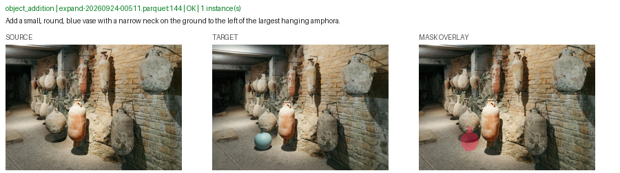
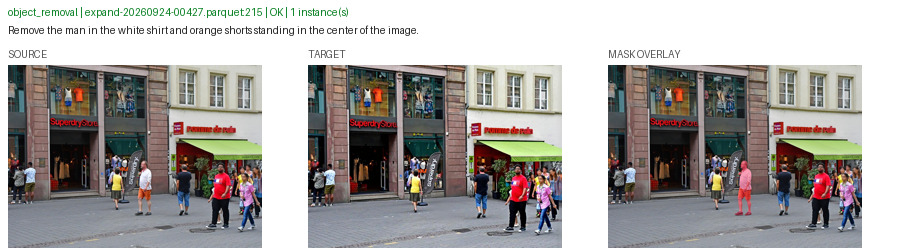
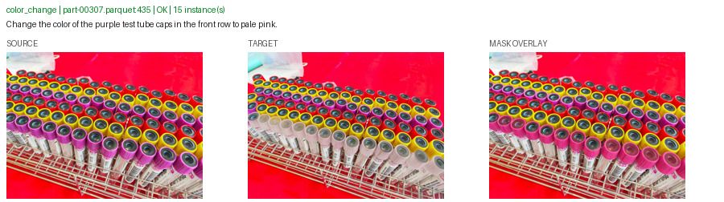
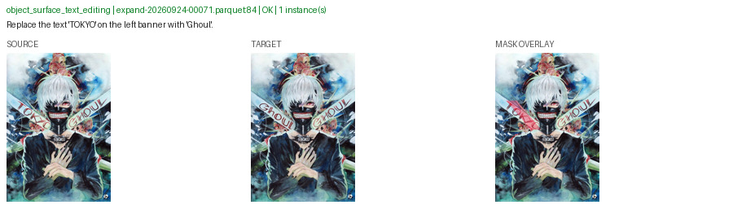
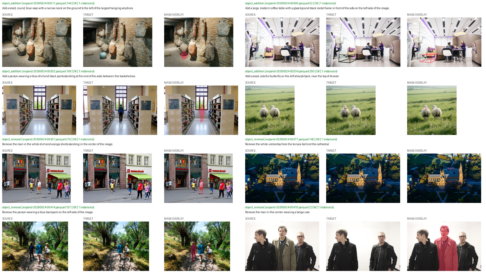
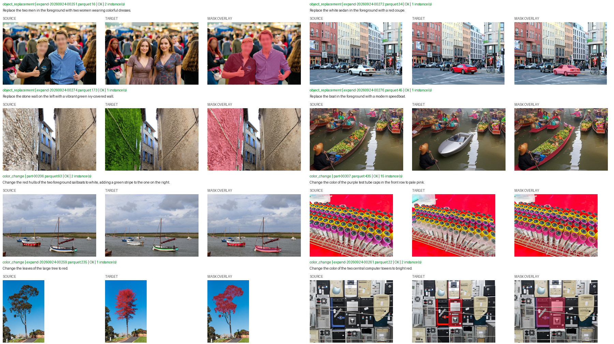
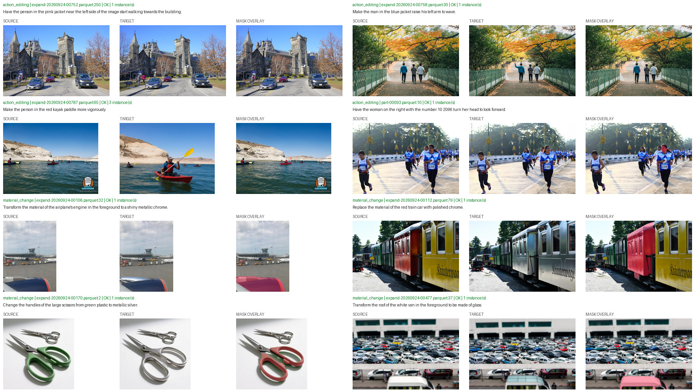
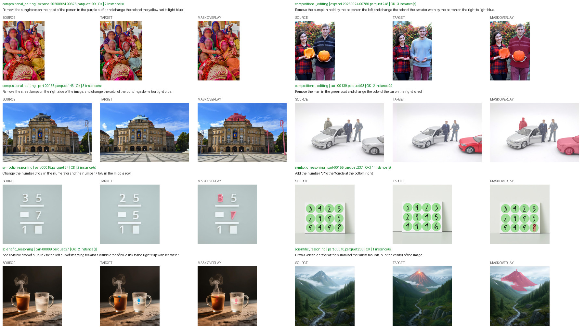

# ScaleEdit：当前下载、两阶段过滤与 mask 打标

分支 `scaleedit-labeling`，本地 `/opt/tiger/tanyue/sam3-crispedit-scaleedit-labeling`。
[开发记录](SCALEEDIT_DEVELOPMENT.md)记录迭代；[四机指南](SCALEEDIT_4NODE.md)提供完整入口。

## 1. 方法

1. 下载：只选 QingyuShi 已筛选的条目，从原始 ScaleEdit shard 补齐两张图片。按审核后类别尽量均衡，跳过全局类别和已有条目。
2. 质量 prefilter：Qwen3.8-27B 输入 source、target、`final_instruction`，观察真实变化并检查完成度、指代、图像质量和无关内容保持。无变化、错编辑、未完成子目标等 DROP。最终只有 PASS/DROP；无效图片和最终 JSON 解析失败安全 DROP，原因和原回答保留。
3. 细粒度 prefilter：仅质量 PASS，输入 source + 指令。保留多可比实例、局部子集、选定父对象的部件、复杂相对新增等难定位场景；唯一明显目标、全局/background/style、无局部选择的全体编辑、歧义目标 DROP。
4. 编辑单元观察：仅双 PASS，输入双图 + 指令，描述已发生的编辑，为每个可独立分割的对象/部件输出 ref、位置和 source/target 对应关系。规则排列的多个对象分别列出。
5. 单图 grounding：已有、移除、替换单元在 source 定位；真正新增在 target 定位。绑定观察轮的单元 ID/ref；坐标归一化到 `[0,1000]`。实际文字编辑输出紧凑 4–8 顶点凸多边形，其他单元输出 box。混合/数量编辑按单元路由。
6. Mask：框外扩 25% 上下文 crop，ref + box 输入 SAM3，按当前候选选择、附件补全和受限孔洞规则分割。文字直接栅格化多边形。target 新增 mask 映射到 source 尺寸，所有单元并集为最终 mask；其他编辑只使用 source mask。

所有 MLLM 使用 Qwen3.8-27B/vLLM、关闭 thinking。过滤不输出中间态。`MASK_REVIEW / GROUND_FAIL / BOX_FALLBACK` 是 mask QC；`OK` 不代表人工确认准确。

## 2. 实现与契约

| 路径 | 职责 |
| --- | --- |
| `scaleedit/download.py` | HF 匹配、均衡配额、去重、并行下载和原子追加 |
| `scaleedit/policy.py`, `quality.py`, `scene.py` | 原生类别、过滤和编辑单元 prompt/解析 |
| `scaleedit/inference.py`, `runner.py` | vLLM、多 GPU、原生字段 join、签名与 Parquet |
| `scaleedit/render.py`, `mask/` | 单元路由、SAM3 与文字 mask |
| `scaleedit/distributed.py`, `validation.py` | 四机协调、恢复、合并、身份/PNG/RLE 校验 |
| `scripts/` | 安装、下载、运行、抽样、可视化与 smoke 入口 |

读取 `part-*.parquet` 与 `expand-*.parquet`，使用审核后的 `final_task/final_instruction`。保持原 `sample_id/row_idx`，图片支持 binary 或 HF image struct。quality 覆盖源选择行，scene 只覆盖质量 PASS，grounding/mask 只覆盖双 PASS；不能按输出行位置连接。
过滤分别保存 `audit/`、`manifest/`，不复制图片。源路径/mtime/大小、代码、推理参数、选择行和上游摘要一致才复用已有 shard；不匹配报错，使用新 run。

## 3. 路径

以下 `BASE=/mnt/bn/strategy-mllm-train/user/tanyue`，`RUN=BASE/experiments/ScaleEdit/labeling_4node_scaleedit_300k_20260926`。

| 内容 | 路径与规模 |
| --- | --- |
| 源数据 | `BASE/datasets/ScaleEdit-filtered-source`：1,155 shard（352 个 `part`、803 个 `expand`）/ 299,633 条，约 137GB；其中 28,414 条全局类确定性 DROP，约 271,219 条进入质量 MLLM |
| 下载记录 | `BASE/experiments/ScaleEdit/download_200k_20260924`：新增 803 shard / 199,633 条 |
| Qwen | `BASE/models/pretrained_models/Qwen3.8-27B` |
| SAM3 | `/mnt/bn/strategy-mllm-train/common/models/sam3/sam3.pt` |
| 正式四机运行 | `RUN/`：`plan.json`、四阶段 plan、`selections/`、`work/`、`control/`、`logs/`、`reports/` |
| 质量过滤 | `RUN/quality/{manifest,audit}/`：各 1,155 shard / 299,633 行 |
| 细粒度过滤 | `RUN/scene/{manifest,audit}/`：各 1,155 shard / 265,456 行 |
| Grounding | `RUN/grounding/`：1,155 shard / 25,664 行 |
| 最终 mask | `RUN/mask/`：1,155 shard / 25,664 行；PNG、实例 RLE、QC |
| 合并后的完整数据 | `BASE/scaleedit_25k/`：1,073 个非空 shard / 双 PASS 的 25,664 条 / 约 16GB；源图/目标图、原始字段、两轮过滤审计、grounding、mask 合并到每行；见下文 |
| 正式统计与日志 | `RUN/reports/run_manifest.json`、`RUN/{quality,scene,grounding,mask}/run_summary.json`、`RUN/logs/` |
| 最终 OK 画廊 | `RUN/review_full_300k/index.html`：90 条自动 OK、17 类、450 张内嵌图片；`review_summary.json` 与 `selected_cases.json` 同目录 |
| 文档联系图 | `docs_assets/scaleedit/full_run_300k/`：六张 JPG、共展示 48 条自动 OK |

各阶段通过源 shard 名与 `row_idx` 连接，不按稀疏结果的行位置连接。开发集和早期试验路径见[开发记录](SCALEEDIT_DEVELOPMENT.md)。

### 合并后的完整数据

`BASE/scaleedit_25k/shards/*.parquet` 是直接可读的最终合并数据集。目录名中的 `25k` 是数量级约数，实际保留全部 25,664 条双 PASS 记录，其中自动 `OK` 25,085 条。每行保留源数据的全部字段（包括 `source_image`、`edited_image`、原始/最终指令、类别和来源），并保留质量过滤、细粒度过滤各自的 manifest 与 audit、grounding、mask 的全部持久化字段。阶段字段以 `quality__`、`quality_audit__`、`scene__`、`scene_audit__`、`grounding__`、`mask__` 为前缀；连接键是 `source_shard` + `row_idx`，不可只依靠 `sample_id` 或过滤后的位置。常用标签为 `mask__mask_png`、`mask__instance_masks`、`mask__qc_flag`、`mask__qc_flags_json`。

`BASE/scaleedit_25k/dataset_manifest.json` 列出完整 schema、逐 shard 行数、编辑类别与 QC 分布和上游路径；`_common_metadata` 提供 Parquet schema，`COMPLETE` 只在全部对齐及统计检查后写入。合并结果包括 `MASK_REVIEW`、`GROUND_FAIL`；训练时应按 `mask__qc_flag` 选择，不应把自动 `OK` 等同人工验收。无结果的空 mask shard 不生成合并 shard。

合并结果已独立核验：1,073 个文件共 25,664 行、物理 schema 一致；`OK` 25,085、`MASK_REVIEW` 472、`GROUND_FAIL` 107，非空 mask 25,518、实例 35,028，均与四机报告相符。随机抽取 32 个 shard 的记录，源/目标图像字节、原始关键字段、mask PNG、实例 RLE 和 grounding JSON 均与上游逐字节/逐字段一致，图像和 PNG 可解码。

重建命令（输出目录必须不存在；默认 24 个 shard 并行 worker、48 个 schema 检查 worker）：

```bash
cd /opt/tiger/tanyue/sam3-crispedit-scaleedit-labeling
.venv-scaleedit-current/bin/python -u scripts/build_scaleedit_final_dataset.py \
  --output-dir /mnt/bn/strategy-mllm-train/user/tanyue/scaleedit_25k \
  --workers 24 --schema-workers 48
```

脚本写到同级临时目录，核对最终行数和 QC 统计后再原子发布；已有正式目录不会被覆盖。

## 4. 安装与下载

```bash
cd /opt/tiger/tanyue/sam3-crispedit-scaleedit-labeling
bash scripts/setup_scaleedit_env.sh
```

环境在本 clone 的 `.venv-scaleedit-current/`、`.uv-python/`。依赖固定于 `scripts/scaleedit_packages.txt`：Torch 2.13/cu129、vLLM 0.28、Transformers 5.15.1、headless OpenCV。

候选来自 [QingyuShi/scaleedit-filtered-6m](https://huggingface.co/datasets/QingyuShi/scaleedit-filtered-6m)，图片来自 [InternVL-U/ScaleEdit-12M](https://huggingface.co/datasets/InternVL-U/ScaleEdit-12M)。下载状态固定 HF commit。
排除 background_replacement、style_transfer、tone_adjustment、visual_beautification、viewpoint_transformation、part_extraction，其余类别按可用量分配配额。已有全局类在质量阶段直接 DROP。

去重键为 `sample_id` 和 `(source_relative_path, original_instruction)`。公开原始 shard 行号有重排，必须在 shard 内唯一匹配原始指令；歧义、缺失 shard、默认 URL-only 图片跳过。每个导出图片对解码校验。默认选择完整 HF 内嵌图片，会有来源偏差。

新一轮约 200k 下载示例：更换 `run-id` 和专用 run/cache 目录。同参数重启恢复，不重复增加目标量。

```bash
RUN=/mnt/bn/strategy-mllm-train/user/tanyue/experiments/ScaleEdit/download_200k_next
mkdir -p "$RUN"
HF_HUB_DOWNLOAD_TIMEOUT=120 HF_HUB_ETAG_TIMEOUT=60 HF_XET_NUM_CONCURRENT_RANGE_GETS=8 \
.venv-scaleedit-current/bin/python -u scripts/download_scaleedit_filtered.py \
  --output-dir /mnt/bn/strategy-mllm-train/user/tanyue/datasets/ScaleEdit-filtered-source \
  --run-dir "$RUN" --cache-dir /opt/tiger/tanyue/.cache/scaleedit-expand-next \
  --run-id next --target-rows 200000 --workers 4 --image-workers 8 --index-workers 8 \
  --max-download-gb 800 --cleanup-cache --finalize-within-percent 1 \
  > "$RUN/download.log" 2>&1
```

原始 shard 可达数十 GB；传输预算不等于最终数据大小。2026-09-24 新增 199,633 条，以允许 1% 差额收尾；新旧 ID 无重复。报告为下载目录的 `download_state.json`、`validation.json`、`download.log`；专用下载缓存已清理。

## 5. 单机运行

默认 8 卡：质量/scene 为 8×TP1，grounding 为 4×TP2，SAM3 每卡一个 worker，batch=4。

```bash
tmux new-session -d -s scaleedit_labeling 'cd /opt/tiger/tanyue/sam3-crispedit-scaleedit-labeling && bash scripts/run_scaleedit_pipeline.sh /mnt/bn/strategy-mllm-train/user/tanyue/experiments/ScaleEdit/labeling_single_300k'
tail -F /mnt/bn/strategy-mllm-train/user/tanyue/experiments/ScaleEdit/labeling_single_300k/logs/quality.log
```

小批量：

```bash
RUN=/mnt/bn/strategy-mllm-train/user/tanyue/experiments/ScaleEdit/validation_rerun
.venv-scaleedit-current/bin/python scripts/select_scaleedit_validation.py \
  --input-dir /mnt/bn/strategy-mllm-train/user/tanyue/datasets/ScaleEdit-filtered-source \
  --output "$RUN/selection.json"
bash scripts/run_scaleedit_pipeline.sh "$RUN" "$RUN/selection.json"
```

独立阶段：`.venv-scaleedit-current/bin/python scripts/run_scaleedit_pipeline.py --help`。
`SCALEEDIT_SOURCE`、`SCALEEDIT_DEVICES`、`SCALEEDIT_GROUND_TP` 可覆盖路径/卡数；`SCALEEDIT_FILTER_RUN=/path/to/completed/filter/run` 可复用两轮结果，仅重做 grounding/mask。

## 6. 正式四机结果与可视化

四台机器各 8 卡，已于 2026-09-27 09:05 UTC 完成。四节点都记录 `complete`，`control/initial/complete.ok` 已写入，没有 `.failed` 标记；每阶段 1,155 个 shard。完整统计见[运行报告](/mnt/bn/strategy-mllm-train/user/tanyue/experiments/ScaleEdit/labeling_4node_scaleedit_300k_20260926/reports/run_manifest.json)。

| 阶段 | 输入 | 结果 | 逐条错误记录 |
| --- | ---: | --- | ---: |
| 质量过滤 | 299,633 | PASS 265,456；DROP 34,177 | 19 |
| 细粒度过滤 | 265,456 | PASS 25,664；DROP 239,792 | 2 |
| Grounding | 25,664 | OK 25,553；MASK_REVIEW 4；GROUND_FAIL 107 | 107 |
| Mask | 25,664 | OK 25,085；MASK_REVIEW 472；GROUND_FAIL 107 | 107 |

最终 mask 中 25,518 条非空，共 35,028 个实例。自动 `OK` 最多的类别是 `object_addition` 6,023、`object_removal` 5,695、`object_replacement` 2,951、`color_change` 2,517、`action_editing` 2,251 和 `material_change` 2,172。107 条 `GROUND_FAIL` 中，84 条属于四种文字编辑类别。`OK` 是自动 QC（占最终行的 97.74%），不等于人工语义准确率；错误行与待复核行保留在结果中，不能直接作为已验收训练标签。

[正式结果 HTML 画廊](/mnt/bn/strategy-mllm-train/user/tanyue/experiments/ScaleEdit/labeling_4node_scaleedit_300k_20260926/review_full_300k/index.html)分层抽取 90 条最终自动 `OK`（17 类，包含多实例），展示 source、target、grounding、source 尺寸上的 mask overlay 和 binary mask；450 张图片都内嵌在单个 HTML 中，可直接 preview。抽样键与类别分布见同目录的 `selected_cases.json` 和 `review_summary.json`。以下先展示四条单独案例，再用六张联系图展示其中 48 条：



















目视检查这些联系图时，新增花瓶 `expand-20260924-00511.parquet:144`、移除人 `expand-20260924-00427.parquet:215`、多实例颜色修改 `part-00307.parquet:435` 等定位符合指令；也发现自动 `OK` 的语义漏检：`part-00169.parquet:41` 的洞扩大却 mask 了整个圆盘，`part-00006.parquet:133` 的底座裂纹却 mask 了整个花瓶，`part-00010.parquet:208` 的火山口编辑覆盖了大半座山。画廊是定向覆盖不同类别的检查样本，不能用来估计总体准确率。

重新生成画廊（不调用模型，只读取抽中的源 shard 和最终结果）：

```bash
cd /opt/tiger/tanyue/sam3-crispedit-scaleedit-labeling
.venv-scaleedit-current/bin/python -u scripts/review_scaleedit_full_run.py \
  --run-dir /mnt/bn/strategy-mllm-train/user/tanyue/experiments/ScaleEdit/labeling_4node_scaleedit_300k_20260926 \
  --source-dir /mnt/bn/strategy-mllm-train/user/tanyue/datasets/ScaleEdit-filtered-source \
  --docs-assets-dir docs_assets/scaleedit/full_run_300k --workers 12
```

早期 512 条开发实验及其过滤/打标画廊保留在[开发记录](SCALEEDIT_DEVELOPMENT.md)，本节只记录正式四机运行。
